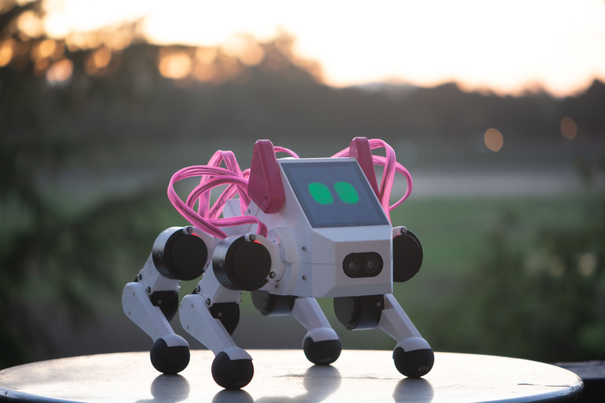

CS 123: A Hands-On Introduction to Building AI-Enabled Robots
#############################################################

    Pupper Robot

**2024-2025 Spring Teaching team:** 

* Instructors: `Prof. Karen Liu <https://tml.stanford.edu/people/karen-liu>`_ (Stanford CS), `Jie Tan <https://www.jie-tan.net/>`_ (Google DeepMind), `Stuart Bowers <https://handsonrobotics.org/>`_ (Apple, Hands-On Robotics)
* Co-Instructors: `Wenhao Yu <https://wenhaoyu.weebly.com/>`_ (Google DeepMind), `Tingnan Zhang <https://www.linkedin.com/in/tingnanzhang/>`_ (Google DeepMind)
* Head TA: `Ankush Dhawan <https://www.linkedin.com/in/ankush-dhawan/>`_ (MS EE 2025)
* Co-TA: `Jiacheng (JC) Hu <https://www.linkedin.com/in/jc-hu-838150233/>`_ (CS 2025)

**Sign-Up Form:** `This form <https://docs.google.com/forms/d/e/1FAIpQLScDPi8bazMjzMV2KLJAHexqzImbAnLQojnsOLfJG0dlEXDcjg/viewform?usp=sharing>`_ will open on Friday, 3/7/2025 at 9AM PST for applications. Please fill out this form if you are interested in enrolling for our Spring offering!

**Overview:**

Welcome to the course page for Stanford's class on legged robots!
This course offers a hands-on introduction to AI-powered robotics. Unlike most introductory robotics courses, students will learn essential robotics concepts by constructing a quadruped robot from scratch and training it to perform real-world tasks such as navigation and command following. The course covers a broad range of topics critical to robot learning, including motor control, forward and inverse kinematics, system identification, simulation, and reinforcement learning. Through weekly labs, students will construct and program an agile robot quadruped named Pupper. In the final few weeks, students will undertake an open-ended project, such as training Pupper to perform agile movements, developing a vision system to allow Pupper to play fetch, or adapting large language models to enable Pupper's ability to communicate with humans.

*"Empowering robots with AI is essential to make them smart and useful in people's daily life. It is one of the most important research directions in both academia and industry. This class teaches the most relevant skills, gives students hands-on experiences, and prepares them for a career in the area of AI and robotics."* - Jie Tan, Staff Research Scientist at Google DeepMind

**Time:** Monday, 3:30pm - 6:20pm

**Lecture Location:** `Lathrop 299 <https://www.google.com/maps/place/Lathrop+Library/@37.4291471,-122.1700007,17z/data=!3m1!4b1!4m6!3m5!1s0x808fbb29c2155555:0x7d7db72ceea1d9ef!8m2!3d37.4291471!4d-122.1674258!16s%2Fm%2F011v6hp4?entry=ttu&g_ep=EgoyMDI1MDMyMy4wIKXMDSoASAFQAw%3D%3D>`_, *in-person attendance required*

**Instructor Office Hours:**
    * Karen: Fridays 9:00-10:00 am (`Zoom link <https://stanford.zoom.us/j/5675692729?pwd=UmtJYVQvT2s3R1I4bXE2RkRyVHNWUT09>`_)
    * Stuart, Jie, Wenhao, Tingnan: Office hours by appointment. Reach out to the teaching team to schedule. 

**TA Office Hours Location:** `Gates B08/B02 <https://www.google.com/maps/place/Gates+Computer+Science,+353+Serra+Mall,+Stanford,+CA+94305/@37.4299866,-122.1759052,17z/data=!3m1!4b1!4m6!3m5!1s0x808fbb2b3f50f727:0xfd9cc3200ee97fda!8m2!3d37.4299866!4d-122.1733303!16s%2Fm%2F02rm986?entry=ttu&g_ep=EgoyMDI1MDMyMy4wIKXMDSoASAFQAw%3D%3D>`_

**TA Office Hours:**

    * Ankush: Mondays 10:30am - 11:30am Gates B08, Fridays 11:00am - 12:00pm Gates B08
    * JC: Tuesdays 2:00pm - 3:30pm Gates B08, Wednesdays 2:00pm - 3:30pm Gates B02, `additional hours <https://calendly.com/jchu0822/cs-123-additional-oh>`_ by appointment.

**Prerequisites:**

* CS106A (programming will be majorly in Python)
* CS107 (familiarity with the terminal and command lines) 
* MATH51/CME100 (understanding of gradients)
* No robotics experience necessary!!

**Number of credits:** 3

**Grading:** Students will work in assigned groups for all labs and the final project. All group members will receive the same score for each lab. Some labs may include individual written homework, which will be graded separately.

**Attendance:** Attendance is mandatory for all classes and counts for 3% of your grade. Missing 0-1 classes gives you full credit, missing 2 classes gives you 50%, and missing more than 2 gives you 0%. Students are expected to attend all classes in person. If you are unable to attend a class, please inform the teaching team in advance.

**Lab Policies:**

*Labs:* Labs are due before class the following week (by 3:30 PM on Mondays) unless otherwise noted. Each team has a total of 7 late days to use across all labs. Using one late day extends the deadline by 24 hours. A maximum of 3 late days may be used per lab. Labs submitted more than 72 hours after the deadline will not be accepted.

*Final project:* No extensions are allowed for the final project proposal or presentation.

**Optional Labs:**
Three optional labs will be offered this quarter, with the first released in Week 3. These labs are significantly more challenging and time-consuming than the regular labs. They may involve concepts beyond the scope of this course and the given prerequisites, and are intentionally open-ended. There are no due dates for these labs—students are encouraged to work on them at their own pace and are welcome to develop them further as part of their final projects.
TAs will be available to support students working on the optional labs during their office hours.

**Enrollment:** ~24 students; 6 groups of 4-5 students

Schedule
==========================

.. csv-table::
   :header: "Week", "Lecture", "Lab", "Lab Due Date", "Other"
   :widths: 15, 30, 30, 15, 20

   "Week 1: 3/31", ":doc:`../schedule/lectures/spring-25/lec-1`", ":doc:`../schedule/labs/spring-25/lab-1`", "4/7/25", ""
   "Week 2: 4/7", ":doc:`../schedule/lectures/spring-25/lec-2`", ":doc:`../schedule/labs/spring-25/lab-2`", "4/14/25", ""
   "Week 3: 4/14", ":doc:`../schedule/lectures/spring-25/lec-3`", ":doc:`../schedule/labs/spring-25/lab-3`", "4/21/25", ":doc:`../schedule/labs/spring-25/opt-lab-1`"
   "Week 4: 4/21", ":doc:`../schedule/lectures/spring-25/lec-4`", ":doc:`../schedule/labs/spring-25/lab-4`", "4/28/25", ""
   "Week 5: 4/28", ":doc:`../schedule/lectures/spring-25/lec-5`", ":doc:`../schedule/labs/spring-25/lab-5`", "5/5/25", ":doc:`../schedule/labs/spring-25/opt-lab-2`"
   "Week 6: 5/5", ":doc:`../schedule/lectures/spring-25/lec-6`", ":doc:`../schedule/labs/spring-25/lab-6`", "5/5/25", ""
**References:** :doc:`../reference/references`

**Past Course Projects:** :doc:`../reference/past_projects`

**Old course materials** :doc:`../reference/past_offerings`
