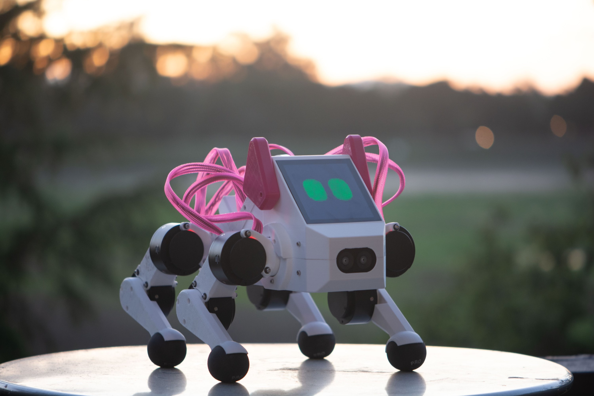

Fall 2025 (Archived)
====================

CS 123: A Hands-On Introduction to Building AI-Enabled Robots
#############################################################

    Pupper Robot

.. note::
   This is the archived Fall 2025 offering. In this offering, inverse kinematics
   (lab 3) and heuristic gait control (lab 4) were separate labs; they have since been
   merged into a single lab. See the current course page for the latest materials.

**2025-2026 Fall Teaching team:** 

* Instructors: `Prof. Karen Liu <https://tml.stanford.edu/people/karen-liu>`_ (Stanford CS), `Jie Tan <https://www.jie-tan.net/>`_ (Google DeepMind), `Stuart Bowers <https://handsonrobotics.org/>`_ (Apple, Hands-On Robotics)
* Co-Instructors: `Wenhao Yu <https://wenhaoyu.weebly.com/>`_ (Google DeepMind), `Tingnan Zhang <https://www.linkedin.com/in/tingnanzhang/>`_ (Google DeepMind)
* TAs: `Ankush Dhawan <https://ankushdhawan5812.github.io>`_ (PhD, MechE), `JC Hu <https://www.linkedin.com/in/jc-hu/>`_ (coterm, CS), `Benji Warburton <https://www.linkedin.com/in/benjiwarburton/>`_ (undergrad, EE)

**Sign-Up Form:** `This form <https://docs.google.com/forms/d/e/1FAIpQLScDPi8bazMjzMV2KLJAHexqzImbAnLQojnsOLfJG0dlEXDcjg/viewform?usp=sharing>`_ will open on Monday, 9/8/2025 at 9AM PST for applications. Please fill out this form if you are interested in enrolling for our Fall offering! We will select 24 out of the first 100 applicants in a lottery that considers equal seniority distribution among undergraduates.

**Overview:**

Welcome to the course page for Stanford's class on legged robots!
This course offers a hands-on introduction to AI-powered robotics. Unlike most introductory robotics courses, students will learn essential robotics concepts by constructing a quadruped robot from scratch and training it to perform real-world tasks such as navigation and command following. The course covers a broad range of topics critical to robot learning, including motor control, forward and inverse kinematics, system identification, simulation, and reinforcement learning. Through weekly labs, students will construct and program an agile robot quadruped named Pupper. In the final few weeks, students will undertake an open-ended project, such as training Pupper to perform agile movements, developing a vision system to allow Pupper to play fetch, or adapting large language models to enable Pupper's ability to communicate with humans.

*"Empowering robots with AI is essential to make them smart and useful in people's daily life. It is one of the most important research directions in both academia and industry. This class teaches the most relevant skills, gives students hands-on experiences, and prepares them for a career in the area of AI and robotics."* - Jie Tan, Staff Research Scientist at Google DeepMind

**Time:** Monday, 3:30pm - 6:20pm

**Lecture Location:** `CoDA B90 <https://www.google.com/maps/dir/37.4297459,-122.1720349/Computing+and+Data+Science+(CoDa),+389+Jane+Stanford+Way,+Stanford,+CA+94305/@37.4299797,-122.1727318,18.57z/data=!4m9!4m8!1m1!4e1!1m5!1m1!1s0x808fbb2b07702f9b:0x9dba28708840961b!2m2!1d-122.1715614!2d37.4300426?entry=ttu&g_ep=EgoyMDI1MDkxNS4wIKXMDSoASAFQAw%3D%3D>`_, *in-person attendance required*

**Instructor Office Hours:**
    * Karen: TBD
    * Stuart, Jie, Wenhao, Tingnan: Office hours by appointment. Reach out to the teaching team to schedule. 

**TA Office Hours Location:** CoDA B50

**TA Office Hours:**

    * Ankush: Mondays: 10:00am - 11:00am, Wednesdays: 10:00am - 11:00am
    * JC: Tuesdays 2:00pm - 3:30pm, Fridays 3:00pm - 4:30pm (in CoDA B04), `additional hours <https://calendly.com/jchu0822/cs-123-additional-oh>`_ by appointment.
    * Benji: Thursdays: 12:45pm - 2:45pm

**Prerequisites:**

* CS106A (programming of all labs will be in Python)
* CS107 (familiarity with the terminal and command lines) 
* MATH51/CME100 (basic understanding of gradients)
* No robotics experience necessary!!

**Number of credits:** 3

**Grading:** Students will work in assigned groups for all labs and the final project. All group members will receive the same score for each lab. Some labs may include individual written homework, which will be graded separately.

**Attendance:** Attendance is mandatory for all classes and counts for 3% of your grade. Missing 0-1 classes gives you full credit, missing 2 classes gives you 50%, and missing more than 2 gives you 0%. Students are expected to attend all classes in person. If you are unable to attend a class, please inform the teaching team in advance.

**Lab Policies:**

*Labs:* Labs are due before class the following week (by 3:30 PM on Mondays) unless otherwise noted. Each team has a total of 7 late days to use across all labs. Using one late day extends the deadline by 24 hours. A maximum of 3 late days may be used per lab. Labs submitted more than 72 hours after the deadline will not be accepted.

*Final project:* No extensions are allowed for the final project proposal, progress report, or final demo video/presentation.

**Optional Labs:**
Two optional labs will be offered this quarter, with the first released in Week 3. These labs will be significantly more challenging and time-consuming than the regular labs. They may involve concepts beyond the scope of this course and the given prerequisites, and are intentionally open-ended. There are no due dates for these labs—students are encouraged to work on them at their own pace and are welcome to develop them further as part of their final projects.
TAs will be available to support students working on the optional labs during their office hours.

**Enrollment:** 21 students; 7 groups of 3 students

Schedule
==========================

.. csv-table::
   :header: "Week", "Lecture", "Lab", "Lab Due Date", "Other"
   :widths: 15, 30, 30, 15, 20

   "Week 1: 9/22", ":doc:`../schedule/lectures/fall-25/lec-1`", ":doc:`../schedule/labs/fall-25/lab-1`", "9/29/25", ""
   "Week 2: 9/29", ":doc:`../schedule/lectures/fall-25/lec-2`", ":doc:`../schedule/labs/fall-25/lab-2`", "10/6/25", ""
   "Week 3: 10/6", ":doc:`../schedule/lectures/fall-25/lec-3`", ":doc:`../schedule/labs/fall-25/lab-3`", "10/13/25", ":doc:`../schedule/labs/fall-25/opt-lab-1`"
   "Week 4: 10/13", ":doc:`../schedule/lectures/fall-25/lec-4`", ":doc:`../schedule/labs/fall-25/lab-4`", "10/20/25", ""
   "Week 5: 10/20", ":doc:`../schedule/lectures/fall-25/lec-5`", ":doc:`../schedule/labs/fall-25/lab-5`", "10/27/25", "Optional Lab 2 coming soon!"
   "Week 6: 10/27", ":doc:`../schedule/lectures/fall-25/lec-6`", ":doc:`../schedule/labs/fall-25/lab-6`", "11/3/25", ""
   "Week 7: 11/3", ":doc:`../schedule/lectures/fall-25/lec-7`", ":doc:`../schedule/labs/fall-25/lab-7`", "11/10/25", ""
   "Week 8: 11/10", ":doc:`../schedule/lectures/fall-25/lec-8`", "Final Project Proposal", "11/14/25", ""
   "Week 9: 11/17", ":doc:`../schedule/lectures/fall-25/lec-9`", "", "", ""
   "Thanksgiving Break: 11/24", "", "", "", ""
   "Week 11: 11/30", "", "", "", ""
   "Finals Week: 12/7", "", "", "", ""

**References:** :doc:`../reference/references`

**Past Course Projects:** :doc:`../reference/past_projects`

**Spring 2025 quarter website:** :doc:`../reference/spring_2025`

**Older offerings (materials only):** :doc:`../reference/past_offerings`