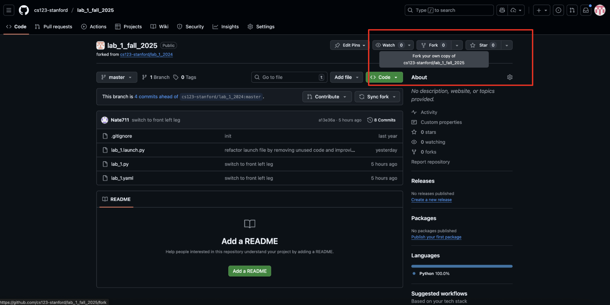
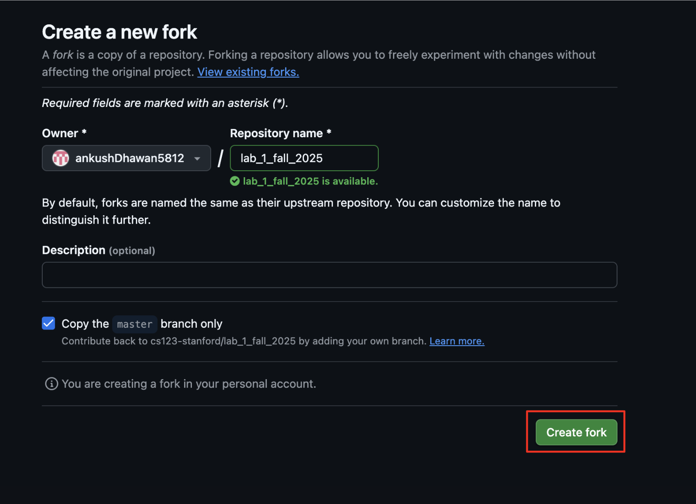
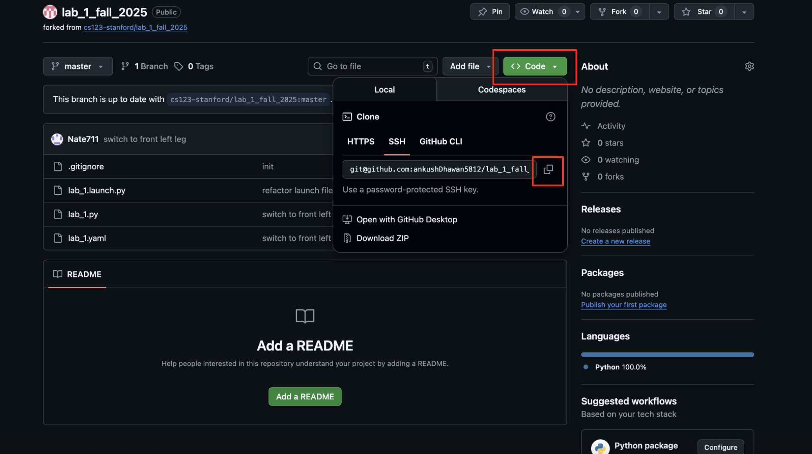
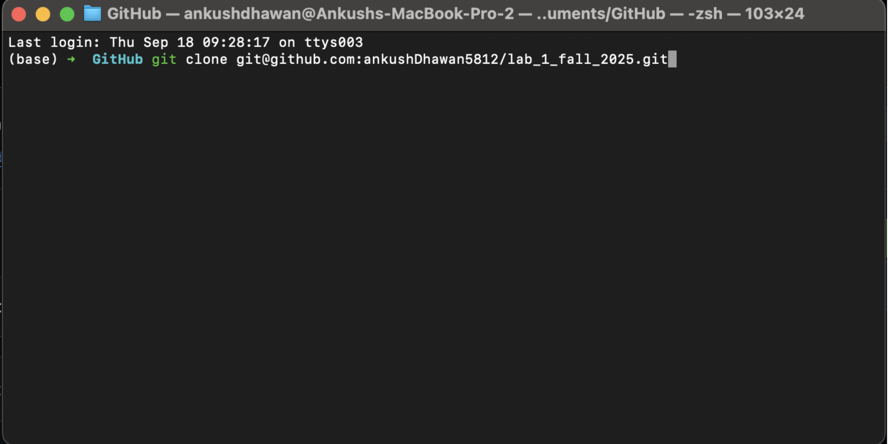

🍴 Forking Repositories Guide
=============================

.. note::
   **What is Forking?** 🎯
   
   Forking a repository is essentially creating a copy of someone else's GitHub repository on your own personal GitHub account, where you can then make all the changes you want! In our case, we provide you with starter code in these repositories, which you will then fill in to complete the lab assignments.

.. warning::
   **Prerequisites** ⚠️
   
   Before you begin, you **must** have already set up your SSH keys as described in the `GitHub SSH Setup Guide <https://docs.github.com/en/authentication/connecting-to-github-with-ssh/generating-a-new-ssh-key-and-adding-it-to-the-ssh-agent?platform=linux>`_.

.. raw:: html

   

   <h3 style="color: white; margin-top: 0;">🚀 Let's Get Started!</h3>
   
Follow these 4 simple steps to fork your first repository and start coding!

   

Step 1: 🍴 Fork the Repository
------------------------------

.. raw:: html

   

   <strong>📋 Instructions:</strong>
   <ol style="margin: 10px 0;">
   <li>Open the URL for the GitHub Repository in your browser (the URL should be in the lab instructions)</li>
   <li>Look for the <strong>Fork</strong> button at the top right of the repository page</li>
   <li>Click the fork icon to create your own copy</li>
   </ol>
   

Step 2: ⚙️ Configure Your Fork
------------------------------

.. raw:: html

   

   <strong>💡 Pro Tips:</strong>
   <ul style="margin: 10px 0;">
   <li>You may change the repository name if you'd like, but it's not necessary</li>
   <li><strong>Important:</strong> Make sure the Owner field shows your own GitHub account</li>
   <li>You can add a description if you want to keep track of what this fork is for</li>
   </ul>
   

Step 3: 🔗 Get the Clone URL
----------------------------

.. raw:: html

   

   <strong>🎯 What to Look For:</strong>
   <ul style="margin: 10px 0;">
   <li>You should be redirected to your forked repository page</li>
   <li>Notice the reference to the original repository at the top left</li>
   <li>Click the green <strong>"Code"</strong> button</li>
   <li>Select <strong>"SSH"</strong> tab</li>
   <li>Click the copy icon to copy the SSH URL</li>
   </ul>
   

Step 4: 💻 Clone to Your Local Machine
--------------------------------------

.. raw:: html

   

   <strong>🖥️ Terminal Commands:</strong>
   
Open your terminal and run these commands:

   

.. code-block:: bash
   :emphasize-lines: 1,3

   git clone <paste-your-copied-ssh-url>
   cd <repository_name>
   code .

.. raw:: html

   

   <strong>📝 What Happens Next:</strong>
   <ul style="margin: 10px 0;">
   <li>The repository will be downloaded to your local machine</li>
   <li>All your changes will automatically sync back to your forked repository</li>
   <li>VSCode will open with your project ready to code!</li>
   </ul>
   

.. raw:: html

   

   <h3 style="color: white; margin-top: 0;">🎉 Congratulations!</h3>
   
You have successfully learned to fork repositories! You'll use this procedure for completing all your lab assignments. Happy coding! 🚀

   

.. tip::
   **Next Steps** 💡
   
   - Start working on your lab assignment
   - Make commits as you progress: ``git add .`` → ``git commit -m "Your message"`` → ``git push``
   - Submit your work when complete!
