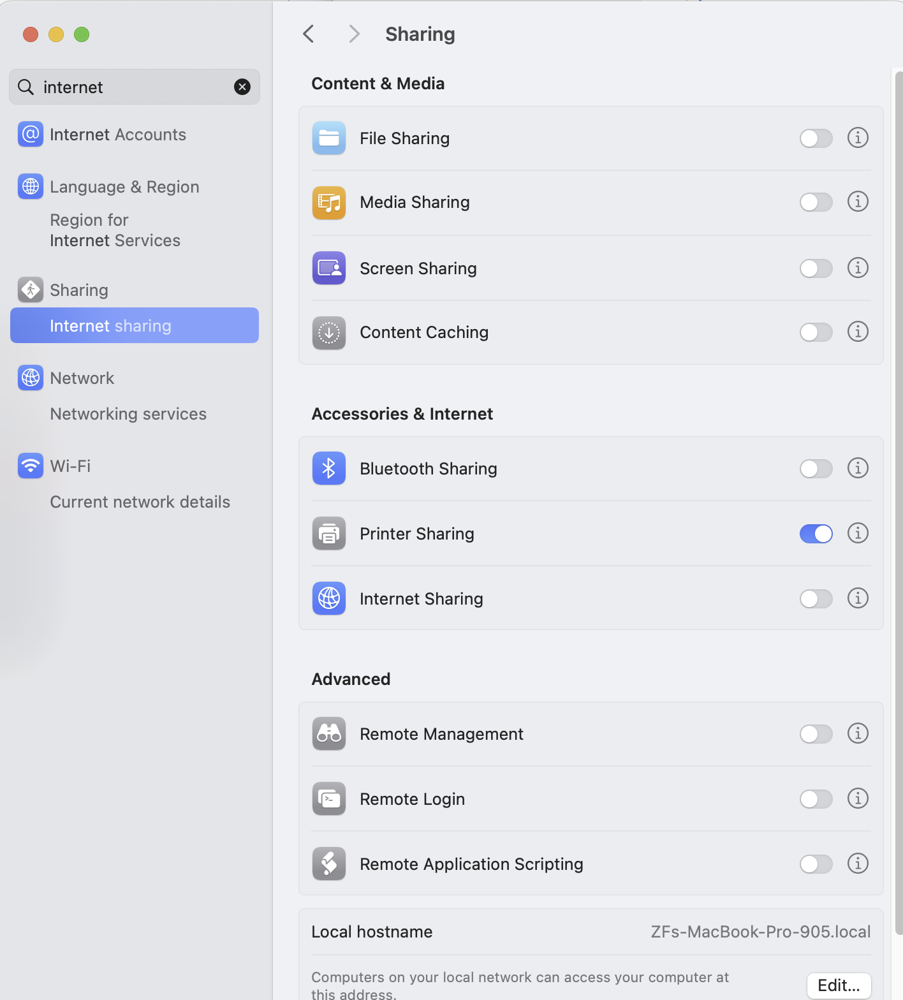

Lab 1: ROS Introduction and PD Control
======================================

Goal
----
Get set up with the Raspberry Pi 5 hardware and build a robot that you can program PD control on using ROS2.

Shared Resources with your Group mates
---------------------------------------
To better organize all the weekly lab materials, create a Google Drive folder to share with your groupmates. 

Lab Document
------------
Fill out this lab document (https://docs.google.com/document/d/1FZ3WAwX1zRO5ivQpqraeYcaJwmDZFZVPRNCVBTsuZrw/edit?usp=sharing) with your answers to the questions and your code. You will submit this document to Gradescope.

Part 0: Setup
-------------

1. For this class, you will be doing all your coding and development on Raspberry Pi 5s, a minimalistic quad-core single-board computer often used in lightweight robotics projects. The Raspberry Pi will serve as the brain for our Pupper robot, communicating with the electronics board, motor drivers, and camera among other functions.

2. You should receive the following from the TAs:

   - Pupper robot: containing Raspberry Pi 5, pre-flashed USB drive, and other components
   - Ethernet cable
   - HDMI cable
   - Monitor, keyboard, and mouse setup

3. Connect to the Raspberry Pi

4. Follow along the assembly instructions to build the robot body with motor dials: 

.. raw:: html

        <a href="https://docs.google.com/presentation/d/1ybz-m6Xk-nR6OFQyP0X7pHQipVa2lH8aqp8fa5Zu2Kw/edit?usp=sharing" target="_blank" style="font-size: 1.2em; font-weight: bold; color: #E53E3E; background-color: #FED7D7; padding: 10px 15px; border-radius: 5px; text-decoration: none; display: inline-block; margin: 10px 0;">📝 Open build instructions in new tab 📝</a>

    
.. raw:: html

       <iframe src="https://docs.google.com/presentation/d/e/2PACX-1vT-untWBUKveG9a8hIGxY4dZnkajODhnuP6juyWcETcsVZ6lx1Ob8acVXTcirVsqF7S5w5ttSK95d0J/pubembed?start=false&loop=false&delayms=60000" frameborder="0" width="960" height="569" allowfullscreen="true" mozallowfullscreen="true" webkitallowfullscreen="true"></iframe>
    

Your USB should come pre-flashed with the operating system. The Raspberry Pi will boot from the memory on this drive. When you power on the Raspberry Pi, it will automatically boot from this card. Ask a TAs if you have any issues.

Option 1: Connect via SSH (Recommended)
^^^^^^^^^^^^^^^^^^^^^^^^^^^^^^^^^^^^^^^^
Secure Shell (SSH) is a protocol that will allow you to connect to the Raspberry Pi remotely from your laptop's terminal or VSCode. Within a SSH session, you can run commands on the Raspberry Pi as if it was your own computer.
(You're probably very familiar with SSH if you've taken CS107, 111, or have worked with the SAIL cluster.)

Part 1: SSH to Raspberry Pi in Terminal

   - Connect your laptop to the Pupper robot using the Ethernet cable.
   - Enable internet sharing in system settings (turn on anything that looks like Ethernet).
   - Alternatively, SSH should work without the ethernet cable, as long as both your laptop and the Raspberry Pi are on the same network.
   - SSH into the Raspberry Pi through terminal: ``ssh pi-[YOUR_GROUP_NUMBER]@pupper.local`` (password: rhea123). 
   - If successful, your terminal prompt should now say `pi@pupper.local` 
   - Friendly reminder: you can **SSH multiple times** to the Raspberry Pi from multiple Terminal windows to run multiple commands at once.

Part 2: SSH to Raspberry Pi in VSCode
   - Download VSCode if you haven't already: https://code.visualstudio.com/
   - Install the "Remote - SSH" extension
   - Connect to the Raspberry Pi by opening the Command Palette with CMD+SHIFT_P, then selecting Remote-SSH: Connect to Host -> ssh
   - Enter the SSH command: ``ssh pi-[YOUR_GROUP_NUMBER]@pupper.local`` (password: rhea123)
   - You should now be connected to the Raspberry Pi through VSCode! You can open folders, edit files, and run terminal commands all from within VSCode.
   - This is the recommended way to work on your code for this class.
   - We recommend installing the Python extension in VSCode for better Python support.

   Enable internet sharing in system settings.

Option 2: Connect via the Monitor Setup (Use only if SSH is not possible)
^^^^^^^^^^^^^^^^^^^^^^^^^^^^^^^^^^^^^^^^^^^^^^^^^^^^^^^^^^^^^^^^^^^^^^^^^^
   - Connect the Raspberry Pi to the monitor using the HDMI - HDMI micro cable.
   - (Note: The HDMI micro cable and the micro HDMI port on Raspberry Pi are **very easy to break**. Breaking the HDMI port means that you will need to change the entire Raspberry Pi on your Pupper, which is a lot of work. So be careful when plugging in the HDMI cable.)
   - Connect the keyboard and mouse to the Raspberry Pi via USB.
   - Log in with the username ``pi`` and password ``rhea123`` after powering on.
   - Connect to the Stanford Guest WiFi network (the regular Stanford network might not work on Pupper).
   - Install firefox: ``sudo snap install firefox``, or any other browsers of your choice, and open the course website: cs123-stanford.readthedocs.io, so you can copy and paste the commands from the lab document into Pupper's terminal. To **copy and paste** in the Ubuntu terminal, use ``Ctrl+Shift+C`` to copy and ``Ctrl+Shift+V`` to paste.

Part 1: ROS2 Introduction
----------------------------

1. We'll be using ROS2 (Robot Operating System) throughout this course. ROS2 provides tools, libraries, and conventions that facilitate building robotic applications and allow different parts of the robot to interact with each other.

2. Familiarize yourself with the basics of ROS by reviewing the ROS introduction guide (https://wiki.ros.org/ROS/Introduction). Keep this guide handy as a ROS2 cheat sheet (https://github.com/ubuntu-robotics/ros2_cheats_sheet/tree/master) that you can refer to throughout the course. We also have a list of important ROS2 commands for this course here: https://cs123-stanford-2024.readthedocs.io/en/latest/schedule/lectures/fall-24/ros_intro.html.

3. ROS services in Pupper: robot.service manages control code (face controller, rl or heuristic controller, etc). See if controller is running: ``systemctl status robot.service`` You should see the status as "active (running)". Checkout all topics and services: ``ros2 topic list`` and ``ros2 service list``.

4. Since we are running custom code, we must disable the robot service before working on your code. This will prevent the robot from running any pre-existing code that may interfere with your work. Make sure to place Pupper on the stand during this process. To disable the robot service, run the following commands:

Note: Robot Service should already be disabled for fall 2025's setup. So you can skip this step and proceed to Part 2.

.. code-block:: bash

   sudo systemctl disable robot.service
   sudo reboot

1. Troubleshooting. If you encounter any issues, try the following:

  - If you see "ros_2 not found", run ``source ~/.bashrc`` again

Part 2: Hello PD
----------------

Step 1: Setup Lab 1 Code Base
^^^^^^^^^^^^^^^^^^^^^^^^^^^^^

1. Open the lab 1 code repository (`https://github.com/cs123-stanford/lab_1_fall_2025 <https://github.com/cs123-stanford/lab_1_fall_2025>`_) on your GitHub account. Then, fork the repository to your own GitHub account following the instructions in :doc:`forking_repositories`.

2. Open the lab 1 folder in VSCode

   .. code-block:: bash

      cd ~/lab_1_fall_2025
      code .

3. Examine ``<lab_1_fall_2025/lab_1.py>`` to understand where the motor angle and velocity are read and where the motor is commanded.

   Note: In ROS2 code, pay attention to publishers and subscribers defined in the ``__init__`` section of the node definition. Publishers send messages to topics, while subscribers listen to messages on topics. Callback functions run when new information is published to a topic.

**DELIVERABLE:** Before running your code, explain in your lab document what you understand about the publishers and subscribers. What gets sent and received on each message publish? How does this correspond to what is physically commanded in the motor?

Step 2: Run ROS Launch Code
^^^^^^^^^^^^^^^^^^^^^^^^^^^

1. Check the launch description in ``lab_1.launch.py`` and ``lab_1.yaml``. Familiarize yourself with the structure and parameters defined in these files.

2. Run the launch file using the following command:

   .. code-block:: bash

      ros2 launch lab_1.launch.py

   This command will start all the necessary nodes for your PD control experiment.

.. warning::
    When you run the launch file, Pupper is trying to calibrate its legs, and so the motor dial will spin for a bit before the software determines that the mechanical calibration stops have been hit. Since we do not have the full legs attached just yet, the motor dial will spin for some time before stopping. Let this process complete (dials stop spinning) before running the code you implement.

3. After running the launch file, you should see output in your terminal indicating that the nodes have been started successfully. If you encounter any errors, double-check your file paths and make sure all dependencies are installed.

4. Open a new terminal window (if using SSH, you can open multiple connections to your Raspberry Pi, or add a terminal from VSCode) and run the following command to see the list of active topics:

   .. code-block:: bash

      ros2 topic list

   You should see topics related to joint states and commands. These are the topics your node will be publishing to and subscribing from.

5. To inspect the data being published on a specific topic, you can use the `ros2 topic echo` command. For example:

   .. code-block:: bash

      ros2 topic echo /joint_states

   This will show you real-time data about the joint states of your robot leg. 

**DELIVERABLE:** In your lab document, provide screenshots of:

1. The terminal output after running the launch file, showing successful node startup.
2. The list of active topics you observed.
3. A sample of the joint states data you saw when using the `ros2 topic echo` command.

Also, answer the following questions:

1. What nodes are being launched by your `lab_1.launch.py` file?
2. What parameters are being set in the `lab_1.yaml` file, and what do you think they control?
3. Based on the topics you observed, how do you think the different parts of your robot control system are communicating with each other?

Remember, understanding how the launch system works and how to inspect your ROS2 system is crucial for debugging and developing more complex robotic systems in the future.

Step 3. Run bang-bang control
^^^^^^^^^^^^^^^^^^^^^^^^^^^^^^

1. Open ``lab_1.py`` and locate the ``control_loop()`` implementation. For this step, you will implement Bang-bang control before PD control. Remember that bang-bang control is a simple control strategy where the control input is either on or off. In this case, the control input is either positive maximum torque or negative maximum torque. The control input switches when the motor angle crosses a threshold.

2. This can be accomplished by a block of if statements. Implement bang-bang control in the `lab_1.py` file by implementing the ``get_target_joint_info(self)`` and ``calculate_torque(self, joint_pos, joint_vel, target_joint_pos, target_joint_vel)`` functions. Run your code by starting a new terminal, navigating to the lab folder, and running ``python lab_1.py``

**DELIVERABLE:** Take a video of your bang bang control, upload the video to your Google Drive Folder, and include the video link in your lab document with your submission

Step 4: Implement P Control
^^^^^^^^^^^^^^^^^^^^^^^^^^^^
1. Implement P control in the `lab_1.py` file by replacing your implementation of bang-bang control. The P controller is more robust than bang-bang control. The proportional gain (Kp) is used to tune the controller. For reference, all the joint states published by ros2 systems are typically in radians.

2. Start with Kp = 2.0

   .. figure:: ../../../_static/p_control.jpg
    :align: center

    P Control Equation. 

Step 5: Implement PD Control
^^^^^^^^^^^^^^^^^^^^^^^^^^^^

1. Implement PD control in the `lab_1.py` file by replacing your implementation of P control. The PD controller is more robust than only P control, and is common control strategy used in robotics to stabilize systems (both Pupper and Toddy use PD controllers!). The proportional gain (Kp) and derivative gain (Kd) are used to tune the controller.

2. Start with Kp = 2.0 and Kd = 0.3. Implement the PD control law using the following update equation:

   .. figure:: ../../../_static/pid_eqn.jpg
    :align: center

    PID Control Equation. 

   Where:
   
   - :math:`\tau` is the commanded torque for the motor
   - :math:`\theta_{target}` is the target angle
   - :math:`\omega_{target}` is the target angular velocity (usually 0)
   - :math:`\theta_{current}` is the current motor angle
   - :math:`\omega_{current}` is the current motor angular velocity
   - :math:`K_p` and :math:`K_d` are the proportional and derivative gains
   - :math:`r(t)` known as a feedforward_term, is a constant term that you can use to send a constant torque to the motor. For us, we just use 0.

3. Run your code ``python lab_1.py`` and observe the behavior of the PD controller.

**DELIVERABLE:** Answer the following questions in your lab document:

- How does the leg respond to manual movements?
- What happens when you change Kp and Kd values?
- Find and report the optimal Kp and Kd values for your setup.

Step 6: Experiment with Different Parameters
^^^^^^^^^^^^^^^^^^^^^^^^^^^^^^^^^^^^^^^^^^^^

Experiment with different Kp and Kd values and observe the effects. Be prepared for potential instability!

For each situation, manually rotate the leg to get a physical sense of the PD behavior. Report your findings in your lab document.

1. Vary Kp while keeping Kd constant (0.1). Try Kp values from 0.5 to 5.0.
2. Vary Kd while keeping Kp constant (2.0). Try Kd values from 0.1 to 1.0.

**DELIVERABLE:** Report your findings for each experiment in your lab document.

Step 7: Experiment with Delays in the System
^^^^^^^^^^^^^^^^^^^^^^^^^^^^^^^^^^^^^^^^^^^^

1. Introduce a delay in the system by adding a buffer in the current motor angle and velocity readings. This simulates the delay in the physical system.
2. Experiment with different delay values (e.g., several steps of delay).

   .. code-block:: python
    
      from collections import deque

      # In your initialization:
      self.delay_buffer_size = int(delay_seconds * control_frequency)
      self.angle_buffer = deque(maxlen=self.delay_buffer_size)
      self.velocity_buffer = deque(maxlen=self.delay_buffer_size)

      # In your control loop:
      self.angle_buffer.append(joint_pos)
      self.velocity_buffer.append(joint_vel)
      joint_pos = self.angle_buffer[0]
      joint_vel = self.velocity_buffer[0]

      #####
      # You can also instead delay the output torque
      #####

**DELIVERABLE:** Report your findings in your lab document. How does the delay affect the performance of the PD controller?

Step 8: Implement Periodic Motion
^^^^^^^^^^^^^^^^^^^^^^^^^^^^^^^^^

1. Program the leg to track a sinusoidal (smooth and continuous back and forth motion) position:

   .. code-block:: python

      import time
      import math

      current_time = time.time()
      joint_pos_desired = math.sin(current_time)

2. Experiment with different frequencies of the sine wave.

**DELIVERABLE:** Take a video of the leg performing periodic motion and include it in your lab document with your submission.

Additional Notes
----------------
- ROS2 Workspace:

  - All robot-relevant code is in ``ros2_ws``
  - Key packages:

    - Neural controller (policy support)
    - Hardware interface (motor control)
    - Pupper feelings (face control)
    - Pupper descriptions (URDF files)

- Motor Control:

  - Refer to the control node and joy node
  - URDF is the source of truth for CAN IDs
  - Joint states topic provides current motor states

Congratulations on completing your first lab! All the ROS code may look a bit overwhelming, but you will definitely get more comfortable with it in a few weeks, especially after you see what Pupper can do! This hands-on experience with ROS2 and PD control on a real robot will serve as a foundation for the more advanced topics we'll cover in future labs.
