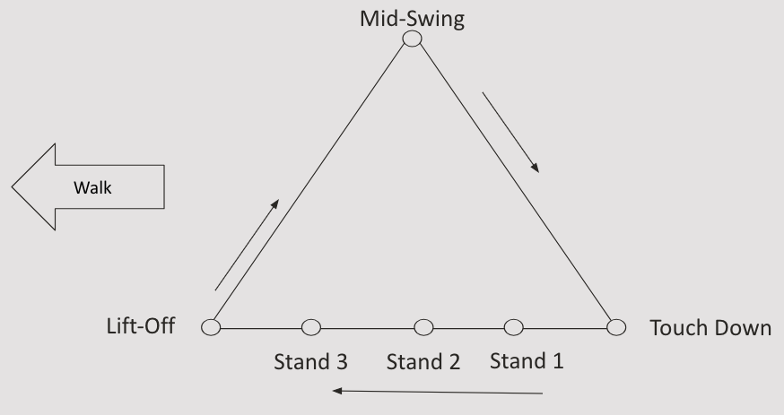

Lab 4: Model-Based Control and Trotting Gait Implementation
===========================================================

Goal
----
Implement a trotting gait for a quadruped robot to move forward using inverse kinematics and trajectory tracking with ROS2.
`Lab Slides <https://docs.google.com/presentation/d/1KhDySk7tXiDoaovGN39XFggkJt5WCZ5Ue0DzZhLcDKU/edit?usp=sharing>`_

Please fill out the `lab document <https://docs.google.com/document/d/1_ZpwR8OAQS39QISJryON0GBG1AbQ2RqVT3LJr9OzBZ8/edit?usp=sharing>`_

.. raw:: html

    

        <iframe src="https://youtu.be/LJGhFBVWEz4" frameborder="0" allowfullscreen style="position: absolute; top: 0; left: 0; width: 100%; height: 100%;"></iframe>
    

Part 0: Setup
-------------

1. Open the lab 4 code repository (`lab 4 code repository <https://github.com/cs123-stanford/lab_4_fall_2025>`_) on your GitHub account. Then, fork the repository to your own GitHub account following the instructions in :doc:`forking_repositories`.

2. Clone the forked repository to your Raspberry Pi:

   .. code-block:: bash

      cd ~/
      git clone https://github.com/YOUR_USERNAME/lab_4_fall_2025.git

   Note: Replace ``YOUR_USERNAME`` with your actual GitHub username.

3. Open the lab 4 folder in VSCode

   .. code-block:: bash

      cd ~/lab_4_fall_2025
      code .

Part 1: Review Previous Implementations
---------------------------------------

1. Open ``lab_4.py`` and locate the following methods:

   - ``forward_kinematics``
   - ``inverse_kinematics_single_leg``

2. Review the code in these methods, which should be completed from previous labs (some notations may be slightly different).

Part 2: Implement Forward Kinematics for All Legs
-------------------------------------------------

1. Locate the following methods in the ``InverseKinematics`` class:

   - ``fl_leg_fk``
   - ``br_leg_fk``
   - ``bl_leg_fk``

**TODO 1:** Implement forward kinematics for the front left, back right, and back left legs.

- Use the provided ``fr_leg_fk`` method, along with the diagrams from lab 2 as a reference.
- Adjust the transformations to account for the different leg positions and orientations. (*Hint:* You essentially need to do an equivalent FK on each of the other legs)

**DELIVERABLE:** You might notice that the ``fr_leg_fk`` method pre-implemented in ``lab_4.py`` looks different than your implementation from lab 3. Are they functionally different? If so, why do we need to make these changes here? If not, how are they empirically the same?

**DELIVERABLE:** An underactuated system that has more degrees of freedom that can be controlled, than the number of independently controlled actuators. How many degrees of freedom does Pupper have? Is it an underactuated system?

**DELIVERABLE:** Why are under-actuated systems more challenging to control?

Part 3: Implement Trotting Gait Trajectory
------------------------------------------

1. Find the ``__init__`` method in the ``InverseKinematics`` class.

**TODO 2:** Implement the trotting gait trajectory.

- Define the positions for each leg's trajectory in the trotting gait.
- Set the appropriate values for ``rf_ee_triangle_positions``, ``lf_ee_triangle_positions``, ``rb_ee_triangle_positions``, and ``lb_ee_triangle_positions``.
- Tip: Think about why we are giving you six reference positions for each leg, instead of just three as in lab 3.
- Ensure that the trajectories create a trotting motion when combined.

This image describes the reference positions for each leg.

    Reference positions for each leg.

**DELIVERABLE:** You have implemented trotting. What are some other gaits that Pupper could exhibit, and why/when would they be useful? List 3 alternative gaits.

**DELIVERABLE:** What are some potential setbacks that may prevent Pupper from exhibiting these gaits you listed above?

Part 4: Implement Trajectory Interpolation
------------------------------------------

1. Locate the ``interpolate_triangle`` method in the ``InverseKinematics`` class.

**TODO 3:** Implement interpolation for all 4 legs.

- Use the provided ``ee_triangle_positions`` for each leg.
- Implement linear interpolation between the trajectory points based on the input time ``t``. (*Hint:* As you probably have experiened in lab 3, we suggest writing a custom weighted sum function to perform interpolation, rather than calling ``np.interp``)
- Ensure the trajectory loops smoothly for each leg.

Part 5: Run and Test Your Implementation
----------------------------------------

1. Run the launch file using the following command:

   .. code-block:: bash

      cd ~/lab_4
      ros2 launch lab_4.launch.py

2. Observe the robot's movement and the terminal output.

3. Verify that the robot is performing a trotting gait.

**DELIVERABLE:** Take a video of the robot performing the trotting gait and submit it with your submission. This can be taken with Pupper on the stand.

**DELIVERABLE:** The controller implemented is a "heuristic" controller. That means it follows a pre-programmed trajectory, and doesn't use online (real-time) sensor feedback outside the motor to optimize its trajectory. What are some potential pitfalls of this approach? How will Pupper react if you push it?

**DELIVERABLE:** Many commercial quadrupeds once used model-based controllers that solve an optimization problem online (they all shift to reinforcement learning-based controllers now for locomotion). Why would it be challenging to deploy MBC/MPC on Pupper, which has a lower cost hardware and runs computation on a Raspberry Pi 5?

Part 6: Analyze and Improve Performance
---------------------------------------

1. Experiment with different trajectory shapes for each leg to optimize the trotting gait.

2. Adjust the ``ik_timer_period`` to find the best balance between performance and computational load.

3. As described in lecture, the center of mass of the robot influences how the robot can walk, whether forward or backward. Play around with the offset values in the ``ee_positions``, and see how that affects performance. 

**DELIVERABLE:** Implement two gaits for Pupper. Make Pupper walk fast, and walk slow. Include videos of Pupper walking fast and walking slow with your submission to Gradescope

**DELIVERABLE:** In your lab document, report on:

- The effects of different trajectory shapes on the trotting gait
- How timer periods affect the system's performance
- How does the center of mass affect performance?

Part 7: Make Pupper Even Faster, and Race!
------------------------------------------

1. Think about ways you can make Pupper walk/run even faster (you can change the timer frequencies, stride lengths, end-effector positions, etc to make Pupper even faster). *HINT* The positions defined after the ``init()`` function in the InverseKinematics class, define each of the stances. 

**DELIVERABLE:** Report on what you tried to make Pupper go faster. What worked and what didn't? 

2. Time your Pupper's speed to go 10 feet (marked by the tape measure) and race against other groups! *The fastest group will get a prize!*

**DELIVERABLE:** Take a video of you timing Pupper completing the course, and report the fastest time you were able to make Pupper go!

3. The positions defined after the ``init()`` function in the InverseKinematics class, define each of the stances. Play around with these values and you can discover some new gaits!

Additional Notes
----------------

- The ``cache_target_joint_positions`` method pre-calculates joint positions for a full gait cycle. Understand how this affects the system's performance.
- Pay attention to the coordinate transformations for each leg, as they are crucial for correct movement.

Congratulations on completing Lab 4! This experience with implementing a trotting gait will be valuable for more advanced quadruped control in future projects. While this lab is relatively simple, get prepared for what's coming in lab 5!
