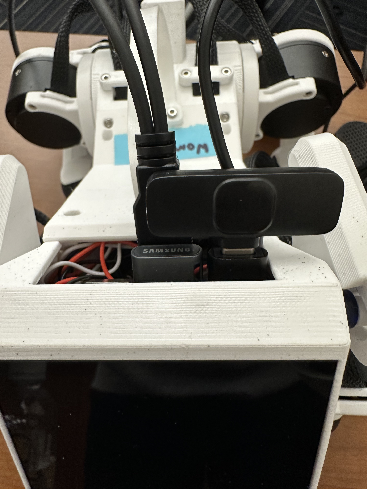

Lab 6: Do What I Say
=============================================

*Goal: Explore how we can use LLMs and speech recognition to control Pupper to do a variety of tasks!*

For this lab, we are going to implement a speech recognition pipeline to command Pupper with voice/speech input. To do so, we will hone ROS implementation skills to add various capabilities to Pupper, which will also be helpful for your final project. If anything is not working as expected or you have any questions, please ask a TA.

As you complete this lab, please fill out the `lab document <https://docs.google.com/document/d/1dU70gedHd83s3HA9g-nIzRdMnL8tlony3w4H7Th0NOA/edit?usp=sharing>`_.

.. raw:: html

    

        <iframe src="https://www.youtube.com/embed/utDWVykqi8w" frameborder="0" allowfullscreen style="position: absolute; top: 0; left: 0; width: 100%; height: 100%;"></iframe>
    

Step 1. Getting Started
^^^^^^^^^^^^^^^^^^^^^^^^^^^^^^^^^^^^^^^^^^^^^

1. In this lab, we will be using the microphone on Pupper to record your voice input. Plug in the microphone transmitter into the Raspberry Pi, as shown in the image below.

    Microphone transmitter inserted into the Raspberry Pi.

2. Turn on the Pupper, and install the related python packages

   .. code-block:: bash

      pip install pygame
      pip install simpleaudio
      pip install openai==1.54.3 websockets==13.1
      pip install openai-whisper
      pip install sounddevice
      pip install pyttsx3

Next, install the following package with a sudo apt install

   .. code-block:: bash

      sudo apt-get install espeak

3. Open the **new** lab 6 code repository (`lab 6 code repository <https://github.com/cs123-stanford/lab_6_fall_2025>`_) on your GitHub account. Then, fork the repository to your own GitHub account following the instructions in :doc:`forking_repositories`.

**Note:** The lab 6 code repository is **new** and significantly different from the version previously released in class. Please make sure to fork this updated repository and begin your lab from there. While your earlier in-class implementation will help you get started, you should treat this as a fresh project. To help compensate for the confusion from class (sorry for that!), the workload for this lab has also been made lighter.

4. Clone the forked repository to your Raspberry Pi:

   .. code-block:: bash

      cd ~/
      git clone https://github.com/YOUR_USERNAME/lab_6_fall_2025.git

   Note: Replace ``YOUR_USERNAME`` with your actual GitHub username.

5. Open the lab 6 folder in VSCode

   .. code-block:: bash

      cd ~/lab_6_fall_2025
      code .

Step 2. Use the Karel Pupper API
^^^^^^^^^^^^^^^^^^^^^^^^^^^^^^^^

1. For much of this lab, we will be using the KarelPupper API, which many of you remember "fondly" from CS106A's Karel the Robot as a programming introduction. Trust me, this isn't nearly that bad on Pupper ;). Much like in CS106A, we use the KarelPupper API to do basic commands to control Pupper. In our case, using this API abstracts away the minute motor control commands and makes code much more readable for something like an LLM. The following exercises will help you get familiar with the API, which is something that many students build on top of for their final projects.

.. figure:: ../../../_static/karel_pupper.png
    :align: center

    Pupper in the Karel Environment.

2. Open `karel.py` in the `~/lab_6_fall_2025/pupper_llm/karel/` directory. You'll notice that we have implemented `wiggle`, `bark`, and `stop` methods for you, but several movement methods need to be completed. Based on the existing implementations and the TODO comments in the code, implement the following methods:

   - `move_forward()` - Make Pupper move forward safely
   - `move_backward()` - Make Pupper move backward (be careful with speed!)
   - `move_left()` - Make Pupper strafe to the left
   - `move_right()` - Make Pupper strafe to the right  
   - `turn_left()` - Make Pupper rotate left in place
   - `turn_right()` - Make Pupper rotate right in place
   - `bob()` - Make Pupper bob back and forth (bonus: with sound!)
   - `dance()` - Create your own awesome dance sequence using the other methods!

   **Hint:** Look at the existing `wiggle()` method to understand how to use `Twist` messages and the `move()` helper function. Pay attention to the coordinate system: `linear.x` is forward/backward, `linear.y` is left/right, and `angular.z` is rotation.

3. Experiment with the KarelPupper API by running the `karel_test.py` script. Take a look at the script, and see if you can understand what Pupper should do before you run the script, and then run the script to validate your thoughts. In a first terminal, run

   .. code-block:: bash

      cd ~/lab_6_fall_2025/launch
      ros2 launch launch.py

In a second terminal, run the commands
   .. code-block:: bash

      cd ~/lab_6_fall_2025/pupper_llm/karel
      python3 karel_test.py

The current implementation of the `karel_test.py` script will create a `KarelPupper` object and sequentially command it to:
1. Wiggle,
2. Bob back and forth,
3. Perform a dance sequence,
4. Bark,
5. Stop (come to rest).

Each of these actions triggers the corresponding method in your `karel.py` file, allowing you to visually observe Pupper perform each defined movement in order.

**DELIVERABLE:** Take a video of Pupper performing the entire test sequence. Upload to Gradescope with your submission.

Step 3. API Key Setup
^^^^^^^^^^^^^^^^^^^^^

Refer to the Canvas/Ed announcements for the OpenAI API key. Then, in your terminal, run the following command:

.. code-block:: bash

    cd ~/lab_6_fall_2025/pupper_llm
    python3 setup_api_keys.py

This script will prompt you to paste your OpenAI API key (select option 1), and securely store it on your system for use by the other scripts. This approach helps you avoid accidentally committing API keys to GitHub and simplifies key management.

(**Note**: Never share your API key with anyone online! There are bad people out there who will try to use your key for malicious purposes.)

Step 4. Implement OpenAI Realtime API Voice Interaction
^^^^^^^^^^^^^^^^^^^^^^^^^^^^^^^^^^^^^^^^^^^^^^^^^^^^^^^

1. We're now using OpenAI's cutting-edge Realtime API, which provides ultra-low latency voice interaction by combining speech recognition, language processing, and text-to-speech in a single WebSocket-based API. This replaces the traditional Whisper → GPT → TTS pipeline with a unified system that's much faster and more responsive!

2. Open the file `realtime_voice.py` in `~/lab_6_fall_2025/pupper_llm/`. This script handles the real-time voice interaction with Pupper using the Realtime API.

3. **Your main task**: Implement the system prompt in the `self.system_prompt` variable (around line 65). This is critical for controlling how the AI responds to voice commands and formats its output for Pupper's command parser.

   Your prompt should:
   - Be approximately 50 lines long
   - Explain the **critical output format** that the command parser expects
   - Include the required action phrases (like "move_forward", "turn_left", "wiggle", etc.)
   - Provide concrete examples of proper command formatting
   - Ensure outputs are line-by-line with correct phrasing

   **Hint:** Look at the Karel API methods you implemented in Step 2 to understand what commands are available.

4. **Note on implementation**: The event handling code (lines that process different event types like `response.audio.delta`, `conversation.item.created`, etc.) has been implemented for you to account for the complexity of this lab's first release. In future iterations, students will need to implement these event handlers themselves to fully understand the conversation flow.

5. Plug in the USB speaker to the Pi. Check that your microphone transmitter has a constant green light indicating it's working properly. If the light is not constant green, try turning the microphone off and on again.

6. Test your implementation. Run the realtime voice script (you do not need to run the launch file for this part):

   .. code-block:: bash

      cd ~/lab_6_fall_2025/pupper_llm
      python3 realtime_voice.py

You should now be able to speak into the microphone and receive ultra-low latency responses from the AI, which is "fit" to your system prompt! The system will automatically handle voice activity detection, audio streaming, and response playback.

**Note:** The OpenAI Realtime API speaks its model output nearly verbatim, so whatever the model generates is also directly spoken aloud. While this behavior can make command parsing more difficult (or natural conversation more awkward), carefully crafting your prompts and designing robust command parsing will help manage this and improve interaction quality.

**DELIVERABLE:** While you do not need to implement any feedback loop in the realtime voice script, understanding some of the underlying engineering details of the interactive voice implementation is crucial. Inspect carefully on the `realtime_voice.py` file, and point out at least 2 things that you find interesting and/or counterintuitive, and explain why they might be crucial to the interaction quality.
**DELIVERABLE:** Record a video of you speaking with Pupper via the realtime voice script. Upload to Gradescope with your submission.

Step 5. Implement Command Parsing and Robot Control
^^^^^^^^^^^^^^^^^^^^^^^^^^^^^^^^^^^^^^^^^^^^^^^^^^^

1. Now we need to connect the Realtime API responses to actual robot commands. Open the file `karel_realtime_commander.py` in `~/lab_6_fall_2025/pupper_llm/karel/`. This script receives responses from the Realtime API and translates them into robot actions.

2. **Your main tasks**: You need to implement three key functions with TODO comments:

   **TODO 1: Parse commands from response text (in `response_callback`)**
   - Split the response string into lines using `\n` as separator (assuming you prompt the model to output the commands in a multi-line format, which you probably should 😉)
   - For each non-blank line, call `self.extract_commands_from_line(line.strip())`
   - Collect all commands in order and append to `all_commands` list
   - This ensures multi-line responses generate sequential actions

   **TODO 2: Extract commands from individual lines (in `extract_commands_from_line`)**
   - Parse robot commands from a single line of text
   - The parsing logic depends on how you formatted your system prompt in Step 4!
   - Map different phrasings (e.g., "move forward", "walk forward") to canonical commands (e.g., "move")
   - Return a list of action strings extracted from the line
   - Example: `"Move forward"` → `['move']` or `"<move, turn_left>"` → `['move', 'turn_left']`

   **TODO 3: Execute robot commands (in `execute_command`)**
   - Map canonical command names to KarelPupper API methods
   - One example is provided: `"move"/"go"/"forward"` → `self.pupper.move_forward()`
   - Add mappings for all other Karel API methods you implemented in Step 2
   - Use appropriate sleep times after each command:
     - Normal moves/turns: `await asyncio.sleep(0.5)`
     - Wiggle/bob actions: `await asyncio.sleep(5.5)`
     - Dance actions: `await asyncio.sleep(12.0)`

3. **Key design considerations**:
   - Your command parsing must match your system prompt format from Step 4
   - Commands are queued with timestamps and executed sequentially
   - Stale commands (>20 seconds old) are automatically discarded (already implemented for you)
   - The system handles multi-line responses and preserves command order (already implemented for you)

4. Test your complete pipeline. You'll need three terminals:

   **Terminal 1: Launch ROS2**
   
   .. code-block:: bash

      cd ~/lab_6_fall_2025/launch
      ros2 launch launch.py

   **Terminal 2: Start the command processor**
   
   .. code-block:: bash

      cd ~/lab_6_fall_2025/pupper_llm/karel
      python3 karel_realtime_commander.py

   **Terminal 3: Start the voice interface**
   
   .. code-block:: bash

      cd ~/lab_6_fall_2025/pupper_llm
      python3 realtime_voice.py

Now you can speak to Pupper and watch it execute your commands in real-time! The system will process your voice → generate commands → execute robot actions seamlessly.

Once you **finished debugging**, we provide a single script to run all three terminals at once, so that you can deploy the system in a single terminal:

.. code-block:: bash

   cd ~/lab_6_fall_2025
   bash run_realtime.sh

**DELIVERABLE:** Now that you have implemented the full voice command pipeline, comment on the shortcomings of using this method in a human-robot interaction environment. Do you have suggestions on how to improve these capabilities? Consider aspects like command reliability, user experience, and system robustness.

**DELIVERABLE:** Test your system with complex multi-step commands (e.g., "Move forward, turn left, then wiggle"). How well does your command parsing handle sequential actions? What challenges arise when chaining multiple commands together?

**DELIVERABLE:** Record a video demonstrating your complete voice-controlled robot system. Show Pupper responding to various voice commands including single actions, multi-step sequences, and different command phrasings. Upload to Gradescope with your submission.

**EXTRA CREDIT:** Implement error handling and recovery mechanisms in your command parser. For example, add support for "undo last command", "stop all actions", or "repeat that command". How would you modify the system prompt, realtime voice script, and parsing logic to support these meta-commands? (other than ctl+c, of course)

Congratulations on completing Lab 6! You've successfully implemented a cutting-edge voice-controlled robot system using OpenAI's Realtime API. You are welcomed to expand on the karel api to make Pupper do more complex actions, and build upon this for your final project!
