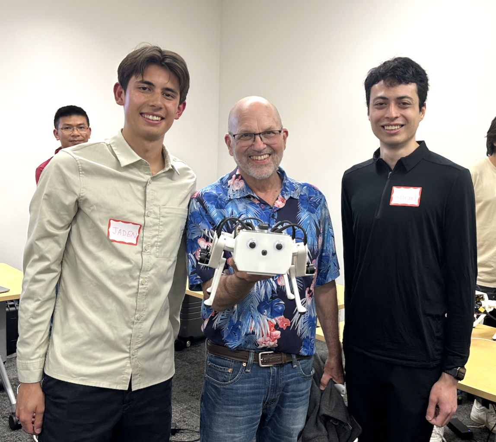
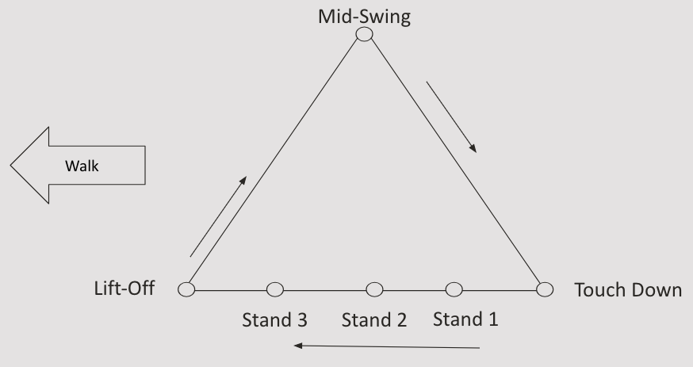

Lab 3: Inverse Kinematics and Heuristic Walking
================================================

Goal
----
Implement inverse kinematics for a robot leg, then use it to make Pupper walk with a
heuristic trotting gait. In Part 1 you get one leg tracking a triangular trajectory; in
Part 2 you extend that to all four legs and coordinate them into a gait. In the
extension you tune gaits live in the browser and bring what you find back into your own
code.

.. note::
   This lab combines what used to be two separate labs. Parts 1–3 get one leg tracking a
   trajectory; Parts 4–5 turn that into a walking gait. **Part 6 is an optional
   extension** — do it if you want to go deeper on gaits, and feel free to keep working
   on it after the deadline or fold it into your final project.

Lab Review Slides: `Inverse kinematics slides <https://docs.google.com/presentation/d/1NvK2dUOB0lqD47rk3x3e-lUMVMnwtgSr/edit#slide=id.g2f9b22e15a6_0_233>`_,
`heuristic gait slides <https://docs.google.com/presentation/d/1KhDySk7tXiDoaovGN39XFggkJt5WCZ5Ue0DzZhLcDKU/edit?usp=sharing>`_

.. TODO(staff): replace the two lab-document links below with the single merged
   lab document for this offering before releasing the lab.

Please also fill out the lab document: `Part 1 questions <https://docs.google.com/document/d/1X1UOZr6DPuhhVHxnpaHo7VfXr0YNnqKPDF-i4rvzxN8/edit?usp=sharing>`_,
`Part 2 questions <https://docs.google.com/document/d/1_ZpwR8OAQS39QISJryON0GBG1AbQ2RqVT3LJr9OzBZ8/edit?usp=sharing>`_

.. raw:: html

    

        <iframe src="https://www.youtube.com/embed/ygwWZw50yw0" frameborder="0" allowfullscreen style="position: absolute; top: 0; left: 0; width: 100%; height: 100%;"></iframe>
    

|

Part 0: Setup
-------------

1. Build the remaining legs for Pupper. Follow the build instructions to assemble the
   last legs, keeping note that all the pieces for each leg are correctly labeled (each
   right leg piece has an R on it, and each left leg piece has an L on it).

    .. raw:: html

        <a href="https://docs.google.com/presentation/d/1LWhURxF0z4iUYnUWLJexuQ4GSN4Q30BKO6-dLN8Wb0w/edit?usp=sharing" target="_blank" style="font-size: 1.2em; font-weight: bold; color: #E53E3E; background-color: #FED7D7; padding: 10px 15px; border-radius: 5px; text-decoration: none; display: inline-block; margin: 10px 0;">📝 Open build instructions in new tab 📝</a>

    .. raw:: html

       <iframe src="https://docs.google.com/presentation/d/e/2PACX-1vRHYkkOR1CYsA7x-u3RZAFrIjvhlZBjibNNWEvTePSsiXtnQ3fwN75Bu6I5iVGKe202sfwx_FWMzLbF/pubembed?start=false&loop=false&delayms=60000" frameborder="0" width="960" height="569" allowfullscreen="true" mozallowfullscreen="true" webkitallowfullscreen="true"></iframe>

2. Open the `lab code repository <https://github.com/cs123-stanford/ik_heuristic_walking_lab>`_
   on your GitHub account. Then fork the repository to your own GitHub account following
   the instructions in :doc:`forking_repositories`.

3. Clone your fork to your Raspberry Pi and open it in VSCode:

   .. code-block:: bash

      cd ~/
      git clone https://github.com/YOUR_USERNAME/ik_heuristic_walking_lab.git
      cd ~/ik_heuristic_walking_lab
      code .

   Note: Replace ``YOUR_USERNAME`` with your actual GitHub username.

4. Take a look around the repository:

   .. list-table::
      :header-rows: 1
      :widths: 35 65

      * - File
        - What it is
      * - ``part_1_ik.py``
        - Parts 1–3. One leg: FK, IK, and trajectory tracking.
      * - ``part_1.yaml``, ``part_1.launch.py``
        - Controller stack for Part 1. Commands 3 joints.
      * - ``part_2_walking.py``
        - Parts 4–5. Four legs: FK, trot keyframes, gait loop.
      * - ``part_2.yaml``, ``part_2.launch.py``
        - Controller stack for Part 2. Commands all 12 joints.
      * - ``extension/``
        - Part 6. Live gait tuning.

   The TODOs are numbered 1–13 and run in the same order as this handout.

.. warning::
   Only one program may drive the motors at a time. Stop ``part_1_ik.py`` before you
   start ``part_2_walking.py``, and stop both before you run the gait tuner in Part 6.
   Keep Pupper on its stand unless the handout says otherwise.

Part 1: Forward Kinematics on the Right Front Leg
--------------------------------------------------

1. Open ``part_1_ik.py`` and locate the ``forward_kinematics`` method in the
   ``InverseKinematics`` class.

2. In this lab we use the right front leg of Pupper. **TODO 1:** implement the
   ``forward_kinematics`` method for the right front leg. This should be very similar to
   your implementation of the front left leg from lab 2. You can refer to the
   `lab 2 slides <https://docs.google.com/presentation/d/1vwDEvQWVjKgC3QcV1UTe0rU-a5v4iTH6/edit?usp=sharing&ouid=116833000630199851799&rtpof=true&sd=true>`_
   for the FK transformations on the right leg.

Part 2: Implement Inverse Kinematics
------------------------------------

Find the ``inverse_kinematics`` method in the ``InverseKinematics`` class.

**TODO 2:** Implement the ``cost_function(theta)`` for inverse kinematics. This function
returns ``cost``, a scalar, and ``l1``, a vector of size 3.

- Use the ``forward_kinematics`` method to get the current end-effector position.
- Calculate the L1 distance between the current and target end-effector positions.
- Return the sum of squared L1 distances as the cost (AKA the squared L2 norm of the error vector).

**TODO 3:** Implement the ``gradient(theta, epsilon)`` function to calculate the
numerical gradient for inverse kinematics.

.. note::
   **Understanding Numerical Gradient Calculation**

   For numerical gradient calculation, we use the finite difference method to approximate the gradient of the cost function with respect to each joint angle. For a joint angle θᵢ, we calculate:

   .. math::

      \frac{\partial C}{\partial \theta_i} \approx \frac{C(\theta_i + \epsilon) - C(\theta_i - \epsilon)}{2\epsilon}

   where:

   - C(θ) is the cost function (squared L2 norm of end-effector position error)
   - ε is a small value (e.g., 1e-3)
   - θᵢ is the i-th joint angle

**TODO 4:** Implement the gradient descent algorithm for inverse kinematics.

- Define the learning rate, maximum number of iterations, and tolerance as hyperparameters. We recommend starting with a relatively large learning rate (e.g., 5), which is higher than what is typically used when training neural networks. Tolerance is measured in meters.
- Update the joint angles using the calculated gradient.
- Stop the iteration if the mean L1 distance is below the tolerance.
- Bonus: Implement a quasi-Newton's method for faster convergence. Check out the `BFGS method <https://en.wikipedia.org/wiki/BFGS_method>`_ if you're feeling ambitious. This method estimates the inverse Hessian matrix using the gradient and the previous iterations. (Part 6 will show you what this buys you.)

**DELIVERABLE:** We use squared L2 norm for our cost function (AKA objective function or loss function). Why is this a useful objective? Why not use L1?

**DELIVERABLE:** What happens if the learning rate is too small… what if the learning rate gets too big? (Note: for Pupper's safety, don't change the learning rate in the code)

**DELIVERABLE:** We are using a numerical differentiation approach to calculate the gradient of the cost function. However, this cost function is fairly simple and the gradient could be computed analytically (we use finite differentiation due to simplicity). Think about different loss functions. Where would a numerical gradient come in handy, and where would an analytical gradient be better?

Part 3: Trajectory Generation and Tracking
-------------------------------------------

Locate the ``interpolate_triangle`` method in the ``InverseKinematics`` class.

**TODO 5:** Implement the interpolation for the triangular trajectory.

You need to create a function that performs linear interpolation between the triangle's vertices. The trajectory should loop smoothly from vertex 1 to 2, vertex 2 to 3, and then from vertex 3 back to vertex 1 based on the time variable. The input to the function is a time variable t that dictates where along the triangle's edges the point currently lies for a given 3-second period. Each vertex transition (e.g., from vertex 1 to vertex 2) should last approximately 1 second.
For example, 0 <= t < 1 should interpolate between vertex 1 and vertex 2.

- Use the provided ``ee_triangle_positions``, which define the 3 vertices of the triangle trajectory (this is a 3x3 matrix).
- Implement linear interpolation between the triangle vertices based on the input time ``t``. You can use the ``np.interp`` function from NumPy to handle the interpolation, or write your own weighted sum function to achieve the same effect.
- Ensure the trajectory loops every ~3 seconds approximately.

**TODO 6:** Advance ``self.t`` in ``ik_timer_callback`` so the trajectory plays forward
at the rate you want.

**DELIVERABLE:** This interpolation between the 3 points on a triangle is called the "Raibert Heuristic", named after the founder of Boston Dynamics. How would you coordinate the movement of 4 legs on a quadruped to make it walk forward, assuming they each follow the Raibert heuristic? Specifically, which legs should be synchronized (same point of the triangle at the same time)? Feel free to draw a diagram. **You will implement your answer in Part 5, so keep it.**

    Marc Raibert at the Spring 2023 Pupper demo day.

Run and test your implementation
^^^^^^^^^^^^^^^^^^^^^^^^^^^^^^^^^

1. Run the launch file in ``~/ik_heuristic_walking_lab``:

   .. code-block:: bash

      ros2 launch part_1.launch.py

2. On a separate terminal, run the node:

   .. code-block:: bash

      python3 part_1_ik.py

3. Observe the leg's movement and the terminal output.

4. Experiment with different trajectory shapes by modifying ``ee_triangle_positions`` in
   the ``__init__`` method. If you recorded end-effector positions in lab 2, you can set
   ``ee_triangle_positions`` to those positions and replay the recorded trajectory.

5. Modify ``ik_timer_period`` and ``pd_timer_period`` to see how they affect the
   system's performance, and try different initial guesses for the IK solver.

**DELIVERABLE:** Take a video of the robot leg tracking the triangular trajectory and submit it with your submission. The triangle motion should be smooth and continuous based on your implementation.

**DELIVERABLE:** Review question: Why do we need the damping term in PD control? What will happen if damping is too high? Too low?

**DELIVERABLE:** In your lab document, report on how different timer periods affect the system's behavior, and the impact of initial guesses on the inverse kinematics convergence.

**DELIVERABLE:** What will the behavior look like if the IK timer has too low of an update frequency? What will happen if the update frequency is too high? Experiment with different frequencies, and upload a video describing each of the cases you notice.

**DELIVERABLE:** What is the behavior of the optimizer when the initial guess is very poor? Take a video of what happens with the robot and upload it to Google Drive.

**DELIVERABLE:** Say you are running this controller for a Pupper walking trajectory. What will the behavior look like if K_p is too low? Take a video of what happens with the robot and upload it to Google Drive.

Part 4: From One Leg to Four
-----------------------------

Open ``part_2_walking.py``. It has the same shape as ``part_1_ik.py``, but it commands
all twelve joints and it precomputes a whole gait cycle before it starts publishing.

.. raw:: html

    

        <iframe src="https://www.youtube.com/embed/LJGhFBVWEz4" frameborder="0" allowfullscreen style="position: absolute; top: 0; left: 0; width: 100%; height: 100%;"></iframe>
    

|

**TODO 7:** Bring forward the code you already wrote. Paste your ``rotation_x``,
``rotation_y``, ``rotation_z``, and ``translation`` helpers into the top of the file, and
your cost function, gradient, hyperparameters, and gradient descent loop into
``inverse_kinematics_single_leg``. These are marked ``[already done in Part 1]``.

Note that ``inverse_kinematics_single_leg`` takes a ``leg_index`` and solves against that
leg's FK function, and that the notation is slightly different from Part 1.

**TODO 8:** Implement forward kinematics for the front left, back right, and back left
legs in ``fl_leg_fk``, ``br_leg_fk``, and ``bl_leg_fk``.

- Use the provided ``fr_leg_fk`` method, along with the diagrams from lab 2, as a reference.
- Adjust the transformations to account for the different leg positions and orientations. (*Hint:* You essentially need to do an equivalent FK on each of the other legs)

**DELIVERABLE:** You might notice that the ``fr_leg_fk`` method pre-implemented in ``part_2_walking.py`` looks different than your implementation in Part 1. Are they functionally different? If so, why do we need to make these changes here? If not, how are they empirically the same?

**DELIVERABLE:** An underactuated system is one that has more degrees of freedom that can be controlled than the number of independently controlled actuators. How many degrees of freedom does Pupper have? Is it an underactuated system?

**DELIVERABLE:** Why are under-actuated systems more challenging to control?

Part 5: Implement the Trotting Gait
------------------------------------

**TODO 9:** Implement the trotting gait trajectory in ``__init__``.

- Define the positions for each leg's trajectory in the trotting gait.
- Set the appropriate values for ``rf_ee_triangle_positions``, ``lf_ee_triangle_positions``, ``rb_ee_triangle_positions``, and ``lb_ee_triangle_positions``.
- Tip: Think about why we are giving you six reference positions for each leg, instead of just three as in Part 1.
- This is where your answer to the Raibert-heuristic deliverable in Part 3 gets implemented — which legs share a phase, and which are half a cycle apart?

This image describes the reference positions for each leg.

    Reference positions for each leg.

**TODO 10:** Implement ``interpolate_triangle`` for all 4 legs.

- Use the provided ``ee_triangle_positions`` for each leg.
- Here ``t`` is a float between 0 and 1 covering one full gait cycle, and each leg has six keyframes instead of three.
- Implement linear interpolation between the trajectory points based on the input time ``t``. (*Hint:* As you probably experienced in Part 1, we suggest writing a custom weighted sum function to perform interpolation, rather than calling ``np.interp``)
- Ensure the trajectory loops smoothly for each leg.

**DELIVERABLE:** You have implemented trotting. What are some other gaits that Pupper could exhibit, and why/when would they be useful? List 3 alternative gaits. (You will get to try yours in Part 6.)

**DELIVERABLE:** What are some potential setbacks that may prevent Pupper from exhibiting these gaits you listed above?

Run and test your implementation
^^^^^^^^^^^^^^^^^^^^^^^^^^^^^^^^^

1. Run the launch file:

   .. code-block:: bash

      cd ~/ik_heuristic_walking_lab
      ros2 launch part_2.launch.py

2. In a separate terminal:

   .. code-block:: bash

      python3 part_2_walking.py

3. Observe the robot's movement and the terminal output, and verify that the robot is
   performing a trotting gait.

.. note::
   Startup runs your IK 200 times (50 frames × 4 legs) and takes a few seconds. Once
   your gait works, ``python3 part_2_walking.py --save-cache`` writes the result to
   ``joint_positions_cache.npz`` and ``--use-cache`` loads it back instantly. Rebuild the
   cache whenever you change the keyframes — ``--use-cache`` will happily replay a stale
   gait, which is a confusing bug to chase.

**DELIVERABLE:** Take a video of the robot performing the trotting gait and submit it with your submission. This can be taken with Pupper on the stand.

**DELIVERABLE:** The controller implemented is a "heuristic" controller. That means it follows a pre-programmed trajectory, and doesn't use online (real-time) sensor feedback outside the motor to optimize its trajectory. What are some potential pitfalls of this approach? How will Pupper react if you push it?

**DELIVERABLE:** Many commercial quadrupeds once used model-based controllers that solve an optimization problem online (they all shift to reinforcement learning-based controllers now for locomotion). Why would it be challenging to deploy MBC/MPC on Pupper, which has a lower cost hardware and runs computation on a Raspberry Pi 5?

Analyze and improve performance
^^^^^^^^^^^^^^^^^^^^^^^^^^^^^^^^

1. Experiment with different trajectory shapes for each leg to optimize the trotting gait.

2. Adjust the ``ik_timer_period`` to find the best balance between performance and computational load.

3. As described in lecture, the center of mass of the robot influences how the robot can walk, whether forward or backward. Play around with the offset values in the ``ee_positions``, and see how that affects performance.

**DELIVERABLE:** Implement two gaits for Pupper. Make Pupper walk fast, and walk slow. Include videos of Pupper walking fast and walking slow with your submission to Gradescope.

**DELIVERABLE:** In your lab document, report on:

- The effects of different trajectory shapes on the trotting gait
- How timer periods affect the system's performance
- How does the center of mass affect performance?

Make Pupper even faster, and race!
^^^^^^^^^^^^^^^^^^^^^^^^^^^^^^^^^^^

1. Think about ways you can make Pupper walk/run even faster (you can change the timer frequencies, stride lengths, end-effector positions, etc). *HINT:* The positions defined at the top of the ``__init__()`` function in the ``InverseKinematics`` class define each of the stances.

**DELIVERABLE:** Report on what you tried to make Pupper go faster. What worked and what didn't?

2. Time your Pupper's speed to go 10 feet (marked by the tape measure) and race against other groups! *The fastest group will get a prize!*

**DELIVERABLE:** Take a video of you timing Pupper completing the course, and report the fastest time you were able to make Pupper go!

Part 6 (Optional): Live Gait Tuning
------------------------------------

.. note::
   This part is **optional**. Everything above is the required lab. The deliverables
   below are bonus — attempt as many or as few as you like.

Changing a gait by editing keyframes and waiting for the IK solve is slow, and it makes
it hard to build intuition for *why* a gait works. In this part you use the
`Pupper gait tuner <https://github.com/ankushDhawan5812/pupper-gait-tuner>`_: a browser
UI where each gait parameter is a slider, the foot trajectories redraw in 3D as you drag,
and the robot follows along. It uses the same leg kinematics you just wrote — the
difference is a faster IK solver, which is what makes it interactive.

Setup
^^^^^

.. code-block:: bash

   cd ~
   git clone https://github.com/ankushDhawan5812/pupper-gait-tuner
   cd pupper-gait-tuner
   pip install -r requirements.txt

Start in **visualize-only** mode — nothing touches the motors:

.. code-block:: bash

   python3 viser_app.py

Open the URL it prints (``http://<pi-ip>:8080``) in a browser.

To drive the real robot, put Pupper on its stand, bring up the same controller stack you
used in Part 5, and run the tuner **instead of** ``part_2_walking.py``:

.. code-block:: bash

   # terminal 1
   ros2 launch ~/ik_heuristic_walking_lab/part_2.launch.py
   # terminal 2
   cd ~/pupper-gait-tuner && python3 main.py

"Send to robot" is off by default. Always confirm the gait in the 3D view first, and use
"Stand (reset pose)" to stop. If your section is sharing one robot,
``python3 workshop_multi.py 3`` gives three groups their own port and hands the motors to
one group at a time.

Exercise 1: The four presets
^^^^^^^^^^^^^^^^^^^^^^^^^^^^^

The **Preset** dropdown loads trot, walk, pace, and bound. Each one only changes the four
**leg timing** sliders — the phase offset of each leg, as a fraction of the cycle.

Try each preset in the 3D view first, then on the robot.

**DELIVERABLE:** For each of the four presets, write down the four phase offsets and
which legs are in the air at the same time. Which of the four keeps at least two feet on
the ground at all times? Take a video of Pupper doing at least two of them.

**DELIVERABLE:** Set all four leg timings to the same value. What gait is that, and why
does it behave so differently from a trot even though the foot trajectory is identical?

Exercise 2: Duty factor
^^^^^^^^^^^^^^^^^^^^^^^^

**Duty** is the fraction of the cycle each foot spends planted on the ground.

**DELIVERABLE:** Sweep duty from 0.4 to 0.9 with a trot. At what value does Pupper stop
having all four feet down at any point in the cycle? What does that do to how it walks?
Report the value you found and what changed.

Exercise 3: Speed vs. stability
^^^^^^^^^^^^^^^^^^^^^^^^^^^^^^^

The tuner reports an **estimated body speed** = step length × frequency, assuming the
feet never slip.

**DELIVERABLE:** Find the fastest gait you can that still walks in a straight line for
10 feet. Report the sliders you used, the estimated speed, and the speed you actually
measured. Why do they disagree, and does the gap grow or shrink as you push the sliders?

**DELIVERABLE:** Step length and frequency both raise the estimated speed. Which one
degrades stability faster on the real robot? Give evidence.

Exercise 4: Asymmetry
^^^^^^^^^^^^^^^^^^^^^^

Open the **per-leg step tuning** section and set one leg's step length multiplier to 1.5,
or one leg's step height to 0.3.

**DELIVERABLE:** Take a video of an asymmetric gait. Describe what Pupper does, and
explain what that tells you about how you would make Pupper turn without adding any new
control code.

Exercise 5 (TODO 11): Add your own gaits
^^^^^^^^^^^^^^^^^^^^^^^^^^^^^^^^^^^^^^^^^

Open ``gait.py`` in your clone of the tuner and find the ``GAIT_PATTERNS`` dictionary.
Each entry maps a leg name to the fraction of the cycle at which that leg starts its
swing. Add at least **two** of your own patterns — the three gaits you listed in Part 5
are a good place to start. New entries appear in the Preset dropdown automatically.

**DELIVERABLE:** Submit your added patterns and a video of Pupper attempting one of
them. Did it work? If it didn't, was the problem the gait itself or the fact that this
controller has no feedback?

Exercise 6 (TODO 12): Change the swing arc
^^^^^^^^^^^^^^^^^^^^^^^^^^^^^^^^^^^^^^^^^^^

In ``foot_position()`` in ``gait.py``, the swing phase lifts the foot on a half-sine arc
while sweeping ``x`` linearly:

.. code-block:: python

   u = (ph - p.duty) / (1.0 - p.duty)
   x = -half + u * step_length
   z = z_stance + step_height * np.sin(np.pi * u)

The foot is therefore still moving backwards relative to the body at the instant it
touches down. Replace this with a profile whose horizontal *and* vertical velocity both
go to zero at touchdown — a cycloid is the standard choice:

.. math::

   x = -\frac{L}{2} + L\left(u - \frac{\sin 2\pi u}{2\pi}\right), \qquad
   z = z_{stance} + h\,\frac{1 - \cos 2\pi u}{2}

**DELIVERABLE:** Implement it and compare against the sine arc at a high step frequency.
Does the foot scuffing change? Does the peak clearance change? Explain why the two
profiles pass through the same start, end, and peak points but behave differently.

Exercise 7 (TODO 13): Bring your gait home
^^^^^^^^^^^^^^^^^^^^^^^^^^^^^^^^^^^^^^^^^^^

A tuned gait is a set of continuous parameters; ``part_2_walking.py`` wants six keyframes
per leg. Implement ``keyframes_for_leg`` in ``extension/tuned_params_to_keyframes.py`` to
convert one into the other, then run it with the parameters you liked:

.. code-block:: bash

   cd ~/ik_heuristic_walking_lab/extension
   python3 tuned_params_to_keyframes.py --pattern trot --step-length 0.12 --frequency 2.5

Paste the output over the keyframes in ``part_2_walking.py`` and run your own code again.

**DELIVERABLE:** Run the converter with the tuner's defaults (``--step-length 0.10
--step-height 0.09 --body-height 0.14 --duty 0.67``). Compare the numbers it prints to
the keyframes you hand-wrote in Part 5. What do you notice, and what does that tell you
about the relationship between "picking keyframes" and "picking gait parameters"?

**DELIVERABLE:** Take a video of Pupper walking with your tuned gait running from
``part_2_walking.py`` (not the tuner). Race it against your Part 5 time.

Why the tuner can do this live
^^^^^^^^^^^^^^^^^^^^^^^^^^^^^^^

Your ``inverse_kinematics_single_leg`` takes roughly 9 seconds to build a 50-frame,
4-leg cache. The tuner builds the same cache in about 30 milliseconds with sub-micron
error, using identical kinematics. Two changes get it there: every frame and leg is
solved as one batched numpy operation instead of a Python loop, and the solver is
Gauss-Newton — it builds the 3×3 Jacobian of foot position with respect to joint angle
and solves for the step directly, instead of taking many small steps down the gradient.
Have a look at ``ik_batch()`` in ``gait.py``.

**DELIVERABLE:** Connect this back to the Part 2 deliverable about numerical versus
analytical gradients. Which of the two changes above mattered more, and why can
Gauss-Newton converge in ~5 iterations when gradient descent needs 100?

Additional Notes
----------------

- The ``inverse_kinematics`` method uses gradient descent. Ensure you understand how the cost function and gradient are calculated.
- ``interpolate_triangle`` should create a continuous trajectory between the defined points, in both parts.
- ``cache_target_joint_positions`` pre-calculates joint positions for a full gait cycle. Understand how this affects the system's performance.
- Pay attention to the coordinate transformations for each leg, as they are crucial for correct movement.

Congratulations on completing Lab 3! You have gone from solving for one leg's joint
angles to a walking quadruped. This experience with inverse kinematics and heuristic gait
control will be valuable for the reinforcement learning lab, where you will let a policy
discover the gait instead of writing it down. While this lab is relatively simple, get
prepared for what's coming in lab 4!
