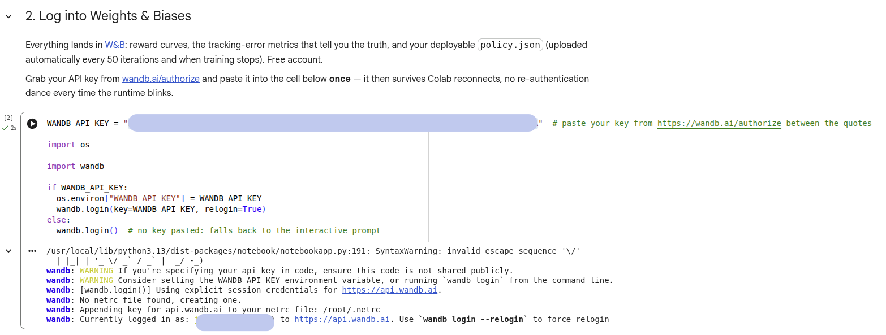
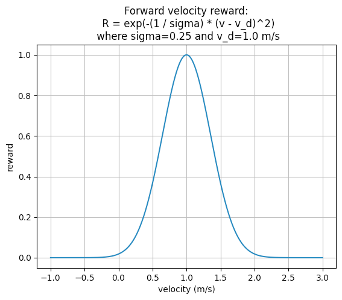
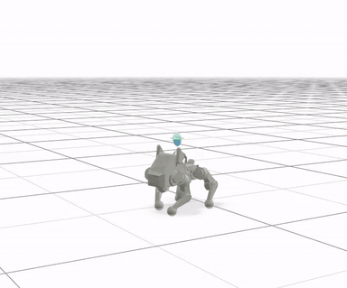
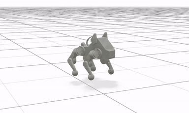
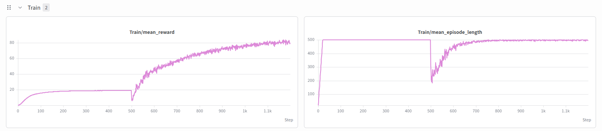
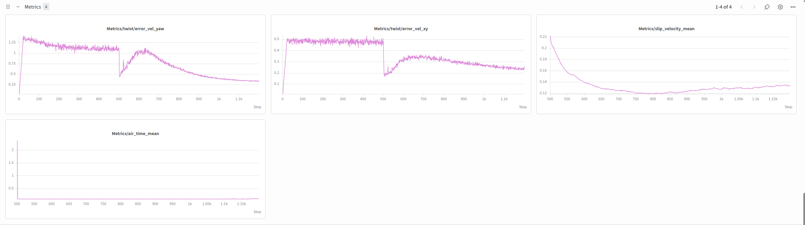
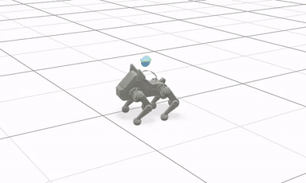
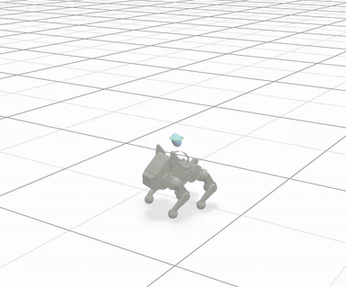
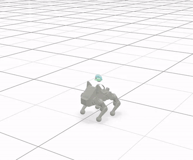

Lab 4: How to Train Your Pupper
================================

*Goal: Train Pupper to walk with reinforcement learning — first from scratch,
then guided by the reference gait machinery you built in lab 3.*

.. TODO(staff): add this offering's lab slides link
.. TODO(staff): add this offering's lab document link

`Lab slides <#>`_ (TODO)

`Lab document <#>`_ (TODO)

This lab has two acts. In the first, you train a walking policy **from
scratch**: nothing but reward weights standing between a randomly initialized
network and a walking robot. You will get it working — and it will not be
pretty. In the second act, you hand the policy a **reference motion** (a
phase-clocked version of the very gait you designed in lab 3) and watch most
of the difficulty evaporate. The quiet thesis of this lab: *reference motion
makes RL easy.* Keep that in mind every time the first act makes you suffer.

Step 0. Setup, and Test Bluetooth Connection
^^^^^^^^^^^^^^^^^^^^^^^^^^^^^^^^^^^^^^^^^^^^
* Clone the deploy repository to your Pupper (you will not need to modify any
  code in this repo):

  .. code-block:: bash

     cd ~/
     git clone https://github.com/cs123-stanford/pupper_gait_deploy.git

* Run the deploy script once to install, rebuild, and launch the neural
  controller:

  .. code-block:: bash

     cd ~/pupper_gait_deploy
     ./deploy.sh

  In the future, when there is nothing new to deploy, you can skip the
  rebuild and launch straight into the walking preparation phase with:

  .. code-block:: bash

     ros2 launch neural_controller launch.py

* Connect your remote controller with Bluetooth or USB cable to give Pupper
  velocity commands. For Bluetooth setup, follow the instructions at
  `this link <https://pupper-v3-documentation.readthedocs.io/en/latest/guide/software_installation.html#first-time-setup>`__.
  You can control the Pupper and switch between policies using the remote
  controller, as shown in the image below:

  .. figure:: ../../../_static/lab4/gamepad_gait_diagram.png
     :align: center
     :width: 1080px

     CS123 gamepad map. The square slot is where *your* policies will live.

* After pressing the "x" button on the remote controller, you should see
  Pupper walking with the default policy. Use the left joystick to control
  Pupper's walking direction and speed. The right joystick controls turning.
  Press any button on the remote controller to switch to a different policy.

* If Pupper is not walking properly, check if:
   - The remote controller is properly connected/turned on
   - There's any wiring issues with Pupper's motors
   - You are using the default walking policy, which you can switch to by
     pressing the "x" button on the remote controller.
   - There is a bad IMU reading message after you reinitialize the neural
     controller (Let's really hope that doesn't happen...)

**DELIVERABLE**: Take a short video of Pupper walking with the default policy.
How does this compare to your implementation from lab 3? (Keep this comparison
in mind — by the end of this lab, your lab 3 work and this policy will turn
out to be much more closely related than they look.)

Step 1. Colab, W&B, and the Deploy Pipeline
^^^^^^^^^^^^^^^^^^^^^^^^^^^^^^^^^^^^^^^^^^^^
* Open the `CS123 Pupper notebook <https://colab.research.google.com/github/cs123-stanford/pupper-mjlab/blob/main/notebooks/CS123_Pupper_mjlab.ipynb>`_
  in Colab, then **File → Save a copy in Drive** so your edits persist.
* Purchase `Colab Pro <https://colab.research.google.com/signup>`_ and set the
  GPU to **G4** (an RTX Pro 6000): Runtime → Change runtime type → G4. A
  3,000-iteration training run finishes in about 18 minutes on it. We will
  reimburse you for the $10 cost — just fill out the
  `reimbursement form here <https://forms.gle/sFHnBEUubMzKw3dT8>`_.
* To track training progress and compare runs, we use wandb (pronounced
  "weights and biases") to log all our training efforts (*Fun Note:* Weights
  and Biases went through a
  `huge acquisition <https://techcrunch.com/2025/03/04/coreweave-acquires-ai-developer-platform-weights-biases/>`_,
  and the Founder/CEO is actually a good friend of Stuart's!). It's really
  easy to set up! For first time users, create a
  `wandb account <https://wandb.ai/>`_, and generate an API key by going to
  `this link <https://wandb.ai/authorize>`__.
* Paste your API key into the W&B cell of the notebook and run it — once. It
  survives Colab reconnects.

   After pasting your wandb key, you should see a message like this. All your
   training logs — and your deployable policy — now land in your wandb account.

* The deploy pipeline is much simpler than in past offerings: every training
  run automatically uploads its deployable ``policy.json`` to the W&B run's
  files — refreshed every 50 iterations and when training stops (the stop
  button is safe). There is no export step. On your Pupper, log into the same
  W&B account once:

  .. code-block:: bash

     wandb login

* From then on, deploying any run is one command on the robot:

  .. code-block:: bash

     cd ~/pupper_gait_deploy
     ./deploy.sh mjlab/<run-id>   # run id = last part of your W&B run URL

  and press the **square button** on the controller to activate your policy.

Step 2. The Notebook: What You Actually Control
^^^^^^^^^^^^^^^^^^^^^^^^^^^^^^^^^^^^^^^^^^^^^^^^
Setting up a proper RL environment is an extremely time-consuming process.
The notebook drives `pupper-mjlab <https://github.com/cs123-stanford/pupper-mjlab>`_,
which trains Pupper in 4,096 parallel GPU simulations (MuJoCo Warp) with PPO.
Almost everything is fixed on purpose — network architecture, PPO
hyperparameters, observations, terminations. Your entire surface area is:

* **The task** (``TASK``): which environment you train in.
* **The reward weights**: every task ships with *all weights at zero*.
  Untouched, the robot learns to do nothing, beautifully. What to reward, what
  to penalize, and by how much is your job.
* **Domain randomization ranges**: motor gain and friction ranges (used in
  the second act).
* **Iterations**: how long to train.

Two facts about the reward terms that you need before touching any weight:

* **Positive terms are shaped and bounded.** Each objective is
  ``exp(-error²/std²)``, which lives in ``[0, 1]`` per step. A positive weight
  is therefore exactly the *most* that term can pay per step — positive terms
  compete with each other **by ratio**.
* **Negative terms are raw physics.** The penalties multiply unbounded
  physical quantities (torque², rad/s², ...), so their useful magnitudes vary
  wildly between terms. Set them by trial and error, and watch each term's
  ``Episode_Reward/...`` curve on W&B to see what it actually costs.

And one fact about judging your runs: **the reward curve is not the metric.**
Judge runs by ``Metrics/twist/error_vel_xy`` and ``error_vel_yaw`` on W&B
(tracking error — lower is better). A rising reward with flat errors means the
policy found a way to farm your weights without walking. It will.

**DELIVERABLE**: Before training anything, which rewards do you think will
matter most for making Pupper walk forwards? What about walking *stably*?
Could these two objectives interfere with each other? Write a few sentences in
your lab document.

**DELIVERABLE**: Read the implementation of
`track_linear_velocity <https://github.com/cs123-stanford/pupper-mjlab/blob/main/src/mjlab/tasks/velocity/mdp/rewards.py>`_.
Explain in words how the exponential shaping works, and why bounding every
positive term in ``[0, 1]`` makes ratio-based weight tuning possible. What
would go wrong if one positive term were unbounded?

Step 3. From Scratch, Part I: Velocity Tracking
^^^^^^^^^^^^^^^^^^^^^^^^^^^^^^^^^^^^^^^^^^^^^^^^
Let's start with the purest version of the problem: reward the robot for
matching commanded velocities, and *nothing else*.

* Set ``TASK = "Mjlab-VelocityFS-Flat-Pupper-v3"`` ("FS" = from scratch).
* In the reward weights cell, set ``track_linear_velocity`` and
  ``track_yaw_velocity`` to nonzero values, leaving everything else at zero.
  In practice, the linear tracking weight should be more than the angular
  one.
* Run the **Watch it live** cell, then the training cell. Open the printed
  viewer link while training runs — the robot appears about a minute in.
* A 3,000-iteration run takes ~18 minutes on the G4 runtime.

**DELIVERABLE**: We use an exponential tracking function for velocity. The
plot below shows the reward as a function of the robot's x-velocity when the
commanded x-velocity is 1.0 m/s.

    Exponential tracking function for velocity

Since Pupper needs to maximize this function, should the reward coefficient be
positive or negative, according to Nathan's original implementation (which
mjlab inherits)? How else could you implement a velocity tracking function?
Write it down in math.

**DELIVERABLE**: While training runs, use the live viewer's
**Checkpoints → Sync → Use Latest** to hop between checkpoints: watch
``model_0``, a mid-training checkpoint, and the final one. Describe the phases
the policy goes through. (This replaces the old "dig through training video
folders" workflow — you are watching the actual policy, live, while it
trains.)

**DELIVERABLE**: With *only* the tracking terms paying, the policy will find
the cheapest possible way to move its velocity sensor — not the same thing as
walking. Record a short video and describe what your policy is exploiting:
vibrating? skating on its knees? something more creative?

Step 4. From Scratch, Part II: Good Enough to Deploy
^^^^^^^^^^^^^^^^^^^^^^^^^^^^^^^^^^^^^^^^^^^^^^^^^^^^^
Now shape it into something you can put on a real robot. Add penalty terms to
kill the exploits — effort, smoothness, stability — and iterate on your weights
until the policy honestly tracks commands.

* Think about which terms make Pupper conserve energy (``joint_torques_l2``?
  ``joint_acc_l2``?) and which kill the behaviors that shake real robots
  (``action_rate_l2`` is the classic). Should their coefficients be positive
  or negative?
* Watch the ``Metrics/twist/error_vel_xy`` and ``error_vel_yaw`` curves. A
  reasonable from-scratch policy gets ``error_vel_xy`` down to roughly
  **0.25 or below** — use that as your bar.
* Check standing: command zero velocity in the live viewer. The
  ``stand_still_*`` terms exist for a reason.

.. important::

   **It is okay — expected, even — for this policy to look bad.** The one in
   our own screenshots is ugly as hell too. From-scratch RL discovers *a* gait
   that satisfies your rewards, not a pretty one, and polishing it by reward
   tuning has brutal diminishing returns. Your deliverable bar is purely
   functional: the policy walks according to commanded velocity and turns both
   ways, in sim and on the real robot. **Do not burn hours refining the gait's
   looks.** Making it pretty is exactly what the second act — the
   reference — is for.

   Our own from-scratch policy. Functional, honest, ugly. Ship it.

**DELIVERABLE**: What is your final reward function? For each nonzero term: why is it there, and what
did you observe change when you added it?

**DELIVERABLE**: Show your ``error_vel_xy`` and ``error_vel_yaw`` curves. Did
you hit the 0.25 bar? If your reward curve rose somewhere while the error
curves stayed flat, which term was being farmed and how did you find it?

**DELIVERABLE**: Record videos from the live viewer of: walking forward,
walking backward, sidestepping, and turning in place. (Drive the robot with
the command sliders.)

**DELIVERABLE**: Record a video of Pupper standing still given a zero command.
Is it actually still?

Step 5. Deploy the From-Scratch Policy
^^^^^^^^^^^^^^^^^^^^^^^^^^^^^^^^^^^^^^^^
Time to test the whole pipeline on hardware — this matters beyond the first
act, because the reference policies deploy through exactly the same path.

* Grab your run id from the W&B run URL, then on the Pupper:

  .. code-block:: bash

     cd ~/pupper_gait_deploy
     ./deploy.sh mjlab/<your-run-id>

* Press the **square button** to activate your policy, and drive it around
  with the joysticks.

**DELIVERABLE:** In what ways is this policy different on the physical robot
(compared to simulation)? We roboticists call this difference the "sim2real
gap" (I think Jie invented this terminology for training robot dogs).

**DELIVERABLE:** Take a video of Pupper walking! Do you notice any differences
when Pupper is walking on different surfaces?

**DELIVERABLE:** Inspect Pupper's discovered gait on each leg, and compare it
to the triangle gait from the heuristics walking lab. Do Pupper's legs move in
a similar triangle motion in the gait it discovered on its own? Write a few
sentences about the similarities and differences you notice.

**DELIVERABLE** (yaw heading correction): Walk Pupper forward with the yaw
stick untouched, and gently rotate its body a few degrees by hand mid-walk.
It steers back onto its original heading — but nothing in your reward set
asked for that. This is the **heading hold**: your policy only ever tracks a
commanded yaw *rate*, so a heading error is invisible to it and small yaw
disturbances would otherwise accumulate into a drifting walk. During training,
the command manager wraps your yaw command in an IMU-yaw P-loop — while you
walk with a quiet yaw command, it captures the current heading and emits
``clip(kp * heading_error, ±clip)`` as the yaw command until you actually
command a turn. The exact same loop, with the exact same constants, runs on
the robot: the numbers are stamped into your ``policy.json`` at export and
transcribed by the controller's command filter, so the policy sees the same
closed-loop command profile in deployment that it trained against. Describe
what you observe in the nudge test, then explain: (a) why the correction has
to live on the *command* side rather than in the reward, and (b) under what
condition does this fix start *hurting* locomotion instead of helping it?
(Think about what the correction blindly trusts, and what happens to a policy
that has learned to lean on it.)

.. figure:: ../../../_static/walker.gif
   :align: center

   Deploy your policy on Pupper v3 (policy trained by Jaden)

Step 6. The Reference, Part I: Twelve Numbers
^^^^^^^^^^^^^^^^^^^^^^^^^^^^^^^^^^^^^^^^^^^^^^
Here is the part of this lab we actually care about. You just experienced how
hard it is to coax a natural gait out of pure reward tuning. Now we give the
policy a *reference motion* — and the entire character of the problem changes.

First, understand what actually changes in the architecture, because it is
less than you think. Both tasks in this lab feed the policy the **same 48-dim
observation frame**: 36 dimensions of proprioception (joint states, IMU, your
velocity command) plus **12 dimensions of reference offset** — one per joint
(abduction, hip, and knee on each of the four legs), each the difference
between the reference's joint angle at the current gait phase and the default
standing pose.

* In ``VelocityFS`` — the task you just trained — those 12 dimensions are
  **pinned to zero**. The policy is on its own.
* In ``StableGait``, those 12 dimensions stream ``ref(phase) − default``: a
  phase clock ticks through one gait cycle, a reference table converts phase
  to joint angles, and the policy *observes where the reference wants its
  joints to be right now*. A matching reward term (``gait_tracking``) pays it
  for agreeing. The reference blends by command: the trot table plays for
  fore/aft walking, and the **lift gait — the one you design, with your lab 3
  machinery** — plays for turn-in-place and sidestep.

Same network. Same deploy path (the robot reproduces the reference tables from
``policy.json`` with its own phase clock, so nothing is stale). The *only*
difference is whether those twelve dimensions carry zeros or a choreography.

.. admonition:: Side topic: Reference-Guided Reinforcement Learning
   :class: note

   What you are about to do has a name in the literature. Pure task-reward RL
   (the first act) forces the policy to solve *exploration* and *style*
   simultaneously — it must stumble into gait-like behavior by chance before
   it can refine it, and the reward designer must encode "look natural" as
   math, which is why you just spent an act playing whack-a-mole with penalty
   terms. Reference-guided methods sidestep both problems: a reference motion
   (from an animator, a motion-capture clip, a model-based controller — or
   your lab 3 gait generator) pins down the style, and a tracking term turns
   the exploration problem into a much easier *local* correction problem. RL
   still earns its keep — the reference is kinematic choreography with no
   knowledge of physics, and the policy must learn torque-level control that
   makes it dynamically real, robust to pushes, slippage, and bad terrain.
   The landmark papers are `DeepMimic <https://arxiv.org/abs/1804.02717>`_
   (explicit tracking, as here), `AMP <https://arxiv.org/abs/2104.02180>`_
   (adversarial style matching), and most recently
   `BeyondMimic <https://arxiv.org/abs/2508.08241>`_ — and the default policy
   your Pupper shipped with is exactly a velocity- and reference-conditioned
   policy of this family. The optional lab goes much deeper: you'll design
   novel reference gaits, bootstrap better references out of trained
   policies, and distill several gaits into one policy.

Now design your lift gait. In the notebook's section 4, you fill in the four
lift-gait parameters — ``LIFT_TOUCHDOWN`` (the per-leg touchdown phases),
``LIFT_STRIDE``, ``LIFT_STANCE_Z``, and ``LIFT_SWING_LIFT`` — and the repo's
reference generator (your lab 3 pipeline: triangle keyframes, gradient-descent
IK, the stance/swing cycle) turns them into a reference table. The design
questions in the notebook are not rhetorical: a lift gait whose stride drags
the robot forward will *fight* every turn command.

* Answer the notebook's three design questions in your lab doc **before**
  filling in numbers.
* Visualize your design before training with it — run the visualizer command
  from the notebook and look at what you built:

   The reference visualizer playing a lift gait. This is pure choreography —
   no physics, no policy — exactly what the reference observation will stream.

**DELIVERABLE**: Your lift gait design: your four parameter values, plus your written
answers to the notebook's three design questions (stride for a turn-in-place,
touchdown pairing, stance depth / swing lift). Include a short video from the
reference visualizer.

**DELIVERABLE**: Read the
`gait_tracking <https://github.com/cs123-stanford/pupper-mjlab/blob/main/src/mjlab/tasks/pupper_gait/mdp/gait.py>`_
reward. It tracks ``default + reference_offset`` rather than the reference
alone. What behavior does the policy get "for free" at zero command because of
this choice, and which of your act-one reward terms did that behavior
previously require?

Step 7. The Reference, Part II: Training StableGait
^^^^^^^^^^^^^^^^^^^^^^^^^^^^^^^^^^^^^^^^^^^^^^^^^^^^
* Set ``TASK = "Mjlab-StableGait-Flat-Pupper-v3"`` and re-run the apply cell
  for your lift gait.
* Set your reward weights. ``gait_tracking`` is the new star of the show —
  and note that the StableGait tasks also expose ``track_angular_velocity``,
  a roll/pitch-rate stabilizer that only exists here.
* Train, and keep the live viewer open for the first few minutes — the
  beginning of a StableGait run looks *broken* if you don't know what you're
  watching. It isn't. Explain below.

.. warning::

   Your act-one weights are a **starting point, not an answer**. Some of them
   transfer to the reference-guided objective just fine; others are badly
   mis-scaled for it, because the two tasks lean on different terms to produce
   walking. Re-derive your weights from the curves — don't copy the from-
   scratch dict over and call it done. Finding *which* terms need to move (and
   in which direction) is part of the deliverable.

StableGait runs have a signature you must understand. The first ~500
iterations run **airborne**: gravity is off, only ``gait_tracking`` pays, and
the policy learns to reproduce the reference in a vacuum. At iteration ~500,
gravity drops in — and every curve on W&B reacts at once:

   Mean reward and episode length for a StableGait run. For the first ~500
   iterations Pupper is held in the air with gravity off, learning nothing but
   how to reproduce the reference; at ~500 gravity switches on and the real
   walking problem begins.

   The tracking-error metrics for the same run. Note that the velocity
   errors only start falling once gravity arrives — tracking a velocity
   command is meaningless in the air.

**DELIVERABLE**: Given this curriculum, interpret the iteration-500 signature
on *your own* curves: the policy did not suddenly get worse, yet the reward
crashes and the episode length dives — what actually changed in what each
curve is measuring? And why is "learn the choreography in a vacuum first,
then add physics" a sensible curriculum, rather than a waste of 500
iterations?

   A trained StableGait policy. Compare the leg motion to your from-scratch
   policy — this one is tracking your lab 3 trot.

   Walking backward: the same trot table played in reverse — one reference
   gait covers the whole fore/aft command range.

   Turning in place — this is *your lift gait* at work: the reference blends
   to it whenever the command is a pure turn or sidestep.

**DELIVERABLE** (the capstone of this lab): Run the head-to-head. With the
same iteration budget, compare your best from-scratch policy against your
StableGait policy on: final ``error_vel_xy`` / ``error_vel_yaw``, gait
naturalness (videos, side by side), and — honestly — how many reward terms and
how many runs each one took you to reach its result. Then argue, in a
paragraph, *why* the reference makes the RL problem easier. Think about what
the reference gives the policy for free: exploration, style, and the shape of
the reward landscape.

Step 8. The Reference, Part III: Rough Terrain and Domain Randomization
^^^^^^^^^^^^^^^^^^^^^^^^^^^^^^^^^^^^^^^^^^^^^^^^^^^^^^^^^^^^^^^^^^^^^^^^
The reference fixed the style; now make the policy *robust*. The simulator is
not your robot: real motors run weaker or stronger than modeled, and real
floors grip differently. Two moves:

* **Terrain**: switch to ``TASK = "Mjlab-StableGait-Bumpy-Pupper-v3"`` — the
  same task on rough ground. This is the sim2real robustness pass.
* **Domain randomization**: the notebook exposes three ranges, each sampled
  per episode — motor position-gain (kp) multiplier, motor damping-gain (kd)
  multiplier, and foot-ground friction. Too narrow breaks on hardware; too
  wide trains a timid crouch.

* Retrain, redeploy (``./deploy.sh`` again — same square button), and compare
  against your flat-trained StableGait policy on the real robot. Try surfaces
  that punished your from-scratch policy in step 5.

.. note::
   Feel free to reach out to the TAs if you have questions about modifying
   parameters in the notebook. Small changes can sometimes have unexpected
   effects on training behavior, and we're happy to help you understand the
   impact of different parameters.

**DELIVERABLE**: For each of the three DR ranges, name the specific real-world
mismatch *on your robot* that it insures against.

**DELIVERABLE**: Comment on what might happen if you add too much domain
randomization.

**DELIVERABLE**: Record videos of your final policy: walking in simulation on
the bumpy terrain, and walking in the real world — including at least one
surface where your from-scratch policy struggled.

Congratulations on completing Lab 4! You trained a policy from scratch, felt
exactly where that hurts, and then made the pain disappear with a reference
motion built by the gait generator you wrote in lab 3. If this loop — design a reference,
let RL make it physically real — got its hooks into you, the optional lab
takes it much further: novel gaits, bootstrapping references from your own
policies, and distilling everything into a single multi-gait policy.

Resources
-----------
`Learning to Walk in Minutes Using Massively Parallel Deep Reinforcement Learning <https://arxiv.org/pdf/2109.11978>`_

`Sim-to-Real: Learning Agile Locomotion For Quadruped Robots <https://arxiv.org/abs/1804.10332>`_

`Minimizing Energy Consumption Leads to the
Emergence of Gaits in Legged Robots <https://energy-locomotion.github.io/>`_

`Learning Agile Quadrupedal Locomotion Over Challenging Terrain <https://www.science.org/doi/full/10.1126/scirobotics.abc5986>`_

`DeepMimic: Example-Guided Deep Reinforcement Learning of Physics-Based Character Skills <https://arxiv.org/abs/1804.02717>`_

`AMP: Adversarial Motion Priors for Stylized Physics-Based Character Control <https://arxiv.org/abs/2104.02180>`_

`BeyondMimic: From Motion Tracking to Versatile Humanoid Control <https://arxiv.org/abs/2508.08241>`_

`mjlab <https://github.com/mujocolab/mjlab>`_ / `MuJoCo Warp <https://github.com/google-deepmind/mujoco_warp>`_ — the stack under the notebook
