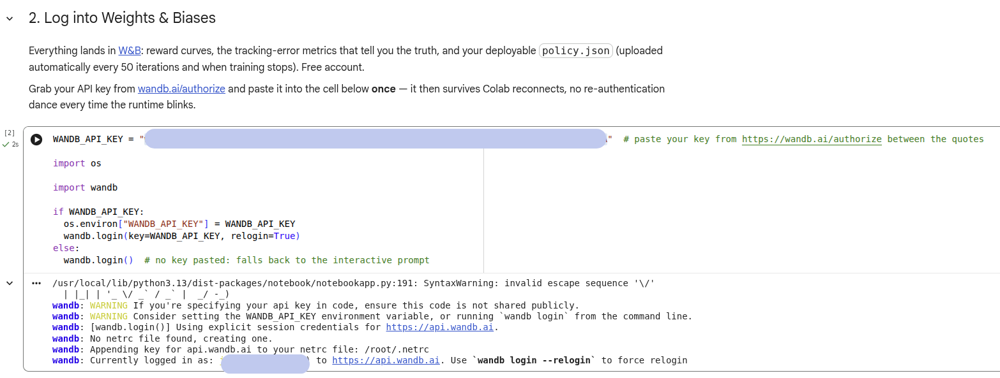
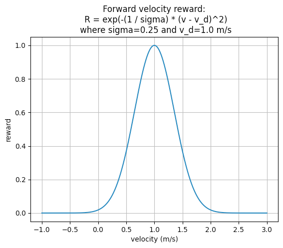
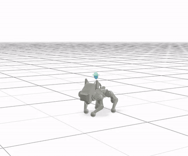
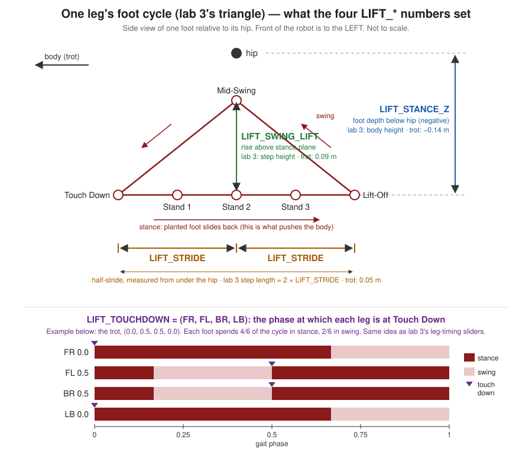
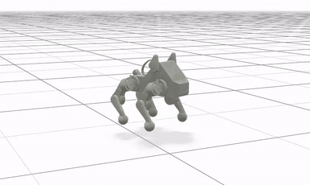
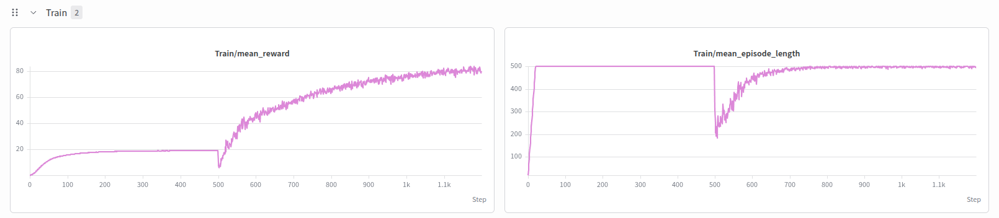
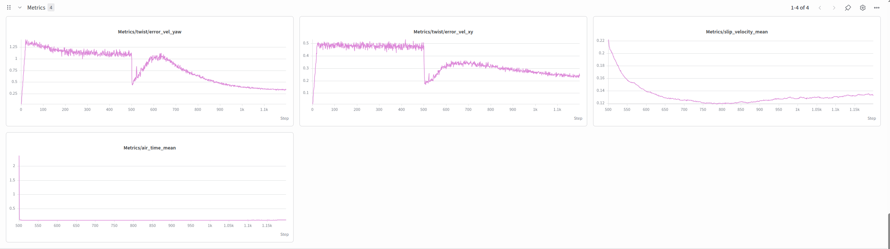
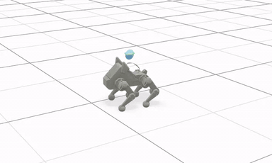
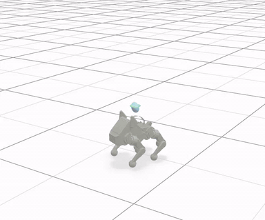
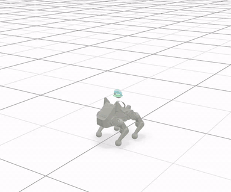

Lab 4: How to Train Your Pupper
================================

*Goal: Train Pupper to walk with reinforcement learning — first from scratch,
then guided by the reference gait machinery you built in lab 3.*

.. TODO(staff): add this offering's lab slides link
.. TODO(staff): add this offering's lab document link

`Lab slides <#>`_ (TODO)

`Lab document <#>`_ (TODO)

This lab has two acts. In the first, you train a walking policy **from
scratch**: nothing but reward weights standing between a randomly initialized
network and a walking robot. You will get it working — and it will not be
pretty. In the second act, you hand the policy a **reference motion** (a
phase-clocked version of the very gait you designed in lab 3) and watch most
of the difficulty evaporate. The quiet thesis of this lab: *reference motion
makes RL easy.* Keep that in mind every time the first act makes you suffer.

.. list-table:: Lab roadmap
   :header-rows: 1
   :widths: 12 48 40

   * - Step
     - What you do
     - Where
   * - 1
     - Colab and W&B setup
     - Notebook sections 1–2
   * - 2
     - Learn what you control; reward-shaping questions
     - Reading (notebook sections 3–6)
   * - 3–4
     - **Act one:** train a from-scratch policy
     - Notebook sections 3, 5, 7, 8
   * - 5
     - Set up the robot, deploy your from-scratch policy
     - Your Pupper
   * - 6
     - **Act two:** design your lift gait
     - Notebook section 4
   * - 7
     - Train StableGait with your reference
     - Notebook sections 3, 4, 5, 7
   * - 8
     - Rough terrain and domain randomization, final deploy
     - Notebook sections 3, 6, 7; your Pupper

Step 1. Colab and W&B
^^^^^^^^^^^^^^^^^^^^^^
* Open the `CS123 Pupper notebook <https://colab.research.google.com/github/cs123-stanford/pupper-mjlab/blob/main/notebooks/CS123_Pupper_mjlab.ipynb>`_
  in Colab, then **File → Save a copy in Drive** so your edits persist.
* Purchase `Colab Pro <https://colab.research.google.com/signup>`_ and set the
  GPU to **G4** (an RTX Pro 6000): Runtime → Change runtime type → G4. A
  3,000-iteration training run finishes in about 18 minutes on it. We will
  reimburse you for the $10 cost — just fill out the
  `reimbursement form here <https://forms.gle/sFHnBEUubMzKw3dT8>`_.
* **Notebook section 1 (Setup):** run the cell. It clones
  ``pupper-mjlab`` into ``/content/pupper-mjlab`` and installs it.
* To track training progress and compare runs, we use wandb (pronounced
  "weights and biases") to log all our training efforts (*Fun Note:* Weights
  and Biases went through a
  `huge acquisition <https://techcrunch.com/2025/03/04/coreweave-acquires-ai-developer-platform-weights-biases/>`_,
  and the Founder/CEO is actually a good friend of Stuart's!). It's really
  easy to set up! For first time users, create a
  `wandb account <https://wandb.ai/>`_, and generate an API key by going to
  `this link <https://wandb.ai/authorize>`__.
* **Notebook section 2 (Log into Weights & Biases):** paste your API key
  between the quotes of ``WANDB_API_KEY`` and run the cell — once. It
  survives Colab reconnects.

   After pasting your wandb key, you should see a message like this. All your
   training logs — and your deployable policy — now land in your wandb account.

* There is no export step: every training run automatically uploads its
  checkpoints and its deployable ``policy.json`` to the W&B run's files
  (refreshed every 50 iterations and when training stops — the stop button is
  safe). You will deploy straight from W&B in step 5.

.. tip::

   **Two habits that will save you time and money on Colab:**

   * **Stop early if a run isn't working.** You do not need to wait for all
     3,000 iterations to know a run is bad — by ~1,000 iterations the
     tracking-error curves tell you (see step 2). Hit the stop button (your
     ``policy.json`` still uploads), fix your weights, and relaunch.
   * **Keep an eye on your Colab Pro quota.** The G4 runtime burns compute
     units the whole time it is connected — including while you sit idle
     thinking about weights. Check your remaining units under the RAM/Disk
     indicator in the top-right corner, and disconnect the runtime
     (Runtime → Disconnect and delete runtime) when you step away. Everything
     that matters is on W&B, and you can bring any run back later (see
     "Lost your runtime?" in step 4).

Step 2. The Notebook: What You Actually Control
^^^^^^^^^^^^^^^^^^^^^^^^^^^^^^^^^^^^^^^^^^^^^^^^
Setting up a proper RL environment is an extremely time-consuming process.
The notebook drives `pupper-mjlab <https://github.com/cs123-stanford/pupper-mjlab>`_,
which trains Pupper in 4,096 parallel GPU simulations (MuJoCo Warp) with PPO.
Almost everything is fixed on purpose — network architecture, PPO
hyperparameters, observations, terminations. Your entire surface area is a
handful of ✏️ cells in the notebook:

.. list-table::
   :header-rows: 1
   :widths: 30 35 35

   * - Notebook section
     - What you set
     - Used in
   * - 3. Choose your task
     - ``TASK`` (which environment), ``ITERATIONS`` (how long to train)
     - Every run
   * - 4. Design the lift gait
     - The four ``LIFT_*`` numbers
     - StableGait only (steps 6–8)
   * - 5. Reward weights
     - ``REWARD_WEIGHTS``: every task ships with *all weights at zero*.
       Untouched, the robot learns to do nothing, beautifully.
     - Every run
   * - 6. Domain randomization
     - Motor gain and friction ranges
     - Step 8 (defaults are fine before that)
   * - 7. Train
     - Nothing to edit — two cells to run (see step 3)
     - Every run

.. important::

   Editing a ✏️ cell does nothing until you **run that cell**. After every
   change, re-run the cell you edited, then re-run the two section 7 cells.

Two facts about the reward terms that you need before touching any weight:

* **Positive terms are shaped and bounded.** Each objective is
  ``exp(-error²/std²)``, which lives in ``[0, 1]`` per step. A positive weight
  is therefore exactly the *most* reward that term can give per step —
  positive terms compete with each other **by ratio**.
* **Negative terms are raw physics.** The penalties multiply unbounded
  physical quantities (torque², rad/s², ...), so their useful magnitudes vary
  wildly between terms. Set them by trial and error, and watch each term's
  ``Episode_Reward/...`` curve on W&B to see what it actually costs.

And one fact about judging your runs: **the reward curve is not the metric.**
Judge runs by ``Metrics/twist/error_vel_xy`` and ``error_vel_yaw`` on W&B
(tracking error — lower is better).

.. warning::

   **Rising reward + flat tracking errors early in a run = kill it.** If, in
   the first ~1,000 iterations, the reward curve climbs while
   ``error_vel_xy`` / ``error_vel_yaw`` stay flat, the policy has found a way
   to farm your weights without walking (it will). This is a signal about
   the *beginning* of training — it does not fix itself if you let it run.
   Don't spend the full 3,000 iterations (~18 minutes, and Colab units)
   waiting for it to recover: stop the run at around 1,000 iterations, find
   which ``Episode_Reward/...`` term is being farmed, redo your reward
   weights, and relaunch.

   (One exception: in StableGait (step 7), the first ~500 iterations look
   exactly like this *by design* — the robot is held in the air and cannot
   track velocity yet. Read step 7 before killing one of those.)

**DELIVERABLE**: Before training anything, which rewards do you think will
matter most for making Pupper walk forwards? What about walking *stably*?
Could these two objectives interfere with each other? Write a few sentences in
your lab document.

**DELIVERABLE**: Read the implementation of
`track_linear_velocity <https://github.com/cs123-stanford/pupper-mjlab/blob/main/src/mjlab/tasks/velocity/mdp/rewards.py>`_.
The plot below shows its exponential tracking function: the reward as a
function of the robot's x-velocity when the commanded x-velocity is 1.0 m/s.

    Exponential tracking function for velocity

Answer the following in your lab document:

1. Explain in words how the exponential shaping works. What does ``std``
   control? Since Pupper maximizes this function, should its reward
   coefficient be positive or negative (according to Nathan's original
   implementation, which mjlab inherits)?
2. Why does bounding every positive term in ``[0, 1]`` make ratio-based
   weight tuning possible?
3. What would go wrong if one positive term were **unbounded**?
4. What other functions would also work as a velocity tracking reward? Write
   at least one down in math — for instance, the negative squared L2 norm of
   the velocity error, :math:`-\lVert \mathbf{v}_{cmd} - \mathbf{v} \rVert^2`.
   Is your alternative bounded? Compared to the exponential, how does its
   gradient behave when the error is large, and when it is near zero?

Step 3. From Scratch, Part I: Velocity Tracking
^^^^^^^^^^^^^^^^^^^^^^^^^^^^^^^^^^^^^^^^^^^^^^^^
Let's start with the purest version of the problem: reward the robot for
matching commanded velocities, and *nothing else*.

**How to launch a training run** (you will repeat this for every run in the
lab):

1. **Section 3 (Choose your task):** set ``TASK`` and run the cell. For this
   step: ``TASK = "Mjlab-VelocityFS-Flat-Pupper-v3"`` ("FS" = from scratch).
   Skip section 4 — VelocityFS ignores it.
2. **Section 5 (Reward weights):** edit ``REWARD_WEIGHTS`` and run the cell.
3. **Section 6 (Domain randomization):** run the cell (defaults are fine
   until step 8).
4. **Section 7, first code cell — "Watch it live":** run it. It starts a
   viewer in the background and prints a link. It does *not* train anything
   and finishes in a few seconds. (Optional, but you need it for the
   deliverables below.)
5. **Section 7, second code cell — the one that starts with**
   ``from mjlab.scripts.train import ...``: **this is the cell that trains.**
   It blocks for the whole run (~18 minutes for 3,000 iterations on G4) and
   prints a W&B link for your curves.
6. Open the link from step 4 in a browser tab. The robot appears once the
   first checkpoint lands, about a minute into training (reload if the page is
   empty). Close the tab when you're done looking — training runs ~25–30%
   slower while a viewer tab is connected.

For this step, in section 5 set ``track_linear_velocity`` and
``track_yaw_velocity`` to nonzero values, leaving everything else at zero. In
practice, the linear tracking weight should be more than the angular one.

**DELIVERABLE**: While training runs, open the viewer from the **"Watch it
live" cell (section 7, first code cell)** and use its
**Checkpoints → Sync → Use Latest** controls to hop between checkpoints: watch
``model_0``, a mid-training checkpoint, and the final one. Describe the phases
the policy goes through.

**DELIVERABLE**: With *only* the tracking terms rewarded, the policy will find
the cheapest possible way to move its velocity sensor — not the same thing as
walking. Record a short video and describe what your policy is exploiting:
vibrating? skating on its knees? something more creative?

Step 4. From Scratch, Part II: Good Enough to Deploy
^^^^^^^^^^^^^^^^^^^^^^^^^^^^^^^^^^^^^^^^^^^^^^^^^^^^^
Now shape it into something you can put on a real robot. Add penalty terms to
kill the exploits — effort, smoothness, stability — and iterate on your weights
until the policy honestly tracks commands. Each iteration is: edit section 5 →
run it → run the two section 7 cells.

* Think about which terms make Pupper conserve energy (``joint_torques_l2``?
  ``joint_acc_l2``?) and which kill the behaviors that shake real robots
  (``action_rate_l2`` is the classic). Should their coefficients be positive
  or negative?
* Watch the ``Metrics/twist/error_vel_xy`` and ``error_vel_yaw`` curves. A
  reasonable from-scratch policy gets ``error_vel_xy`` down to roughly
  **0.25 or below** — use that as your bar.
* Check standing: command zero velocity in the viewer. The
  ``stand_still_*`` terms exist for a reason.
* The bottom of the notebook has a **"When it doesn't walk"** troubleshooting
  list — check it before asking.

.. important::

   **It is okay — expected, even — for this policy to look bad.** The one in
   our own screenshots is ugly as hell too. From-scratch RL discovers *a* gait
   that satisfies your rewards, not a pretty one, and polishing it by reward
   tuning has brutal diminishing returns. Your deliverable bar is purely
   functional: the policy walks according to commanded velocity and turns both
   ways, in sim and on the real robot. **Do not burn hours refining the gait's
   looks.** Making it pretty is exactly what the second act — the
   reference — is for.

   Our own from-scratch policy. Functional, honest, ugly. Ship it.

Once a run finishes, **section 8 (Watch it)** loads its final checkpoint into
an interactive viewer — use it (or the live viewer) for the videos below.

.. admonition:: Lost your runtime? Replay any run from W&B
   :class: tip

   Section 8 only finds checkpoints on the *current* runtime's disk. If your
   runtime disconnected (or you deleted it to save units), the checkpoints are
   still on W&B — every run uploads them. In a fresh runtime:

   1. Run sections 1 and 2.
   2. Run section 3 with ``TASK`` set to the task **that run was trained
      on**.
   3. **StableGait runs only:** run section 4 with the **same** ``LIFT_*``
      values the run was trained with. (A fresh runtime has no lift gait, and
      StableGait refuses to build without it.)
   4. Add a new code cell and run the following, with your run id (the last
      part of the W&B run URL — the same id you deploy with):

      .. code-block:: python

         RUN_PATH = "mjlab/<your-run-id>"
         CHECKPOINT = None  # None = latest; or e.g. "model_1500.pt"

         from dataclasses import asdict
         from pathlib import Path

         import viser
         from mjlab.envs import ManagerBasedRlEnv
         from mjlab.rl import MjlabOnPolicyRunner, RslRlVecEnvWrapper
         from mjlab.tasks.registry import load_env_cfg, load_rl_cfg, load_runner_cls
         from mjlab.utils.os import get_wandb_checkpoint_path
         from mjlab.viewer import ViserPlayViewer

         ckpt, _ = get_wandb_checkpoint_path(
           Path("logs/rsl_rl"), Path(RUN_PATH), CHECKPOINT
         )
         print("Using checkpoint:", ckpt)

         device = "cuda:0"
         env_cfg = load_env_cfg(TASK, play=True)
         env_cfg.scene.num_envs = 1
         agent_cfg = load_rl_cfg(TASK)
         env = RslRlVecEnvWrapper(
           ManagerBasedRlEnv(cfg=env_cfg, device=device),
           clip_actions=agent_cfg.clip_actions,
         )
         runner_cls = load_runner_cls(TASK) or MjlabOnPolicyRunner
         runner = runner_cls(env, asdict(agent_cfg), device=device)
         runner.load(str(ckpt), load_cfg={"actor": True}, strict=True, map_location=device)

         server = viser.ViserServer(label="pupper", share=True)
         print("Open the viewer here:", server.request_share_url())
         ViserPlayViewer(
           env, runner.get_inference_policy(device=device), viser_server=server
         ).run()

   Interrupt the cell (stop button) to close the viewer. On your own machine
   with a GPU and a display, the one-liner equivalent is
   ``uv run play <TASK> --wandb-run-path mjlab/<your-run-id>`` from a
   ``pupper-mjlab`` checkout.

**DELIVERABLE**: What is your final reward function? For each nonzero term: why is it there, and what
did you observe change when you added it?

**DELIVERABLE**: Show your ``error_vel_xy`` and ``error_vel_yaw`` curves. Did
you hit the 0.25 bar? If your reward curve rose somewhere while the error
curves stayed flat, which term was being farmed and how did you find it?

**DELIVERABLE**: Record videos from the viewer of: walking forward,
walking backward, sidestepping, and turning in place. (Drive the robot with
the command sliders.)

**DELIVERABLE**: Record a video of Pupper standing still given a zero command.
Is it actually still?

Step 5. Deploy the From-Scratch Policy
^^^^^^^^^^^^^^^^^^^^^^^^^^^^^^^^^^^^^^^^
Time to test the whole pipeline on hardware — this matters beyond the first
act, because the reference policies deploy through exactly the same path.

**5a. Set up the robot and check the default policy**

* Clone the deploy repository to your Pupper (you will not need to modify any
  code in this repo):

  .. code-block:: bash

     cd ~/
     git clone https://github.com/cs123-stanford/pupper_gait_deploy.git

* Run the deploy script once to install, rebuild, and launch the neural
  controller:

  .. code-block:: bash

     cd ~/pupper_gait_deploy
     ./deploy.sh

  In the future, when there is nothing new to deploy, you can skip the
  rebuild and launch straight into the walking preparation phase with:

  .. code-block:: bash

     ros2 launch neural_controller launch.py

* Connect your remote controller with Bluetooth or USB cable to give Pupper
  velocity commands. For Bluetooth setup, follow the instructions at
  `this link <https://pupper-v3-documentation.readthedocs.io/en/latest/guide/software_installation.html#first-time-setup>`__.
  You can control the Pupper and switch between policies using the remote
  controller, as shown in the image below:

  .. figure:: ../../../_static/lab4/gamepad_gait_diagram.png
     :align: center
     :width: 1080px

     CS123 gamepad map. The square slot is where *your* policies will live.

* After pressing the "x" button on the remote controller, you should see
  Pupper walking with the default policy. Use the left joystick to control
  Pupper's walking direction and speed. The right joystick controls turning.
  Press any button on the remote controller to switch to a different policy.
  This is also your hardware sanity check: if the default policy walks, any
  problem with your own policy is in the policy, not the robot.

* If Pupper is not walking properly, check if:
   - The remote controller is properly connected/turned on
   - There's any wiring issues with Pupper's motors
   - You are using the default walking policy, which you can switch to by
     pressing the "x" button on the remote controller.
   - There is a bad IMU reading message after you reinitialize the neural
     controller (Let's really hope that doesn't happen...)

**DELIVERABLE**: Take a short video of Pupper walking with the default policy.
How does this compare to your implementation from lab 3? (Keep this comparison
in mind — by the end of this lab, your lab 3 work and this policy will turn
out to be much more closely related than they look.)

**5b. Deploy your policy**

* On your Pupper, log into the same W&B account you used in the notebook
  (once):

  .. code-block:: bash

     wandb login

* Grab your run id from the W&B run URL (the last part), then on the Pupper:

  .. code-block:: bash

     cd ~/pupper_gait_deploy
     ./deploy.sh mjlab/<your-run-id>

* Press the **square button** to activate your policy, and drive it around
  with the joysticks. The other buttons keep the reference policies for
  comparison.

**DELIVERABLE:** In what ways is this policy different on the physical robot
(compared to simulation)? We roboticists call this difference the "sim2real
gap" (I think Jie invented this terminology for training robot dogs).

**DELIVERABLE:** Take a video of Pupper walking! Do you notice any differences
when Pupper is walking on different surfaces?

**DELIVERABLE:** Inspect Pupper's discovered gait on each leg, and compare it
to the triangle gait from the heuristics walking lab. Do Pupper's legs move in
a similar triangle motion in the gait it discovered on its own? Write a few
sentences about the similarities and differences you notice.

**DELIVERABLE** (yaw heading correction): Walk Pupper forward with the yaw
stick untouched, and gently rotate its body a few degrees by hand mid-walk.
It steers back onto its original heading — but nothing in your reward set
asked for that. This is the **heading hold**: your policy only ever tracks a
commanded yaw *rate*, so a heading error is invisible to it and small yaw
disturbances would otherwise accumulate into a drifting walk. During training,
the command manager wraps your yaw command in an IMU-yaw P-loop — while you
walk with a quiet yaw command, it captures the current heading and emits
``clip(kp * heading_error, ±clip)`` as the yaw command until you actually
command a turn. The exact same loop, with the exact same constants, runs on
the robot: the numbers are stamped into your ``policy.json`` at export and
transcribed by the controller's command filter, so the policy sees the same
closed-loop command profile in deployment that it trained against. Describe
what you observe in the nudge test, then explain: (a) why the correction has
to live on the *command* side rather than in the reward, and (b) under what
condition does this fix start *hurting* locomotion instead of helping it?
(Think about what the correction blindly trusts, and what happens to a policy
that has learned to lean on it.)

.. figure:: ../../../_static/walker.gif
   :align: center

   Deploy your policy on Pupper v3 (policy trained by Jaden)

Step 6. The Reference, Part I: Construct Your Lift Gait
^^^^^^^^^^^^^^^^^^^^^^^^^^^^^^^^^^^^^^^^^^^^^^^^^^^^^^^^
Here is the part of this lab we actually care about. You just experienced how
hard it is to coax a natural gait out of pure reward tuning. Now we give the
policy a *reference motion* — and the entire character of the problem changes.
This step has three parts: understand what the policy sees (6a), understand
which reference plays when (6b), then design the one missing reference
yourself (6c).

**6a. What changes in the observation**

First, understand what actually changes in the architecture, because it is
less than you think. Both tasks in this lab feed the policy the **same 48-dim
observation frame**, in this exact order:

.. list-table::
   :header-rows: 1
   :widths: 10 30 60

   * - Dims
     - Term
     - What it is
   * - 3
     - ``body_ang_vel``
     - IMU gyro: body angular velocity (roll, pitch, yaw rates)
   * - 3
     - ``projected_gravity``
     - IMU orientation: the gravity direction expressed in the body frame
       (tells the policy which way is down)
   * - 3
     - ``command``
     - Your velocity command: :math:`v_x`, :math:`v_y`, yaw rate
   * - 3
     - ``desired_world_z``
     - Desired body "up" direction — always the constant ``[0, 0, 1]``
       here; kept only to match the deploy layout
   * - 12
     - ``joint_pos - default``
     - Joint states: each joint's angle relative to the standing pose
   * - 12
     - ``last_action``
     - The policy's own previous action (joint position targets)
   * - 12
     - ``gait_reference_offset``
     - **Reference offset**: ``ref(phase) − default`` per joint

So the first **36** dimensions are proprioception — 6 from the IMU, 3 from
the command, 3 constant, 12 joint positions, and 12 previous actions (note
there are *no* joint velocities in the frame; the policy infers motion from
the change between frames and from its last action). The last **12** are the
reference offset — one per joint (abduction, hip, and knee on each of the
four legs), each the difference between the reference's joint angle at the
current gait phase and the default standing pose.

* In ``VelocityFS`` — the task you just trained — those 12 dimensions are
  **pinned to zero**. The policy is on its own.
* In ``StableGait``, those 12 dimensions stream ``ref(phase) − default``: a
  phase clock ticks through one gait cycle, a reference table converts phase
  to joint angles, and the policy *observes where the reference wants its
  joints to be right now*. A matching reward term (``gait_tracking``) rewards
  it for agreeing.

Same network. Same deploy path (the robot reproduces the reference tables from
``policy.json`` with its own phase clock, so nothing is stale). The *only*
difference is whether those twelve dimensions carry zeros or a choreography.

**6b. Which reference plays when**

StableGait does not play one gait all the time — it picks a reference from
the **velocity command** every step. There are only two gait tables, the trot
(shipped, the same triangle gait as lab 3) and the **lift gait** (yours, 6c);
the rest comes from playing them forwards or backwards and from fading them
out near zero command:

.. list-table::
   :header-rows: 1
   :widths: 34 30 36

   * - Command
     - Reference that plays
     - Why
   * - Zero (or nearly zero) command
     - **Standing pose** (offset = 0); the gait fades in linearly until the
       command magnitude :math:`\lVert(v_x, v_y, \omega_z)\rVert` reaches
       0.1
     - A tiny command should not trigger a full stride
   * - Forward (:math:`v_x \ge 0.05` m/s)
     - **Trot**, played forward
     - The lab 3 gait; planted feet slide back, body moves forward
   * - Backward (:math:`v_x \le -0.05` m/s)
     - **Trot, played backwards** (phase clock reversed)
     - Same table in reverse: feet slide forward, body moves back
   * - Turn in place and/or sidestep (:math:`|v_x| < 0.05` m/s, any
       :math:`v_y` or :math:`\omega_z`)
     - **Your lift gait** (played backwards for negative yaw)
     - The trot's fore-aft stride would fight a turn or a crab walk; the lift
       gait just steps in place
   * - Walking **and** turning/sidestepping (:math:`|v_x| \ge 0.05` m/s plus
       :math:`v_y` or :math:`\omega_z`)
     - **Trot** (forward or backward, by the sign of :math:`v_x`)
     - Forward/backward motion dominates; the policy produces the turn or
       side motion on top of the trot by itself

.. admonition:: Side topic: Reference-Guided Reinforcement Learning
   :class: note

   What you are about to do has a name in the literature. Pure task-reward RL
   (the first act) forces the policy to solve *exploration* and *style*
   simultaneously — it must stumble into gait-like behavior by chance before
   it can refine it, and the reward designer must encode "look natural" as
   math, which is why you just spent an act playing whack-a-mole with penalty
   terms. Reference-guided methods sidestep both problems: a reference motion
   (from an animator, a motion-capture clip, a model-based controller — or
   your lab 3 gait generator) pins down the style, and a tracking term turns
   the exploration problem into a much easier *local* correction problem. RL
   still earns its keep — the reference is kinematic choreography with no
   knowledge of physics, and the policy must learn torque-level control that
   makes it dynamically real, robust to pushes, slippage, and bad terrain.
   The landmark papers are `DeepMimic <https://arxiv.org/abs/1804.02717>`_
   (explicit tracking, as here), `PMTG <https://arxiv.org/abs/1910.02812>`_
   (Policies Modulating Trajectory Generators — Jie's work at Google, and the
   closest ancestor of this lab on a robot dog: a phase-driven trajectory
   generator supplies the periodic leg motion, and the learned policy
   modulates its parameters and adds residual corrections on top),
   `AMP <https://arxiv.org/abs/2104.02180>`_
   (adversarial style matching), and most recently
   `BeyondMimic <https://arxiv.org/abs/2508.08241>`_ — and the default policy
   your Pupper shipped with is exactly a velocity- and reference-conditioned
   policy of this family. The optional lab goes much deeper: you'll design
   novel reference gaits, bootstrap better references out of trained
   policies, and distill several gaits into one policy.

**6c. Design your lift gait (notebook section 4)**

The trot is already built. The one thing missing is the **lift gait**: the
reference that plays for turning in place and sidestepping (6b). Its job is
to keep the feet stepping — so the policy can rotate or shift the body
between touchdowns — without the reference itself dragging the robot
anywhere. In other words, **a walking-in-place gait.**

**All you do in this step is change four numbers** in the ✏️ cell of
notebook section 4 ("Design the lift gait"):

.. code-block:: python

   LIFT_TOUCHDOWN = None  # (FR, FL, BR, LB) touchdown phases in [0, 1); the trot's is (0.0, 0.5, 0.5, 0.0)
   LIFT_STRIDE = None  # fore-aft half-stride [m]; trot: 0.05
   LIFT_STANCE_Z = None  # foot depth below the hip during stance [m]; trot: -0.14
   LIFT_SWING_LIFT = None  # foot rise above the stance plane in swing [m]; trot: 0.09

You have built this machinery before. The cell feeds your numbers into the
repo's reference generator, which *is* your lab 3 pipeline: it lays out
lab 3's triangle keyframes for each foot, offsets each leg's timing by its
touchdown phase, runs the same gradient-descent IK to turn foot positions
into joint angles, and stores the result as a reference table. Here is
exactly what each number controls on lab 3's triangle:

   The four ``LIFT_*`` parameters on lab 3's triangle foot trajectory. The
   cycle is lab 3's six keyframes: Touch Down → Stand 1 → Stand 2 → Stand 3 →
   Lift-Off (stance, foot planted) → Mid-Swing (swing) → back to Touch Down.

.. list-table::
   :header-rows: 1
   :widths: 22 38 22 18

   * - Notebook parameter
     - Meaning on the triangle
     - Lab 3 name
     - Trot value
   * - ``LIFT_STRIDE``
     - Distance from under the hip (Stand 2) to Touch Down, and to Lift-Off —
       *half* the stance line
     - Step length ÷ 2
     - 0.05 m
   * - ``LIFT_STANCE_Z``
     - Height of the stance line relative to the hip (negative = below)
     - Body height (sign flipped)
     - −0.14 m
   * - ``LIFT_SWING_LIFT``
     - How far Mid-Swing rises above the stance line
     - Step height
     - 0.09 m
   * - ``LIFT_TOUCHDOWN``
     - For each leg (FR, FL, BR, LB), the gait phase at which that foot is at
       Touch Down
     - Leg timing (phase offsets)
     - (0.0, 0.5, 0.5, 0.0)

.. note::

   Two small differences from lab 3's gait tuner: ``LIFT_TOUCHDOWN`` marks
   when each foot *lands*, whereas the tuner's leg-timing sliders marked when
   each foot *starts its swing* — same idea, different reference point. And
   the duty factor is fixed: every foot spends 4/6 of the cycle in stance and
   2/6 in swing.

**Design questions** — answer these in your lab doc **before** filling in
numbers. Each one maps to a parameter:

* ``LIFT_STRIDE`` — The trot slides each planted foot backward along the
  stance line, and that is what pushes the body forward. What must the stride
  be if the reference must **not** oppose a turn-in-place or a sidestep?
* ``LIFT_TOUCHDOWN`` — Which legs should land together? Does the pairing you
  picked in lab 3 for forward trotting still make sense when the robot is not
  going anywhere?
* ``LIFT_STANCE_Z`` and ``LIFT_SWING_LIFT`` — The trot's values hold the body
  at standing height and clear the terrain. Is there any reason to change
  them for a gait that steps in place?

**Procedure:**

1. In section 4, replace each ``None`` with your value and **run the cell**.
   It writes your design into the repo (so the visualizer and later training
   see it) and runs the IK immediately, so an impossible design fails here
   instead of mid-training.
2. **Add a new code cell** directly below the section 4 cell
   (**+ Code**), paste this line into it, and run it:

   .. code-block:: python

      !cd /content/pupper-mjlab && python -m mjlab.tasks.pupper_gait.visualize_reference --gait lift --viser --share

   It prints a link; open it to see your lift gait played on the robot model.
   This is pure choreography — no physics, no policy — exactly what the
   reference observation will stream.
3. Not happy? Stop the visualizer cell (stop button), change the numbers in
   section 4, **re-run the section 4 cell**, then re-run the visualizer cell.
4. Once you are happy, record a short video of the visualizer for your
   deliverable, then stop the visualizer cell and **delete it**
   (trash-can icon on the cell). The visualizer runs until you interrupt it,
   so if you leave it in the notebook, the next **Run all** gets stuck on it
   and never reaches training.

   The reference visualizer playing a lift gait. This is pure choreography —
   no physics, no policy — exactly what the reference observation will stream.

**DELIVERABLE**: Your lift gait design: your four parameter values, plus your
written answers to the three design questions above. Include a short video
from the reference visualizer.

**DELIVERABLE**: Read the
`gait_tracking <https://github.com/cs123-stanford/pupper-mjlab/blob/main/src/mjlab/tasks/pupper_gait/mdp/gait.py>`_
reward. It tracks ``default + reference_offset`` rather than the reference
alone. What behavior does the policy get "for free" at zero command because of
this choice, and which of your act-one reward terms did that behavior
previously require?

Step 7. The Reference, Part II: Training StableGait
^^^^^^^^^^^^^^^^^^^^^^^^^^^^^^^^^^^^^^^^^^^^^^^^^^^^
Same launch procedure as step 3, with two differences — section 3 changes
task, and section 4 now matters:

1. **Section 3:** set ``TASK = "Mjlab-StableGait-Flat-Pupper-v3"`` and run the
   cell.
2. **Section 4:** make sure your four ``LIFT_*`` values are filled in and
   **run the cell**. Do this every time you start a new runtime — the lift
   gait lives in the runtime's copy of the repo, and StableGait refuses to
   build without it.
3. **Section 5:** set your reward weights and run the cell.
   ``gait_tracking`` is the new star of the show and **must be nonzero** (see
   the curriculum below for why). Note that the StableGait tasks also expose
   ``track_angular_velocity``, a roll/pitch-rate stabilizer that only exists
   here.
4. **Section 6:** run the cell (defaults are still fine).
5. **Section 7:** run the "Watch it live" cell, then the training cell. Keep
   the viewer open for the first few minutes — the beginning of a StableGait
   run looks *broken* if you don't know what you're watching. It isn't.
   Explained below.

.. warning::

   Your act-one weights are a **starting point, not an answer**. Some of them
   transfer to the reference-guided objective just fine; others are badly
   mis-scaled for it, because the two tasks lean on different terms to produce
   walking. Re-derive your weights from the curves — don't copy the from-
   scratch dict over and call it done. Finding *which* terms need to move (and
   in which direction) is part of the deliverable.

**The curriculum.** As the task gets more sophisticated — a reference to
imitate *and* a body to balance *and* commands to follow — handing the policy
everything at once makes learning slow and unstable: a random policy falls
over immediately, so it never gets enough practice moving its legs to
discover what the reference is asking for. So StableGait uses a
**curriculum**: it first trains a strictly easier sub-problem, then switches
on the full problem once the policy has the basics. Concretely, there are two
stages, switched automatically by iteration count (there is nothing to
configure):

.. list-table::
   :header-rows: 1
   :widths: 16 28 26 30

   * - Iterations
     - The robot
     - Active rewards
     - What the policy learns
   * - **Stage 1:** 0 – ~500
     - **Held in the air**: the body is pinned upright and motionless 30 cm
       above the ground, every step. The legs swing freely; the robot cannot
       fall.
     - ``gait_tracking`` **only** — every other weight you set is
       temporarily zeroed
     - Reproduce the reference choreography with its legs. Nothing else is
       possible yet — it cannot move its body, so it cannot track velocity.
   * - **Stage 2:** ~500 – end
     - Released: normal physics, feet on the ground
     - **All** of your reward weights, as you set them
     - Make that choreography physically real: support its weight, balance,
       walk, and track velocity commands

What this looks like on W&B:

* **Stage 1:** the reward climbs fast (only one bounded term is active, and
  it is easy to earn in the air). The episode length sits at its maximum,
  because a pinned robot cannot fall. The velocity-tracking errors stay flat
  — exactly the "rising reward, flat errors" pattern from step 2, but here it
  is expected.
* **The switch at ~500:** the reward crashes and the episode length dives.
  The policy did not get worse: your penalty terms just switched on, and the
  robot now has to hold itself up — and falls.
* **Stage 2:** reward and episode length recover, and the velocity errors
  start falling for the first time.

This also explains why ``gait_tracking`` must be nonzero: if it is zero,
stage 1 has no reward at all, and the first 500 iterations teach nothing.

   Mean reward and episode length for a StableGait run. For the first ~500
   iterations Pupper is held in the air, learning nothing but how to
   reproduce the reference; at ~500 it is released and the real walking
   problem begins.

   The tracking-error metrics for the same run. Note that the velocity
   errors only start falling once the robot is released — tracking a velocity
   command is meaningless in the air.

**DELIVERABLE**: Given this curriculum, interpret the iteration-500 signature
on *your own* curves: the policy did not suddenly get worse, yet the reward
crashes and the episode length dives — what actually changed in what each
curve is measuring? And why is "learn the choreography in a vacuum first,
then add physics" a sensible curriculum, rather than a waste of 500
iterations?

   A trained StableGait policy. Compare the leg motion to your from-scratch
   policy — this one is tracking your lab 3 trot.

   Walking backward: the same trot table played in reverse — one reference
   gait covers the whole fore/aft command range.

   Turning in place — this is *your lift gait* at work: the reference
   switches to it whenever the command is a pure turn or sidestep.

**DELIVERABLE** (the capstone of this lab): Run the head-to-head. With the
same iteration budget, compare your best from-scratch policy against your
StableGait policy on: final ``error_vel_xy`` / ``error_vel_yaw``, gait
naturalness (videos, side by side), and — honestly — how many reward terms and
how many runs each one took you to reach its result. Then argue, in a
paragraph, *why* the reference makes the RL problem easier. Think about what
the reference gives the policy for free: exploration, style, and the shape of
the reward landscape.

Step 8. The Reference, Part III: Rough Terrain and Domain Randomization
^^^^^^^^^^^^^^^^^^^^^^^^^^^^^^^^^^^^^^^^^^^^^^^^^^^^^^^^^^^^^^^^^^^^^^^^
The reference fixed the style; now make the policy *robust*. The simulator is
not your robot: real motors run weaker or stronger than modeled, and real
floors grip differently. Two moves:

* **Terrain — section 3:** set ``TASK = "Mjlab-StableGait-Bumpy-Pupper-v3"``
  and run the cell — the same task on rough ground. This is the sim2real
  robustness pass. (Section 4 still needs to have been run in this runtime;
  the bumpy task uses the same lift gait.)
* **Domain randomization — section 6:** the cell exposes three ranges, each
  sampled per episode — motor position-gain (kp) multiplier
  (``KP_MULTIPLIER_RANGE``), motor damping-gain (kd) multiplier
  (``KD_MULTIPLIER_RANGE``), and foot-ground friction (``FRICTION_RANGE``).
  **The ranges we ship are already tuned for Pupper** — you do not need to
  change them to get a policy that transfers. Run the cell as-is.

* Retrain (section 7, both cells), redeploy (``./deploy.sh mjlab/<run-id>``
  again — same square button), and compare against your flat-trained
  StableGait policy on the real robot. Try surfaces that punished your
  from-scratch policy in step 5.
* **Then experiment.** Now that you have a good baseline, pick **one** range
  and break it on purpose — either collapse it to no randomization (e.g.
  ``(1.0, 1.0)``) or widen it well beyond the default — and run once more
  with everything else unchanged. Look at the result in sim and, if it
  trains, on the robot.

.. note::
   Feel free to reach out to the TAs if you have questions about modifying
   parameters in the notebook. Small changes can sometimes have unexpected
   effects on training behavior, and we're happy to help you understand the
   impact of different parameters.

**DELIVERABLE**: For each of the three DR ranges, name the specific real-world
mismatch *on your robot* that it insures against.

**DELIVERABLE**: Describe your DR experiment: which range you changed, to
what, and what you *predicted* would happen before training. Then compare
against your baseline (tracking-error curves, the gait in sim, and behavior on
the robot if you deployed it). Did a narrower range break on hardware? Did a
wider one train a more timid or crouched gait? Based on this, explain the
trade-off of adding too much domain randomization.

**DELIVERABLE**: Record videos of your final policy: walking in simulation on
the bumpy terrain, and walking in the real world — including at least one
surface where your from-scratch policy struggled.

Congratulations on completing Lab 4! You trained a policy from scratch, felt
exactly where that hurts, and then made the pain disappear with a reference
motion built by the gait generator you wrote in lab 3. If this loop — design a reference,
let RL make it physically real — got its hooks into you, the optional lab
takes it much further: novel gaits, bootstrapping references from your own
policies, and distilling everything into a single multi-gait policy.

Resources
-----------
`Learning to Walk in Minutes Using Massively Parallel Deep Reinforcement Learning <https://arxiv.org/pdf/2109.11978>`_

`Sim-to-Real: Learning Agile Locomotion For Quadruped Robots <https://arxiv.org/abs/1804.10332>`_

`Minimizing Energy Consumption Leads to the
Emergence of Gaits in Legged Robots <https://energy-locomotion.github.io/>`_

`Learning Agile Quadrupedal Locomotion Over Challenging Terrain <https://www.science.org/doi/full/10.1126/scirobotics.abc5986>`_

`DeepMimic: Example-Guided Deep Reinforcement Learning of Physics-Based Character Skills <https://arxiv.org/abs/1804.02717>`_

`Policies Modulating Trajectory Generators <https://arxiv.org/abs/1910.02812>`_

`AMP: Adversarial Motion Priors for Stylized Physics-Based Character Control <https://arxiv.org/abs/2104.02180>`_

`BeyondMimic: From Motion Tracking to Versatile Humanoid Control <https://arxiv.org/abs/2508.08241>`_

`mjlab <https://github.com/mujocolab/mjlab>`_ / `MuJoCo Warp <https://github.com/google-deepmind/mujoco_warp>`_ — the stack under the notebook
