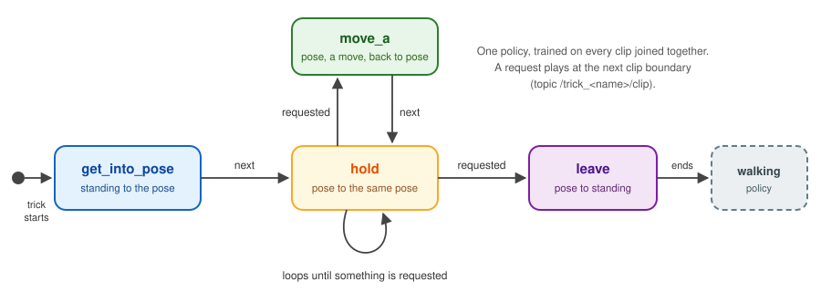

Lab 6: A Foundation Model on a Leash
====================================

*Goal: let a foundation model drive Pupper, safely. Gemini decides what to
do; the tools you write decide what it can do, and tell it what really
happened. Then train Pupper to sit, stay and shake a paw.*

.. TODO(staff): add this offering's lab slides link
.. TODO(staff): add this offering's lab document link

`Lab slides <#>`_ (TODO)

`Lab document <#>`_ (TODO)

.. note::

   **Gemini Pupper was created by** `Peng Xu <https://scholar.google.com/citations?user=460NWeQAAAAJ&hl=en>`_
   **(Google DeepMind).** This lab is built on his project
   (`sippeyxp/gemini-pupper <https://github.com/sippeyxp/gemini-pupper>`_). Thank you, Peng!

Robot foundation models are becoming the "brain" of robots: models like
Gemini can listen, look through a camera, reason about what you want, and
decide what to do. But a foundation model
cannot move a single motor. It can only **call tools**. So here is the
picture for this lab:

* **The brain** is Gemini Live: it hears you, sees through the camera and
  talks back.
* **The muscles** are policies: the walking policy from lab 4, and trick
  policies you will train in this lab.
* **The leash** is the tool layer in between, and you build it. It decides
  which tools exist, what Gemini is told about them, what each one does on
  the robot, what it refuses, and what it reports back.

The idea to keep in mind: *a foundation model is only as good as its tools,
and it only knows what its tools tell it.* A tool that fails silently is a
robot that lies to you. Remember that every time Gemini says "Okay, I'm
walking!" while Pupper stands perfectly still.

**About coding agents.** We recommend using a coding agent (Claude Code or
Codex) in this lab, and the repo comes with notes for one (``AGENTS.md``).
But you don't need one. Every piece of code you write is short, every one
has a checker you can run, and the lab tells you where each piece goes.

.. important::

   **Safety rules for this lab.** Read them now. They apply to you *and* to
   your coding agent, if you use one.

   * Test anything new with Pupper **on the ground, clear space around it, and
     your hand near the e-stop** (press the gamepad's right stick: it relaxes
     the motors, whatever Gemini is doing). Never on a table.
   * **TA gate:** before a newly trained trick policy runs on the robot for the
     first time, show a TA its score and the viewer. A badly trained trick can
     slam a paw or the body into the ground.
   * A coding agent never moves the robot on its own: no ``start.sh``, no
     ``curl`` to a POST endpoint, no ``ros2 topic pub``, unless you say yes,
     right then, standing at the robot.
   * **Pupper overheats.** Sitting and holding poses load the motors hard. If
     Pupper is hot to the touch or a motor faults, stop, relax the motors
     (``robot/stop.sh``), and let it cool.
   * Never put an API key in a file in your repo, a commit, or a chat you
     submit.

Step 0. Setup
^^^^^^^^^^^^^^^^^^^^^^^^^^^^^^^^^^^^^^^^^^^^^
1. Fork the `gemini_pupper <https://github.com/cs123-stanford/gemini_pupper>`_
   repository to your own GitHub account, following
   :doc:`forking_repositories`, and clone your fork onto the Pupper:

   .. code-block:: bash

      cd ~/
      git clone https://github.com/YOUR_USERNAME/gemini_pupper.git

2. **Your Gemini API key.** Create one in
   `Google AI Studio <https://aistudio.google.com/apikey>`_.

   .. TODO(staff): confirm whether students need billing enabled / course
      credits for the Live API models the app uses, and say so here.

3. **Set it up.** On the Pupper:

   .. code-block:: bash

      cd ~/gemini_pupper
      robot/setup.sh

   It installs what the app needs (without ``sudo``), builds it, and asks for
   your key. The key goes in ``~/.config/gemini-pupper/api_key`` on the
   Pupper, never in the repo. You can run ``setup.sh`` again at any time.

4. **Wake Pupper up.** Put Pupper on the ground in clear space, then:

   .. code-block:: bash

      robot/start.sh --kiosk     # the app on Pupper's own screen, with its mic and speaker

   Or run ``robot/start.sh`` and use the app from your laptop: forward the
   port, browse to ``http://localhost:8000``, open **Settings**, paste your
   key, and press **WAKE PUPPER**:

   .. code-block:: bash

      ssh -N -L 8000:localhost:8000 pi@pupper[YOUR_GROUP_NUMBER].local

   Say hi. The **debug view** shows every tool call Gemini makes and what the
   robot said back: keep it open for the whole lab. ``robot/stop.sh`` relaxes
   the motors and stops everything.

5. Try what the starter can do: *"stand up"*, *"lie down"*, *"do the sit
   trick"*. Then ask Pupper to come to you.

**DELIVERABLE:** Ask Pupper to walk toward you. What does Gemini *say*, what
does the robot *do*, and which tool calls (if any) show up in the debug view?
In a few sentences: why is a model that talks about moving, with no tool to
move, a particularly bad failure for a robot?

**DELIVERABLE:** Trace one voice command, *"stand up"*, from the microphone
to the controller switch: name every file and function it passes through.
Use a coding agent or read the code yourself (start at ``robot/tools.py``).
Then check your trace against the robot server's log
(``/tmp/gemini-pupper/server.log``). If an agent helped, point out anything
it got wrong, skipped or made up.

Step 1. The Leash: Prompt and Tools
^^^^^^^^^^^^^^^^^^^^^^^^^^^^^^^^^^^^^^^^^^^^^
Gemini gets two things from your robot when it connects: a **prompt** that
says who Pupper is and how to behave, and a list of **tools**. Everything is
Python, on the robot:

.. figure:: ../../../_static/lab6/tool_loop.svg
   :align: center
   :width: 95%

   The loop you are building. Gemini picks a tool from its *description*;
   your code on the robot does the work and reports back; the report is the
   only thing Gemini learns about what actually happened.

* ``robot/prompt.md``: the prompt.
* ``robot/tools.py``: the tools. Each tool is one Python function with a
  ``@tool(...)`` line above it. The ``@tool`` line is what Gemini reads (a
  description, and a description for each parameter); the function is what
  runs. Read the finished tools at the top of the file first:
  ``stand_up``, ``lie_down``, ``stop``, ``robot_status``, ``play_trick``.
* ``robot/tool_server.py``: the robot side. A queue runs one motion at a
  time and switches the walking and trick policies. Every method returns a
  ``Result``, and its message goes straight back to Gemini.

Work through the parts marked ``YOUR CODE HERE`` / ``TODO(student)``:

1. **Refuse what the robot must not do** (``check_move`` in
   ``tool_server.py``). Speeds, durations and distances all have limits
   (``MoveLimits``). The string you return is all Gemini learns about the
   refusal: say what was wrong and what the limit is.
2. **Walk** (the loop in ``move`` in ``tool_server.py``). One speed message is
   not enough: ``cmd_vel_mux`` (the node that lets your joystick win over
   Gemini) drops a source that has been quiet for half a second.
3. **Your motion tools** (``move`` and ``turn`` in ``tools.py``). Write what
   Gemini reads, and the code that turns a direction and a speed into robot
   velocities. Put the robot's real limits in your descriptions. And decide
   what *"run"* means: the walking policy switches to its running gait above
   about 0.5 m/s, and in this lab "run" means **1.0 m/s or faster**. Where
   does that rule live: in the description, in code, or both?
4. **Follow mode.** The robot has a person follower (camera → person
   detection → walking, like your lab 5 state machine). Write the ``follow``
   tool, and make this rule true in ``_leave_follow_mode``:

      *Questions and conversation keep following. Any motion (walk, turn,
      trick, stand up, lie down) ends follow mode, and Pupper says so first:
      "Let me stop following you and ..."*

5. **The prompt** (``robot/prompt.md``). Give Pupper a personality, and the
   rules it needs: call a tool before saying it moved, be honest when a tool
   says no, what to say before follow mode ends, what to do if someone says
   stop or if it falls over. The comment at the top of the file lists them.

You don't need the robot to check your code. The repo has tests that run your
tools against a fake robot. Run them after every change:

.. code-block:: bash

   python3 robot/test_tools.py part1

To try it on the robot: after changing ``tools.py`` or ``tool_server.py``,
restart (``robot/stop.sh && robot/start.sh``). After changing ``prompt.md``,
just reconnect in the app.

.. note::

   **Checkpoint: a refusal Gemini can explain.** Get Gemini to call your
   motion tool with a request the robot refuses, and explain the refusal to
   you using *only the robot's reply*. If your descriptions are so good that
   Gemini never asks for anything impossible, great: try something that fits
   the tool but breaks another rule. "Run forward for ten seconds" is more
   than 5 m. Show a TA the conversation and the debug view.

**DELIVERABLE:** The output of ``python3 robot/test_tools.py part1`` with every
check passing.

**DELIVERABLE:** Your tools: for each one you wrote, its description and one
sentence on a choice you made (which parameters, which defaults, what the
description promises). Where is "run means at least 1.0 m/s" enforced, and
why there?

**DELIVERABLE:** Your ``prompt.md``. Pick two rules from it. For each: is the
sentence in the prompt enough, or does the robot also enforce it in code?
Why? (Hint: try the follow-mode rule with ``_leave_follow_mode`` switched
off.)

**DELIVERABLE:** A video of Pupper, by voice only: walking forward and
backward, turning both ways, sidestepping, and running. Include the refusal
checkpoint (a screenshot of the debug view is fine for that part).

**DELIVERABLE:** A video of follow mode: Pupper follows you, you ask it a
question while it follows (it keeps following), then you ask it to do
something else (it tells you it will stop following, then does it).

**DELIVERABLE:** Your motion tools reply as soon as the command is *queued*,
not when it *finishes*. What does Gemini believe at that moment, and when (if
ever) does it find out that a queued motion failed? Describe one situation
where this matters, and one way you could fix it.

Step 2. Sit, Stay, Shake
^^^^^^^^^^^^^^^^^^^^^^^^^^^^^^^^^^^^^^^^^^^^^
Pupper already knows ``sit``: it sits like a dog, holds for two seconds, and
stands right back up. By the end of this step, Pupper will **sit when told,
stay sitting for as long as you like, shake whichever paw you ask for, and
stand up when you say so**, all by voice.

You won't design any new poses. You get two finished motions, *sit down and
stand up* and *shake the left paw while sitting*, and you cut and join them
into a **clip library**: named pieces of motion the robot plays one at a time,
on request. Then you train one **tracking policy** on the whole library,
BeyondMimic-style: in simulation, the policy watches the reference motion and
is rewarded for following it, the same idea as lab 4's reference gaits.

Part A: Build the Clip Library
----------------------------------------
Open the `CS123 Sit, Stay, Shake notebook <https://colab.research.google.com/github/cs123-stanford/pupper-mjlab/blob/main/notebooks/CS123_Pupper_Sit_Stay_Shake.ipynb>`_
in Colab, **File → Save a copy in Drive**, and pick the same G4 GPU runtime
as lab 4. Log into W&B with the **same account your Pupper is logged into**:
W&B carries your motion to training, and your policy to the robot. (Prefer
your laptop? The same TODOs are in ``tricks/sit_stay_shake.py`` in
`pupper-mjlab <https://github.com/cs123-stanford/pupper-mjlab/tree/main/src/mjlab/tasks/tracking/config/pupper>`_.)

This is the library you build:

   A clip trick. Every clip starts and ends at a pose it shares with its
   neighbours, so the robot can go straight from the end of one clip to the
   start of the next. A looping clip repeats until something else is asked
   for.

Fill in the four TODOs in the notebook:

1. ``cut``: a piece of a motion between two times. Cut the sit into
   ``sit_down`` and ``stand_up``.
2. ``hold``: stand still in one pose. This is ``sit_idle``, the **stay**.
3. ``mirror``: swap left and right, to get ``shake_right`` from
   ``shake_left``. You will need to work out how Pupper's left and right
   motors are mounted: does a mirrored leg copy the other leg's angles, or
   flip some signs? Your lab 2 kinematics helps.
4. **The clip table and the training order.** Which clip loops? What plays
   after each one? And in what order are the clips joined for training, so
   the policy sees every change the robot can make?

The notebook checks your code and prints ``ok`` or ``FAIL`` for each check.

**DELIVERABLE:** Draw your clip graph, like the figure above: every clip, the
pose it starts and ends in, which one loops, and each clip's ``next``. Why
must clips meet at matching poses: what would the robot do at a mismatched
boundary?

**DELIVERABLE:** Your ``mirror``. Which joint angles did you negate, and why
does Pupper need that? How did you check it?

**DELIVERABLE:** Your training order. Why does every change the robot can make
on request need to appear in it?

Part B: Watch It Fall, Then Train It
----------------------------------------
Keep going in the notebook:

* **Replay with physics.** The robot plays the joined motion as a fixed
  recording, with no policy. Expect it to fall.
* **Upload** the motion to W&B, and **train** one policy on the whole library
  (3,000 iterations).
* **Score** your policy with the same physics check, and watch it in the
  viewer.

**DELIVERABLE:** The plain-replay verdict and worst errors, next to your
policy's. In which clip does plain replay fail, and why can't a fixed
recording recover from it?

**DELIVERABLE:** In your own words: why did the "stay" not need a policy
trained on a longer sit? What does the policy observe, frame by frame, that
makes an open-ended stay possible?

Part C: On the Robot
----------------------------------------
1. **TA gate.** Show a TA your policy's score and the viewer.
2. Fetch the policy on the Pupper with the command the training log printed,
   naming it ``sit_stay_shake``:

   .. code-block:: bash

      python3 robot/get_trick.py <entity>/mjlab/<run-id> --name sit_stay_shake

3. Fill in ``tricks/sit_stay_shake/trick.yaml``: the ``description`` (what
   Gemini reads), the ``actions`` Gemini may ask for while Pupper sits (with a
   description each), the ``exit_clip``, ``end_pose: sitting``, and
   ``max_body_angle_deg: 60`` (the sit leans back about 35 degrees).
4. **Give Gemini the actions.** Write ``trick_action`` in ``tool_server.py``,
   and the ``trick_action`` tool in ``tools.py``. This is where the robot's
   *state* matters: an action only makes sense while its trick holds its pose,
   and the exit clip ends that state. Think about when you check that: when
   Gemini calls the tool, or when the queue reaches it? Test "sit, and give me
   your paw" said in one breath.

   .. code-block:: bash

      python3 robot/test_tools.py part2

5. Restart (``robot/stop.sh && robot/start.sh``) and try it by voice.

**DELIVERABLE:** The output of ``python3 robot/test_tools.py part2`` with every
check passing.

**DELIVERABLE:** A video, by voice only: "sit", wait at least ten seconds (it
stays), "shake", "now the other paw", "stand up", "walk forward".

**DELIVERABLE:** Ask for a paw shake while Pupper is standing. What does it do,
and what does it say? Where did your check fire, and what did the tool result
tell Gemini?

Step 3. Demo and Reflection
^^^^^^^^^^^^^^^^^^^^^^^^^^^^^^^^^^^^^^^^^^^^^
* **Live demo (TA checkoff).** A short, unscripted conversation with Pupper
  that walks and turns, follows someone and stops following, sits, stays,
  shakes both paws, stands, plays a trick, and refuses at least one request
  with a reason.
* **Reflection.** A page, not more:

  - Where did you put each rule: in the prompt, in a tool description, or in
    code? Which one would you move, and why?
  - One time Pupper did something you didn't expect. What did the tool results
    and the server log tell you, and what did you change?
  - If you used a coding agent: one prompt that worked well, one place it went
    wrong, and how you caught it. Attach short excerpts (no secrets).
  - What would you tell next year's students?

**DELIVERABLE:** Your reflection.

**DELIVERABLE:** A video of your demo conversation.

Optional: Your Own Trick or Dance
^^^^^^^^^^^^^^^^^^^^^^^^^^^^^^^^^^^^^^^^^^^^^
Want more? The `CS123 Pupper Tricks notebook <https://colab.research.google.com/github/cs123-stanford/pupper-mjlab/blob/main/notebooks/CS123_Pupper_Tricks.ipynb>`_
takes any motion from keyframes to a trained policy on the robot. Design a
trick of your own, or a few dance moves as one clip trick, and give Gemini a
``dance`` tool that checks a whole routine before the first move. This is a
great start for a final project.

.. TODO(staff): add the UniMate text-to-motion option (type a sentence, get a
   Pupper reference motion, edit and chain clips) once it is packaged for
   students.

Working With a Coding Agent (Optional)
^^^^^^^^^^^^^^^^^^^^^^^^^^^^^^^^^^^^^^^^^^^^^
If you use one, a few habits help:

* **Give it checks it can run**: ``python3 robot/test_tools.py``, and the
  notebook's (or ``sit_stay_shake.py``'s) ``ok`` / ``FAIL`` checks.
* **Ask for the plan before the code.** "Read ``tool_server.py`` and tell me
  how a trick action should use the queue; don't edit anything yet."
* **Check its claims against the robot.** The server log, the debug view and
  ``curl localhost:8000/system/mode`` are the truth. The agent's summary is
  not.
* **Don't let it weaken a test or raise a limit** to make something pass.

Congratulations! Pupper now listens, answers, and does what it is told, and
only what it can do safely. You built the leash for a robot foundation model:
tools a model can reason about, honest reports of what happened, state and
preconditions, and a trick pipeline that turns motions into a policy on
hardware. Your final project can build on all of it.

Resources
-----------
`Gemini Pupper <https://github.com/sippeyxp/gemini-pupper>`_ by
`Peng Xu <https://scholar.google.com/citations?user=460NWeQAAAAJ&hl=en>`_
(Google DeepMind), and his write-up, *Interactive Robot Dog with Gemini Live*
(``docs/interactive-robot-dog.md`` in your repo)

`Gemini Live API <https://ai.google.dev/gemini-api/docs/live>`_ and
`function calling <https://ai.google.dev/gemini-api/docs/function-calling>`_

`Gemini Robotics: Bringing AI into the Physical World <https://arxiv.org/abs/2503.20020>`_

`Do As I Can, Not As I Say: Grounding Language in Robotic Affordances (SayCan) <https://say-can.github.io/>`_

`Code as Policies: Language Model Programs for Embodied Control <https://code-as-policies.github.io/>`_

`BeyondMimic: From Motion Tracking to Versatile Humanoid Control <https://arxiv.org/abs/2508.08241>`_

`DeepMimic: Example-Guided Deep Reinforcement Learning of Physics-Based Character Skills <https://arxiv.org/abs/1804.02717>`_

`Pupper tricks: design, replay, train <https://github.com/cs123-stanford/pupper-mjlab/tree/main/src/mjlab/tasks/tracking/config/pupper>`__ (the README behind the notebooks)
