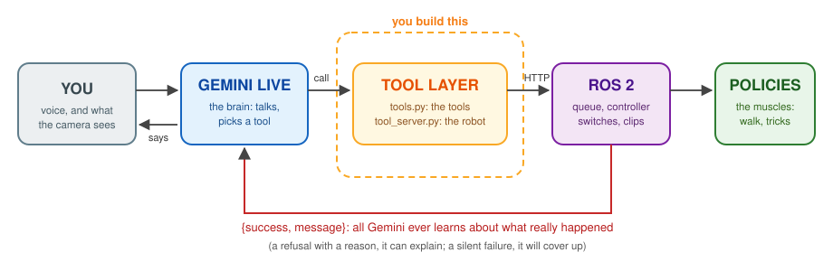

Lab 6: Who's a Good Pupper?
===========================

*Goal: give Pupper a voice and a will — let Gemini drive the robot through
tools you design, then teach it to sit, stay, shake a paw, and dance.*

.. TODO(staff): add this offering's lab slides link
.. TODO(staff): add this offering's lab document link

`Lab slides <#>`_ (TODO)

`Lab document <#>`_ (TODO)

This lab puts everything you have built so far behind a conversation. Here is
the picture to keep in your head: **Gemini is the brain, trained policies are
the muscles, and you build the nervous system in between.**

* The **brain** is Gemini Live, a model that listens to you, watches through a
  camera, and talks back in real time. It cannot move a single motor. All it
  can do is *call tools*.
* The **muscles** are policies: the walking policy you know from lab 4, and
  small trick policies that track a reference motion — the same
  reference-guided idea as lab 4, now applied to sitting, shaking a paw, and
  dancing.
* The **nervous system** is the tool layer: which tools exist, how they are
  described to Gemini, what each one does on the robot, and — just as
  important — what each one *reports back*. The starter repo ships with almost
  none of it. That is your job.

The quiet thesis of this lab: *a language model is only as good as its tools,
and it only knows what your tools tell it.* A tool that fails silently is a
robot that lies to you. Keep that in mind every time Gemini says "Okay, I'm
walking!" while Pupper stands perfectly still.

This lab is also **agentic end to end**: you are expected to use a coding
agent (Claude Code or Codex) throughout — to read the codebase, write tools,
search for keyframe values, and debug. You will hand in excerpts of your agent
sessions along with a short reflection (Step 4). Those are graded lightly, on
*process*: did you verify what the agent told you, test in simulation first,
and catch its mistakes? Your robot's behavior carries most of the grade.

.. important::

   **Safety rules for this lab.** Read them now; they apply to you *and* your
   coding agent.

   * Test anything new with Pupper **on the ground, clear space around it, and
     your hand near the e-stop** (press the gamepad's right stick: it relaxes
     the motors, whichever controller Gemini is using). Never on a table.
   * **TA gate:** before a newly trained trick policy runs on the robot for the
     first time, show a TA its physics-replay score and the viewer video. A
     badly trained contact-heavy trick can slam a paw or the body into the
     ground.
   * Your coding agent never moves the robot on its own: no ``start.sh``, no
     ``curl`` to a POST endpoint, no ``ros2 topic pub`` without you saying yes,
     right then, while standing at the robot. The repo's ``AGENTS.md`` tells
     it so — make sure it read it.
   * **Pupper overheats.** Sitting and holding poses load the motors hard. If
     Pupper is hot to the touch or a motor faults, stop, relax the motors
     (``robot/stop.sh``), and let it cool before you continue.
   * Never put an API key in a file in your repo, a commit, or a chat with an
     agent you then submit.

Step 0. Setup
^^^^^^^^^^^^^^^^^^^^^^^^^^^^^^^^^^^^^^^^^^^^^
1. Fork the `gemini_pupper <https://github.com/cs123-stanford/gemini_pupper>`_
   repository to your own GitHub account, following
   :doc:`forking_repositories`, and clone your fork onto the Pupper:

   .. code-block:: bash

      cd ~/
      git clone https://github.com/YOUR_USERNAME/gemini_pupper.git

   Clone it on your laptop too — you will build the web app there.

2. **Your coding agent.** Claude Code comes preinstalled (logged out) on your
   Pupper; log in with your own account, or use Codex, or run the agent on
   your laptop against your clone. Either way, start your first session in the
   repo and have it read ``AGENTS.md`` (Claude Code picks it up automatically
   through ``CLAUDE.md``). Save your sessions as you go (for example,
   ``/export`` in Claude Code) — you will need excerpts in Step 4.

3. **Your Gemini API key.** Create one in
   `Google AI Studio <https://aistudio.google.com/apikey>`_. It goes in the
   app's Settings panel (stored in your browser), and — only if you want the
   app on the robot's own screen — in a file on the Pupper that no repo can
   see:

   .. code-block:: bash

      mkdir -p ~/.config/gemini-pupper && (umask 077; cat > ~/.config/gemini-pupper/api_key)
      # paste the key, press Enter, then Ctrl-D

   .. TODO(staff): confirm whether students need billing enabled / course
      credits for the Live API models the app uses, and say so here.

4. **Build the web app** on your laptop (Node.js 20 or newer) and copy it to
   the robot:

   .. code-block:: bash

      cd gemini_pupper
      npm install
      npm run build
      rsync -a dist/ pi@pupper[YOUR_GROUP_NUMBER].local:~/gemini_pupper/dist/

5. **Wake Pupper up.** Put Pupper on the ground in clear space. On the Pupper:

   .. code-block:: bash

      cd ~/gemini_pupper
      robot/start.sh        # robot stack + robot server, about 40 s

   On your laptop, forward the robot server's port, browse to
   ``http://localhost:8000``, open **Settings**, paste your key, and press
   **WAKE PUPPER**:

   .. code-block:: bash

      ssh -N -L 8000:localhost:8000 pi@pupper[YOUR_GROUP_NUMBER].local

   Say hi. The face listens, the mouth moves, and the **debug view** shows
   every tool call Gemini makes and what the robot said back. Keep it open for
   the whole lab. ``robot/stop.sh`` relaxes the motors and stops everything.

6. Try what the starter can do: *"stand up"*, *"lie down"*, *"do the sit
   trick"*. Then ask it to come to you.

**DELIVERABLE:** Ask Pupper to walk toward you. What does Gemini *say*, what
does the robot *do*, and which tool calls (if any) show up in the debug view?
In a few sentences: why is a model that talks about moving, with no tool to
move, a particularly bad failure for a robot?

**DELIVERABLE:** Ask your coding agent to trace one voice command —
*"stand up"* — from the microphone to the controller switch, naming every file
and function it passes through. Then check its answer yourself against the
code and the robot server's log (``/tmp/gemini-pupper/server.log``). Submit the
trace, and point out anything the agent got wrong, skipped, or made up.

Step 1. Wake It Up: Walk, Turn, Run
^^^^^^^^^^^^^^^^^^^^^^^^^^^^^^^^^^^^^^^^^^^^^
*(About 1.5 hours.)* Every tool has two halves, and you write both:

   The loop you are building. Gemini picks a tool from its *description*; your
   code on the robot does the work and reports back; the report is the only
   thing Gemini learns about what actually happened.

* **The declaration** — ``buildTools`` in ``services/geminiLive.ts``: the
  tool's name, description, and parameter schema. This text is *all* Gemini
  knows about your tool. It decides when to call it, what arguments to fill
  in, and what to tell the user from these words alone. Below
  ``buildTools``, ``handleMessage`` dispatches each call to the robot and
  passes the robot's ``{success, message}`` back to Gemini.
* **The implementation** — ``robot/tool_server.py``: what the tool does on the
  robot, through a command queue that runs one motion at a time. Every method
  returns a ``Result`` whose message goes straight back to Gemini.

Work through the marked sections (``YOUR CODE HERE`` / ``TODO(student)``):

1. **Refuse what the robot must not do** (``check_move``). Speeds, durations,
   and distances all have limits (``MoveLimits``). The string you return is
   the whole explanation Gemini gets — say what was wrong and what the limit
   is.
2. **Walk** (``move``'s queued ``run``). One velocity message is not enough:
   ``cmd_vel_mux`` (the node that lets your joystick outrank Gemini) drops a
   source that has been quiet for half a second.
3. **Design your motion tools** in ``buildTools``, and dispatch them in
   ``handleMessage``. One general tool with three velocities, or separate
   walk and turn tools with friendly defaults? Your call — but think about
   which one Gemini will use *well*. Put the robot's actual limits (``L``) in
   your descriptions. And decide what *"run"* means: the default policy
   switches to its running gait above about 0.5 m/s, and in this lab "run"
   means **1.0 m/s or faster**. Where does that rule live — in the
   description, in code, or both?
4. **Follow mode.** The robot has a built-in person follower (camera → person
   detection → walking, the same idea as your lab 5 state machine). Add a tool
   that switches it on and off, and implement this spec exactly:

      *Questions and conversation keep following. Any motion — walk, turn,
      trick, stand up, lie down — ends follow mode, and Pupper says so first:
      "Let me stop following you and ..."*

   The robot side lives in ``_leave_follow_mode``, which every motion tool
   already calls.

You do not need the robot to check the robot side. The repo ships a desk-side
contract test that runs your tool layer against a fake robot — run it after
every change (and let your agent run it too):

.. code-block:: bash

   python3 robot/test_tools.py part1

For the browser side, a faster loop than rebuilding ``dist/``: run
``npm run dev`` on your laptop, open ``https://localhost:5173``, and set
**Settings → Robot API URL** to ``http://localhost:8000`` (your SSH tunnel).
It reloads on every save. Changes to ``robot/*.py`` need a restart:
``robot/stop.sh && robot/start.sh``.

.. note::

   **Checkpoint: a refusal Gemini can explain.** Get Gemini to call your
   motion tool with a request the robot refuses, and explain the refusal to
   you using *only the robot's reply*. If your tool descriptions are so good
   that Gemini never asks for anything impossible — great, that is half the
   point — try something that fits the schema but breaks a different rule:
   "run forward for ten seconds" is more than 5 m. Show a TA the conversation
   and the debug view.

**DELIVERABLE:** The output of ``python3 robot/test_tools.py part1`` with every
check passing.

**DELIVERABLE:** Your tool set: list each tool you added, with its
description, and a sentence on each design choice you made (one tool or
several, which arguments, which defaults). Where is "run means at least
1.0 m/s" enforced, and why there?

**DELIVERABLE:** A video of Pupper, by voice only: walking forward and
backward, turning both ways, sidestepping, and running. Include the refusal
checkpoint (a screenshot of the debug view is fine for that part).

**DELIVERABLE:** A video of follow mode: Pupper follows you, you ask it a
question while it follows (it keeps following), then you ask it to do
something else (it tells you it will stop following, then does it). Then
explain: why does the rule have to be enforced on the robot, rather than just
written into a tool description?

**DELIVERABLE:** Your motion tools reply as soon as the command is *queued*,
not when it *finishes*. What does Gemini believe at that moment, and when (if
ever) does it find out that a queued motion failed? Describe one situation
where this matters, and one way you could fix it.

Step 2. Sit, Stay, Shake
^^^^^^^^^^^^^^^^^^^^^^^^^^^^^^^^^^^^^^^^^^^^^
*(About 3.5 hours — the heart of the lab.)* Pupper already knows one trick
beyond the built-in recordings: ``sit``. It steps its hind feet in, sits like a
dog with its chest up, holds for two seconds... and stands right back up. By
the end of this step, Pupper will **sit when told, stay sitting for as long as
you like, shake whichever paw you ask for, and stand up when you say so** — all
by voice.

Part A: The Worked Example, End to End
----------------------------------------
First, learn the trick pipeline on a motion that already works. A trick is a
**reference motion** — the body's pose and the 12 joint angles over time — and
it can reach the robot in two ways: played open loop as a joint recording, or
tracked by a small policy trained in simulation (BeyondMimic-style: the policy
observes the reference and is rewarded for following it, the same recipe as
lab 4's reference gaits).

* Open the `CS123 Pupper Tricks notebook <https://colab.research.google.com/github/cs123-stanford/pupper-mjlab/blob/main/notebooks/CS123_Pupper_Tricks.ipynb>`_
  in Colab, **File → Save a copy in Drive**, and pick the same G4 GPU runtime
  as lab 4. Log into W&B with the **same account your Pupper is logged into**:
  W&B is how motions and policies travel between your laptop, Colab, and the
  robot.
* Read ``tricks/sit.py`` in
  `pupper-mjlab <https://github.com/cs123-stanford/pupper-mjlab/tree/main/src/mjlab/tasks/tracking/config/pupper>`_
  (and the README next to it): keyframes of where the body is and where each
  foot touches the ground, with inverse kinematics filling in the joint
  angles.
* Run the notebook top to bottom with the worked example unchanged and
  ``TRICK_NAME = "my_sit"``. For this pipeline check, ``ITERATIONS = 500`` is
  enough. You will see, in order: the **motion report** (IK error, ground
  clearance, joint speeds), the **physics replay** verdict — **HOLDS UP**,
  **WOBBLES**, or **FALLS** — for plain open-loop replay, the upload of the
  motion to W&B, training, and the same physics check with your policy in
  charge.
* On the Pupper, fetch your policy with the command the training log prints,
  and restart so the launch file loads its controller:

  .. code-block:: bash

     python3 robot/get_trick.py <entity>/mjlab/<run-id> --name my_sit
     robot/stop.sh && robot/start.sh

* Edit ``tricks/my_sit/trick.yaml``: its ``description`` is what Gemini reads
  when deciding whether your trick matches what someone asked for.
* **TA gate**, then ask Pupper for ``sit_replay`` (the open-loop recording),
  ``sit`` (our policy), and ``my_sit`` (yours).

You can also design and replay motions **locally with your coding agent** —
motion design and physics replay run fine on a laptop CPU (``uv sync`` in
pupper-mjlab, then the commands in its tricks README). The report and the
verdict are printed as text, which makes them perfect for an agent to iterate
on. Either way, the motion reaches training the same way: uploaded to W&B by
name (``upload_motion``); in the notebook, set ``TRICK_NAME`` and
``MOTION_ARTIFACT`` by hand and start at section 6.

**DELIVERABLE:** The physics-replay verdict and worst errors for plain replay
of the sit, next to your trained policy's score. Then a side-by-side video of
``sit_replay`` and ``sit`` on the robot. What does the policy do that the
recording cannot, and why can't an open-loop recording do it?

Part B: Make It Stay
----------------------------------------
Now the real problem. The sit sits for two seconds because its reference sits
for two seconds. You want a sit that lasts *until someone says otherwise* —
without knowing, at training time, how long that will be. And from that sit,
you want Pupper to offer a paw on request, and stand up on request.

Before you reach for a longer sit, ask your agent — and yourself — what a
tracking policy actually does on the robot, frame by frame. What does it
observe? What would happen if the reference it is fed stopped moving forward
in time, or went back to an earlier frame?

.. hint::

   Nothing forces a reference to play once, from start to finish. The robot's
   trick controller can play a policy's motion as **clips**: named pieces of
   one motion, each with a ``next`` clip to play when it ends, some of them
   **looping** until something else is requested. A clip is requested by name
   (on the topic ``/trick_<name>/clip``) and starts at the next clip
   boundary. The mechanism is provided; *what the clips are* is your design.

   .. figure:: ../../../_static/lab6/clip_graph.svg
      :align: center
      :width: 95%

      A generic clip trick. Every clip starts and ends at a pose it shares
      with its neighbours, so the controller can go straight from the end of any
      clip to the start of the next.

   In pupper-mjlab, ``motion_design.concat_clips`` joins your clips into one
   continuous motion (with a clip table) for training, and refuses clips whose
   poses don't meet. See "Clip tricks" in the tricks README and section 3b of
   the notebook. One policy trains on the whole library; on the robot, the
   trick's ``trick.yaml`` names the clips Gemini may request (``actions``) and
   the one that returns to standing (``exit_clip``).

Work through it:

1. **Design the clip library.** Which clips do you need? Where does each one
   start and end? Which one loops? You can build the sitting-down part out of
   the worked example's keyframes. The paw is the new part: a front foot that
   leaves the ground is a *free* leg (leave it out of ``feet`` and give its
   joint angles, or give it a target in the air), and the body should lean
   onto the other three feet first. Iterate with the motion report and the
   physics replay until the verdicts make sense — expect plain replay to
   struggle with the paw, and ask yourself why.
.. TODO(staff): time a 3,000-iteration tracking run on the Colab G4 runtime
   (about 15 minutes on an RTX 5090) and budget Steps 2 and 3 accordingly.

2. **Train one policy on the library** (the full 3,000 iterations), score it,
   and get it through the **TA gate**. Fetch it with ``get_trick.py`` under a
   name of your choice, and fill in its ``trick.yaml``: the description,
   ``actions`` (with descriptions Gemini will read), ``exit_clip``,
   ``end_pose``, and ``max_body_angle_deg`` (the tilt e-stop while the trick
   plays: the sit leans back about 35 degrees).
3. **Give Gemini the actions.** Implement ``trick_action`` in
   ``tool_server.py`` and a matching tool in ``buildTools``. This is where the
   robot's *state* matters: an action only makes sense while its trick is
   holding its pose, and the exit clip ends that state. Think about when you
   check that precondition — when Gemini calls the tool, or when the queue
   reaches it — and test "sit, and give me your paw" said in one breath.

   .. code-block:: bash

      python3 robot/test_tools.py part2

**DELIVERABLE:** Draw your clip graph, like the figure above: every clip, the
pose it starts and ends in, which one loops, and each clip's ``next``. Why must
clips meet at matching poses — what would the robot do at a mismatched
boundary?

**DELIVERABLE:** In a paragraph, in your own words: why did "stay" not need a
policy trained on a longer sit? What does the policy observe that makes an
open-ended stay possible?

**DELIVERABLE:** Plain-replay verdict for your paw clip alone, and your trained
policy's score on the whole library. What did training buy you?

**DELIVERABLE:** The output of ``python3 robot/test_tools.py part2`` with every
check passing.

**DELIVERABLE:** A video, by voice only: "sit" — wait at least ten seconds
(it stays) — "shake" — "now the other paw" — "stand up" — "walk forward".

**DELIVERABLE:** Ask for a paw shake while Pupper is standing. What does it do,
and what does it say? Where did your precondition check fire, and what did the
tool result tell Gemini?

Step 3. Your Own Dance
^^^^^^^^^^^^^^^^^^^^^^^^^^^^^^^^^^^^^^^^^^^^^
*(About 3.5 hours.)* Now the creative part: give Pupper a move set of its own,
and a ``dance`` tool that lets Gemini choreograph it.

1. **Design at least three moves** as clips of one clip trick, around a resting
   pose the dance returns to between moves. So that every group's dance is its
   own, your moves must satisfy the constraint for your group number
   (``YOUR_GROUP_NUMBER mod 6``):

   .. TODO(staff): sanity-check these constraints on a robot before release.

   .. csv-table::
      :header: "Group mod 6", "Your moves must include"
      :widths: 15, 85

      "0", "one move that shifts the body sideways, and one paw move"
      "1", "one paw move, and one bow (nose down at least 15 degrees)"
      "2", "one move that shifts the body sideways, and one that turns the body at least 20 degrees and back"
      "3", "one move that lowers the body at least 4 cm, and one paw move"
      "4", "a mirrored pair (the same move to the left and to the right), and one bow"
      "5", "one move that rolls the body at least 10 degrees, and one move that shifts the body sideways"

2. Take the library through the same loop as Step 2: report, physics replay,
   upload, train, score, **TA gate**, ``get_trick.py``. Install it as
   ``tricks/dance/`` (or change ``DANCE_TRICK`` in ``tool_server.py``) and
   list your moves as its ``actions``.
3. **Write the dance tool.** Gemini sends a list of moves with timing; the
   robot validates the *whole* request before anything moves (unknown moves,
   bad timing, a dance that runs too long) and then sequences it, reusing your
   Step 2 machinery. The schema is yours to design: ``robot/server.py`` has a
   suggested ``DanceStep`` (a move and a rest after it) and
   ``robotBridge.dance`` sends it; change them together if you want something
   else. Then write a description that makes Gemini a good choreographer.

   .. code-block:: bash

      python3 robot/test_tools.py part3

(Optional, for the ambitious: make the timing follow a beat — a tempo
argument, or music.)

**DELIVERABLE:** Your move set: each move, what it does, and how the set meets
your group's constraint. Include the physics-replay verdicts and your trained
policy's score.

**DELIVERABLE:** Your dance tool's declaration (name, description, schema), and
what your validation refuses. Why validate the whole dance before the first
move, instead of failing at the move that is wrong?

**DELIVERABLE:** A video of Gemini choreographing: ask for a dance in your own
words ("do a little dance with a pause after the second move", "your best
move, three times") and show what it sends in the debug view.

Step 4. Demo and Reflection
^^^^^^^^^^^^^^^^^^^^^^^^^^^^^^^^^^^^^^^^^^^^^
*(About 1.5 hours.)* Put it all together.

* **Live demo (TA checkoff).** A short, unscripted conversation with Pupper
  that walks and turns, follows someone and stops following, sits, stays,
  shakes both paws, stands, dances, and refuses at least one request with a
  reason. Feel free to give Pupper a personality: the system instruction is in
  Settings.
* **Reflection.** A page, not more, on how you worked with your coding agent:

  - Which prompts worked well, and why? Paste one or two.
  - Where did the agent go wrong — a wrong claim about the code, a motion that
    looked fine in its report and fell over in replay, a test it "fixed" by
    weakening it? How did you catch it?
  - What did you have to verify yourself, and how?
  - What would you tell next year's students about using an agent for robotics?

  Attach excerpts of your agent sessions that back this up (not whole
  transcripts; remove anything secret).

**DELIVERABLE:** Your reflection and transcript excerpts.

**DELIVERABLE:** A video of your demo conversation.

Working With Your Coding Agent
^^^^^^^^^^^^^^^^^^^^^^^^^^^^^^^^^^^^^^^^^^^^^
A few habits that separate a productive session from an expensive one:

* **Give it checks it can run.** Agents are at their best when they can check
  their own work. Point it at ``python3 robot/test_tools.py``, ``npx tsc
  --noEmit``, the motion report, and ``play_motion.py``'s verdict, and ask it to
  run them after every change.
* **Ask for the plan before the code.** "Read ``tool_server.py`` and tell me
  how a trick action should interact with the queue — don't edit anything yet"
  gets you an answer you can check before anything changes.
* **Describe motions in numbers.** "Chest up 35 degrees, hips on the ground,
  front legs straight under the shoulders" gives an agent something to search
  for; "sit nicely" does not. Let it sweep keyframe values against the report,
  the way the note at the end of ``sit.py`` describes.
* **Verify claims against the robot, not against the agent.** The server log,
  the debug view, ``curl localhost:8000/system/mode`` and
  ``ros2 control list_controllers`` are ground truth. The agent's summary of
  what happened is not.
* **Don't let it weaken a test or raise a limit to make something pass.** If a
  contract test fails, the tool is wrong until proven otherwise.
* **Keep sessions focused**, one per part, and save them as you go.

Congratulations — Pupper now listens, answers, and does what it is told, and
only what it can do safely. You built the nervous system of a robot
foundation-model stack: tools a language model can reason about, honest
reports of what happened, state and preconditions, and a trick pipeline that
turns a pose you describe in numbers into a policy on hardware. Your final
project can build on all of it.

Resources
-----------
`Gemini Live API <https://ai.google.dev/gemini-api/docs/live>`_ and
`function calling <https://ai.google.dev/gemini-api/docs/function-calling>`_

`Do As I Can, Not As I Say: Grounding Language in Robotic Affordances (SayCan) <https://say-can.github.io/>`_

`Code as Policies: Language Model Programs for Embodied Control <https://code-as-policies.github.io/>`_

`BeyondMimic: From Motion Tracking to Versatile Humanoid Control <https://arxiv.org/abs/2508.08241>`_

`DeepMimic: Example-Guided Deep Reinforcement Learning of Physics-Based Character Skills <https://arxiv.org/abs/1804.02717>`_

`Pupper tricks: design, replay, train <https://github.com/cs123-stanford/pupper-mjlab/tree/main/src/mjlab/tasks/tracking/config/pupper>`__ — the README behind the notebook

`AGENTS.md <https://agents.md/>`_ — the convention the lab repo uses to brief your coding agent
