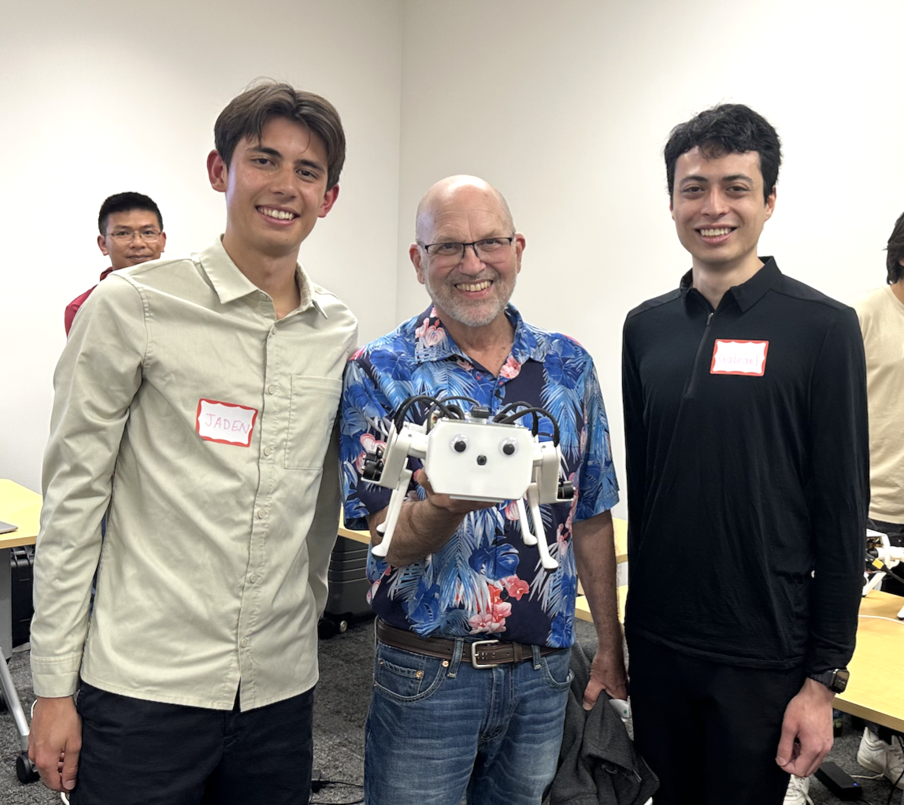

Lab 3: Inverse Kinematics and Trajectory Tracking
================================================

Goal
----
Implement inverse kinematics for a robot leg and create a trajectory tracking system using ROS2.

Lab Review Slides: `Lab 3 slides <https://docs.google.com/presentation/d/1NvK2dUOB0lqD47rk3x3e-lUMVMnwtgSr/edit#slide=id.g2f9b22e15a6_0_233>`_ 

Please also fill out the `lab document <https://docs.google.com/document/d/1X1UOZr6DPuhhVHxnpaHo7VfXr0YNnqKPDF-i4rvzxN8/edit?usp=sharing>`_ .

.. raw:: html

    

        <iframe src="https://www.youtube.com/embed/ygwWZw50yw0" frameborder="0" allowfullscreen style="position: absolute; top: 0; left: 0; width: 100%; height: 100%;"></iframe>
    

|

Part 0: Setup
-------------

1. Build remaining legs for Pupper. Follow the build instructions to assemble the last legs of Pupper, keeping note that all the pieces for each leg are correctly labeled (each right leg piece has an R on it, and each left leg piece has an L on it).

    .. raw:: html

       <iframe src="../../../_static/lab_2_3_build_instructions.pdf" width="100%" height="600px"></iframe>

2. Clone the lab 3 code repository on your Raspberry Pi:

   .. code-block:: bash

      cd ~/
      git clone https://github.com/cs123-stanford/lab_3_2024.git lab_3

   Note: Ensure the folder name is ``lab_3``. If different, update the launch file accordingly.

3. Open the workspace in VSCode:

   .. code-block:: bash

      cd ~/lab_3
      code .

4. Examine ``lab_3.py`` to understand the structure of the ``InverseKinematics`` class and its methods.

5. Change all 12 occurrences of homing_kp values back to 5.5 and homing_kd values back to 0.2 in the ``~/ros2_ws/src/pupper_v3_description/description/components.xacro`` file to undo the changes from lab 2. This way, Pupper's legs will be powerful enough to move again!

Part 1: Forward Kinematics (already done in lab 2)
------------------------------------

1. Open ``lab_3.py`` and locate the ``forward_kinematics`` method in the ``InverseKinematics`` class.

- Paste your implementation of the ``forward_kinematics`` method from lab 2.
- Review the compositions of the transformation matrices T_0_1, T_1_2, T_2_3, and T_3_ee.
- Review the final transformation matrix T_0_ee.
- Review the end-effector position (the first 3 elements of the last column of T_0_ee).

Part 2: Implement Inverse Kinematics
------------------------------------

1. Find the ``inverse_kinematics`` method in the ``InverseKinematics`` class.

**TODO 1:** Implement the ``cost_function(theta)`` for inverse kinematics. This function returns ``cost``, a scalar, and ``l1``, a vector of size 3.

- Use the ``forward_kinematics`` method to get the current end-effector position.
- Calculate the L1 distance between the current and target end-effector positions.
- Return the sum of squared L1 distances as the cost (AKA the squared L2 norm of the error vector).

**TODO 2:** Implement the ``gradient(theta, epsilon)`` function for inverse kinematics.
.. note::
   **Understanding Numerical Gradient Calculation**

   For numerical gradient calculation, we use the finite difference method to approximate the gradient of the cost function with respect to each joint angle. For a joint angle θᵢ, we calculate:

   .. math::

      `\frac{\partial C}{\partial \theta_i} \approx \frac{C(\theta_i + \epsilon) - C(\theta_i - \epsilon)}{2\epsilon}`

   where:
   
   - C(θ) is the cost function (squared L2 norm of end-effector position error)
   - ε is a small value (e.g., 1e-3)
   - θᵢ is the i-th joint angle

**TODO 3:** Implement the gradient descent algorithm for inverse kinematics.

- Use the provided learning rate and maximum iterations.
- Update the joint angles using the calculated gradient.
- Stop the iteration if the mean L1 distance is below the tolerance.
- Bonus: Implement a quasi-Newton's method for faster convergence. Check out the `BFGS method <https://en.wikipedia.org/wiki/BFGS_method>`_ if you're feeling ambitious. This method estimates the inverse Hessian matrix using the gradient and the previous iterations.

**DELIVERABLE:** We use squared L2 norm for our cost function (AKA objective function or loss function). Why is this a useful objective? Why not use L1?

**DELIVERABLE:** What happens if the learning rate is too small… what if the learning rate gets too big? (Note: for Pupper's safety, don't change the learning rate in the code)

**DELIVERABLE:** We are using a numerical differentiation approach to calculate the gradient of the cost function. However, this cost function is fairly simple and the gradient could be computed analytically (we use finite differentiation due to simplicity). Think about different loss functions. Where would a numerical gradient come in handy, and where would an analytical gradient be better?

Part 3: Implement Trajectory Generation
---------------------------------------

1. Locate the ``interpolate_triangle`` method in the ``InverseKinematics`` class.

**TODO 4:** Implement the interpolation for the triangular trajectory.

You need to create a function that performs linear interpolation between the triangle's vertices. The trajectory should loop smoothly from vertex 1 to 2, vertex 2 to 3, and then from vertex 3 back to vertex 1 based on the time variable. The input to the function is a time variable t that dictates where along the triangle's edges the point currently lies for a given 3-second period. Each vertex transition (e.g., from vertex 1 to vertex 2) should last approximately 1 second.
For example, 0 <= t < 1 should interpolate between vertex 1 and vertex 2.

- Use the provided ``ee_triangle_positions``, which define the 3 vertices of the triangle trajectory (this is a 3x3 matrix).
- Implement linear interpolation between the triangle vertices based on the input time ``t``. You can use the ``np.interp`` function from NumPy to handle the interpolation.
- Ensure the trajectory loops every ~3 seconds approximately.

**DELIVERABLE:** This interpolation between the 3 points on a triangle is called the "Raibert Heuristic", named after the founder of Boston Dynamics. How would you coordinate the movement of 4 legs on a quadruped to make it walk forward, assuming they each follow the Raibert heuristic? Specifically, which legs should be synchronized (same point of the triangle at the same time)? Feel free to draw a diagram.

    Marc Raibert at the Spring 2023 Pupper demo day.

Part 4: Run and Test Your Implementation
----------------------------------------

1. Run the launch file using the following command in ``~/lab_3``:

   .. code-block:: bash

      ros2 launch lab_3.launch.py

2. On a separate terminal, run the following command to run the ``lab_3.py`` file in ``~/lab_3``:

   .. code-block:: bash

      python3 lab_3.py

3. Observe the robot leg's movement and the terminal output.

4. Experiment with different trajectory shapes by modifying the ``ee_triangle_positions`` in the ``__init__`` method. If you have recorded the end-effector positions from lab 2, you can use them to set the ``ee_triangle_positions`` to match the recorded positions and replay the recorded trajectory!

**DELIVERABLE:** Take a video of the robot leg tracking the triangular trajectory and submit it with your submission. The triangle motion should be smooth and continuous based on your implementation.

**DELIVERABLE:** Review question: Why do we need the damping term in PD control? What will happen if damping is too high? Too low?

Part 5: Analyze and Improve Performance
---------------------------------------

1. Modify the ``ik_timer_period`` and ``pd_timer_period`` to see how they affect the system's performance.

2. Try different initial guesses for the inverse kinematics algorithm and observe the convergence behavior.

**DELIVERABLE:** In your lab document, report on:

- How different timer periods affect the system's behavior
- The impact of initial guesses on the inverse kinematics convergence

**DELIVERABLE:** What will the behavior look like if the IK timer has too low of an update frequency? What will happen if the update frequency is too high? Experiment with different frequencies, and upload a video describing each of the cases you notice.

**DELIVERABLE:** What is the behavior of the optimizer when the initial guess is very poor? Take a video of what happens with the robot and upload it to Google Drive. 

**DELIVERABLE:** Say you are running this controller for a Pupper walking trajectory. What will the behavior look like if K_p is too low? Take a video of what happens with the robot and upload it to Google Drive. 

Part 6: Test Neural Controller
---------------------------------------

1. Now that you have built the full Pupper, we can deploy the default walking policy to see how Pupper walks around! To do this, first connect the PS5 controller to Pupper via Bluetooth. To put the PS5 controller into pairing mode, hold down the create button and PlayStation buttons (Follow these directions on `first time setup <https://pupper-v3-documentation.readthedocs.io/en/latest/guide/software_installation.html#first-time-setup>_` Open the Bluetooth settings with the Desktop, and connect to the device "DualSense Controller". 

2. Place Pupper on the stand, and run neural controller with

   .. code-block:: bash

      ros2 launch neural_controller launch.py

This should start the default walking policy for Pupper. Once you have run this, you should be able to use the PS5 controller to walk Pupper around!

    .. note::

        Neural controller is the repository on Pupper that controls the reinforcement learning policy for the walking gait. Running the neural controller launch file will launch all the necessary ROS2 nodes for walking Pupper, so you won't need to implement that yourself. By default, Pupper comes with the latest and greatest RL policy that has been trained, and you will experiment with your own policies during Lab 5! 

**DELIVERABLE:** Take a video of Pupper walking around and upload it to your Google Drive link. If you notice that anything does not look right (i.e. Pupper isn't able to cleanly walk), please talk to a TA so that we can debug!

Additional Notes
----------------

- The ``inverse_kinematics`` method uses gradient descent. Ensure you understand how the cost function and gradient are calculated.
- The ``interpolate_triangle`` method should create a continuous trajectory between the defined triangle points.

Congratulations on completing Lab 3! This hands-on experience with inverse kinematics and trajectory control will be crucial for more advanced robot control tasks in future labs.
