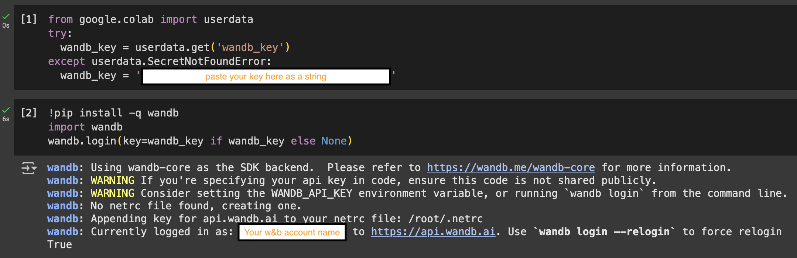
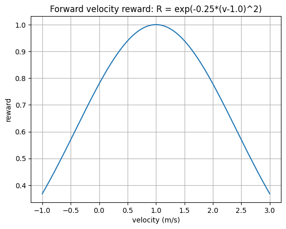
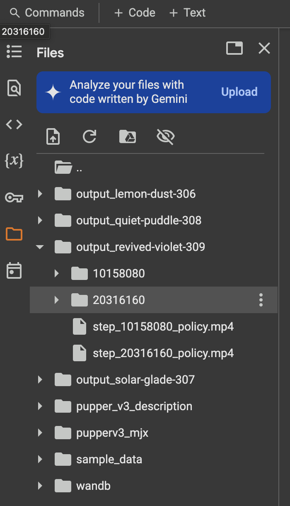
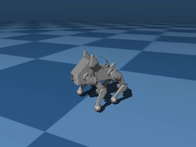
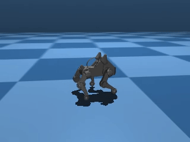
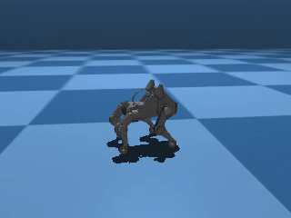
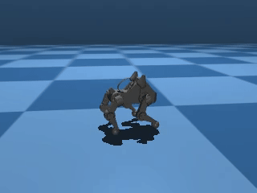
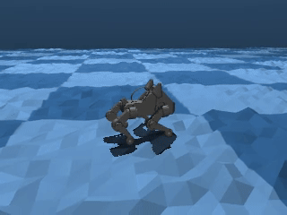

Lab 5: How to Train Your Dog
=============================

*Goal: Train Pupper to walk using reinforcement learning!*

`Lab slides <https://docs.google.com/presentation/d/1M66Y04oQe-v2Rjdd5DlflRhgR0MSj-aA/edit?usp=sharing&ouid=116833000630199851799&rtpof=true&sd=true>`_

`Lab document <https://docs.google.com/document/d/19SxabuzXPwqu-q0i3K2NRWW-GlK_V9ndIN5UgcBE58c/edit?usp=sharing>`_

Step 0. Test Pupper's new OS
^^^^^^^^^^^^^^^^^^^^^^^^^^^^^^^^^^^^^^^^
We have prepared a new, Raspberry Pi native OS for Pupper! This OS enables direct microphone control, accelerated image/audio processing, and a touch screen interface!

* Try the touch screen on Pupper. Super cool, isn't it?
* The OS has been modified to enable more deployable walking policies. Before you start training your own, let's first make sure the new OS is working on your Pupper. Open a new terminal using ``control+alt+t``, and run the following command:

   .. code-block:: bash

      cd ~/
      ./deploy_test_policy

This script without any arguments will just launch the neural controller. When provided the path to a policy file, it will overwrite that policy to the test_policy.json file, which is used by the neural controller, and then it will ask if you would like to launch the neural controller. After you have trained a policy and saved it on Pupper, for instance as ``~/Downloads/policy.json``, you can run the following command to overwrite the test policy:

   .. code-block:: bash

      ./deploy_test_policy ~/Downloads/policy.json

You will do this later after you have trained a policy, so keep this command handy. Before you deploy your own policy, the test policy is the same as the default policy (which is pretty impressive as it is, and is even better than the heuristic policy!).

* Connect your remote controller with Bluetooth or USB cable to give Pupper velocity commands. For Bluetooth setup, follow the instructions at `this link <https://pupper-v3-documentation.readthedocs.io/en/latest/guide/software_installation.html#first-time-setup>`_. You can control the Pupper and switch between policies using the remote controller, as shown in the image below:

   .. figure:: ../../../_static/cs123_gamepad.png
      :align: center
      :width: 1080px

      CS123 Specific Gamepad Controller

* You should see Pupper walking in place. Use the left joystick to control Pupper's walking direction and speed. The right joystick controls turning. Press any button on the remote controller to switch to a different policy.

* If Pupper is not walking properly, check if:
   - The remote controller is properly connected/turned on
   - There's any wiring issues with Pupper's motors
   - You are using the default walking policy, which you can switch to by pressing the "x" button on the remote controller.
   - There is a bad IMU reading message after you reinitialize the neural controller (Let's really hope that doesn't happen...)

**DELIVERABLE**: Take a short video of Pupper walking with the default policy. How does this compare to your implementation from lab 4?

Step 1. Colab setup
^^^^^^^^^^^^^^^^^^^^^^^^^^^^^^^^^^^^^^^^
* Make a copy of the `Pupper Lab 5 Colab <https://colab.research.google.com/drive/1w5c69BxMfCnkBinFAr7S13GcAnJ9dKbK?usp=sharing>`_
* Purchase Colab Pro and set the GPU to A100. Select runtime in top panel -> change runtime type -> A100. We will reimburse you for the cost of the GPU!
* To track our training progress and compare between different runs, we will use wandb (pronounced "weights and biases") to log all our training efforts. It's really easy to set up! For first time users, create a `wandb account <https://wandb.ai/>`_, and generate an API key by going to `this link <https://wandb.ai/authorize>`_
* Set up your wandb key by pasting your API key into cell 1 and running it.

   After pasting your wandb key, you should see a message like this. This means all your training logs will be saved to your wandb account!

Step 2. Notebook Overview
^^^^^^^^^^^^^^^^^^^^^^^^^^^^^^^^
Setting up a proper RL environment is an extremely time-consuming process. Although the majority of the setup is already implemented for you, there are still many parameters that you can tune.

The notebook is organized into several key sections. The notebook leverages JAX's powerful GPU acceleration to train Pupper in thousands of parallel environments simultaneously. This massive parallelization dramatically speeds up the training process, allowing us to collect large amounts of experience data efficiently. Each environment runs an independent simulation of Pupper, enabling rapid exploration of different walking strategies and faster convergence to optimal policies. The key sections are:

Rewards
~~~~~~~
The reward function is crucial for training Pupper to walk effectively. This is the part of the notebook that you will be tuning for this lab. The notebook provides several reward terms that you can tune:

* **Velocity Tracking**: Encourages Pupper to match desired linear and angular velocities
* **Effort Minimization**: Penalizes excessive motor torques and energy consumption
* **Stability**: Rewards maintaining a stable orientation and penalizes falling
* **Smoothness**: Encourages smooth joint movements and penalizes jerky motions
* **Height**: Rewards maintaining a desired body height
* **Foot Contact**: Encourages proper foot placement and contact timing

Refer to the `rewards.py <../../../_static/rewards.py>`_ file for reward definitions. You need to understand the exact implementation of each reward term to determine what coefficients to use on these rewards.

MJX Configs
~~~~~~~~~~~
The MJX (MuJoCo + Jax) configuration controls the physics simulation environment:

* **Robot Parameters**: Mass, inertia, and dimensions of Pupper's components (you should not change these)
* **Control**: Motor dynamics, PID gains, and actuation limits (you don't need to change these for this lab)

PPO Configs
~~~~~~~~~~
Proximal Policy Optimization (PPO) is a popular RL algorithm for training robot policies. We won't cover the details of this algorithm in this class for simplicity--you can think of it as an optimizer to train RL models for maximizing rewards. The PPO configuration controls the learning process:

* **Network Architecture**: Size and structure of the policy and value networks (you should not change these for this lab)
* **Training Parameters**: Learning rate, batch size, number of epochs
* **Policy Clipping**: Limits on policy updates to ensure stable learning (you should not change these for this lab)
* **Value Function**: Parameters for the value function estimation (you should not change these for this lab)
* **Entropy Bonus**: Encourages exploration during training (you should not change these for this lab)

Command Sampling
~~~~~~~~~~~~~~
Controls how velocity commands are generated during training:

* **Linear Velocity**: Range for forward/backward and lateral movement
* **Angular Velocity**: Range for turning commands
* **Zero Command Probability**: Chance of receiving a zero-velocity command (you should not change these for this lab)
* **Stand Still Threshold**: Velocity threshold below which commands are considered "standing still" (you should not change these for this lab)

Termination Conditions
~~~~~~~~~~~~~~~~~~~
Defines when an episode should end:

* **Body Height**: Episode ends if body center goes below a certain height (you should not change these)
* **Body Angle**: Episode ends if body angle exceeds a threshold (you should not change these)
* **Early Termination**: Allows episodes to end before reaching maximum length (you should not change these)

Domain Randomization
~~~~~~~~~~~~~~~~~
Parameters that add variability to the simulation to improve robustness:

* **Perturbations**: Random kicks, angular velocity noise, and gravity variations
* **Motor Properties**: Random variations in position control gains
* **Starting Position**: Random initial positions for training (you should not change these)
* **Latency**: Simulated delays in action execution and IMU readings (you should not change these)
* **Body Properties**: Random variations in mass, inertia, and center of mass
* **Friction**: Random variations in ground friction

Heightfields and Obstacles
~~~~~~~~~~~~~~~~~~~~~~~
Environment features to test Pupper's capabilities:

* **Heightfield Types**: Random terrain or steps
* **Heightfield Parameters**: Grid size, radius, and elevation
* **Obstacles**: Number, position, and dimensions of obstacles

Understanding and tuning these parameters is key to training an effective walking policy. We will start with the basic velocity tracking reward and gradually add other terms to improve Pupper's walking behavior.

**DELIVERABLE:** Before actually training a policy, what do you think will be the most important rewards to tune when training Pupper to walk forwards? What about making Pupper walk stably? Could these two factors have a combined effect and interfere? Write a few sentences in your lab document. 

Step 3. Velocity tracking
^^^^^^^^^^^^^^^^^^^^^^^^^^^^^^^^
Let's implement a naive reward function for Pupper velocity tracking

* In the **Reward Configuration** section, change the ``tracking_lin_vel`` and ``tracking_ang_vel`` values to some nonzero values to get Pupper to follow a velocity command. In practice, the linear velocity tracking coefficient should be around double the angular velocity tracking
* Run entire notebook, which loads in all the training and mjx configs, initializes Pupper in a flat environment, and trains Pupper to follow a desired velocity
* Pupper should take around ~20 minutes to train. 

**DELIVERABLE**: We use an exponential tracking function for Pupper to track a desired velocity. The plot below shows how the reward value depends on the x-axis velocity of the robot when the desired x-axis velocity is 1.0m/s.

    Exponential Tracking Function for Velocity

Since Pupper needs to maximize this function, should the reward coefficient be positive or negative, according to Nathan's implementation? How else could you implement a velocity tracking function? Write it down in math.

**DELIVERABLE**: Visualize Pupper's progress during training. How does Pupper look in the first 20 million env steps? How does it look after 200 million env steps?

You can access training videos in the training progress folder as shown below:

   Training videos are saved in the training_progress folder.

Screen recording of walking in simulation. In the video, you can see Pupper learning to bend low, stand up, and walk in different directions - forward, backward, left, right, and turning both clockwise and counter-clockwise.

   Earlier in training, Pupper will move seemingly randomly

.. figure:: ../../../_static/loss_pup.png
   :align: center
   :width: 360px

   During training, your reward should be going up steadily and eventually plateau

   As you may be able to tell, just because Pupper has velocity tracking reward doesn't mean it will perfectly follow the desired speed. To learn natural gaits, auxiliary rewards are needed. Next, you will implement a function to encourage Pupper to walk more efficiently.

Step 4. Effort Conservation
^^^^^^^^^^^^^^^^^^^^^^^^^^^^^^^^^^^^^^^^
* Edit the **Reward Configuration** section to write a reward function that helps Pupper conserve effort. Think about which rewards should be nonzero to encourage Pupper to conserve energy. Should the coefficients be positive or negative?
* Rerun the notebook to initialize Pupper in a flat environment and train Pupper to walk forward more efficiently
* Pupper should take around ~20 minutes to train. 

**DELIVERABLE**: What is your reward function (in math, don't just take a screenshot from the notebook!)? Why did you choose this function? What existing reward terms could be used to make Pupper conserve energy, and what are their potential pros and cons? Are there any rewards that could be used that are not listed?

**DELIVERABLE**: Qualitatively, how does this Pupper policy compare to the previous one?

**DELIVERABLE**: Record a video of Pupper walking in simulation. 

   Pupper should walk with much better stability and smoothness. However, it still shouldn't have a super natural locomotion, and will likely not be robust to pushes or other changes in the environment. Next, you will implement several additional auxiliary rewards to help Pupper stay stable.

Step 5. Reward tuning
^^^^^^^^^^^^^^^^^^^^^^^^^^^^^^^^

* Now that you have a gist of how to tune the reward functions, it's time to set you free! Tune the config to make Pupper smoothly follow velocities with a natural gait. Feel free to use any rewards you like (to reduce your search space, don't try tuning other parameters yet!)
* Increase the ``training_config.ppo.num_timesteps`` to at least 300 million (in practice, Nathan used 1 billion timesteps to train a really good policy from scratch)
* Rerun the entire notebook, and train Pupper to walk in simulation
* Depending on the number of timesteps, the training process should take around ~30 minutes to ~2 hours. 

**DELIVERABLE**: What terms are included in your reward functions? What coefficients did you use? How did you come up with these terms and what was their desired effect? Do you think this policy will perform well on the physical robot?

**DELIVERABLE**: Visualize Pupper's progress during training. How does Pupper look in the first 20 million env steps? How does it look after 200 million env steps?

**DELIVERABLE**: Record a video of Pupper walking in simulation. 

   You should aim to train a stable policy up to 0.75 m/s in simulation

**DELIVERABLE**: Record a video of Pupper standing still in simulation. To do this, you can set all commands to zero during visualization. Is Pupper able to stand still given zero commands?

Step 6. Deploy your walking policy
^^^^^^^^^^^^^^^^^^^^^^^^^^^^^^^^^^^^^^^^

Transfer policy from local machine to Pupper

* Download the policy you trained in Colab to Pupper's local machine. In Colab, you can find the trained policy as "policy.json" in the training progress folder after running the "Export Policy for neural_controller" cell. We suggest you first save the policy to your Google Drive, and then log into Google Drive on Pupper's local machine and download the policy from there.
* Connect your remote controller to Pupper
* Run the following command to deploy the policy (assuming you saved the policy as "policy.json" in your Downloads folder on Pupper):
   .. code-block:: bash

      ./deploy_test_policy ~/Downloads/policy.json

Remember to press the square button on the remote controller to switch to your trained policy!

**DELIVERABLE:** In what ways is this policy different on the physical robot (compared to simulation)? We roboticists call this difference the "sim2real gap" (I think Jie invented this terminology for training robot dogs).

**DELIVERABLE:** Take a video of Pupper walking! Do you notice any differences when Pupper is walking on different surfaces?

**DELIVERABLE:** Inspect Pupper's gait on each leg, and compare it to the triangle gait from the heuristics walking lab. Do Pupper's legs move in a similar traingle motion in the gait you discovered? Write a few sentences about the similarities and differences you notice. 

.. figure:: ../../../_static/walker.gif
   :align: center

   Deploy your policy on Pupper v3 (policy trained by Jaden)

Step 7. Domain randomization
^^^^^^^^^^^^^^^^^^^^^^^^^^^^^^^^^^^^^^^^^^^^^^^^^^^^^^^^^^^

Okay, so Pupper looks pretty good in sim, but the policy doesn't look so great in the real world...
(That was a comment from Jaden before the Pupper update. Now the sim2real transfer is much better, and you should have a decent policy even without domain randomization!)

To play with additional features in hopes of making the policy more robust, you will need to add randomization to the sim environment. Consider randomizing parameters such as Pupper mass, environment heightfields, or PID gains.

* Edit the environment config to adequately represent all the situations Pupper might encounter in the real world
* Try several magnitudes of the domain randomization terms to see what works
* Iterate many times tuning the domain randomization and rewards for the best policy possible! An agile policy should be fast, efficient, stable, and robust to disturbances. Train the best policy you can!

.. note::
   Feel free to reach out to the TAs if you have questions about modifying parameters in the notebook. Small changes can sometimes have unexpected effects on training behavior, and we're happy to help you understand the impact of different parameters.

   Your sim environment should expose Pupper to a variety of possible scenarios

**DELIVERABLE**: Comment on what might happen if you add too much domain randomization

**DELIVERABLE**: Record a video of Pupper walking in simulation, and another video of Pupper walking in the real world with this policy.

**DELIVERABLE**: Describe your approach to training an agile Pupper policy. What parameters were key? Did you use a heightfield? Why/why not?

**DELIVERABLE**: Report all the graphs you get from the notebook with the best policy. Do a thorough analysis of the graphs: How do the gaits look like for your policy? What are the outputs of the policy you just trained? How do you think it gets passed to Pupper?

Congratulations on completing Lab 5! This is a pretty hefty lab, and you've successfully trained Pupper to walk and gained valuable experience in tuning reward functions and domain randomization. These skills will be essential for the more advanced tasks in the upcoming optional lab!

Resources
-----------
`Learning to Walk in Minutes Using Massively Parallel Deep Reinforcement Learning <https://arxiv.org/pdf/2109.11978>`_

`Sim-to-Real: Learning Agile Locomotion For Quadruped Robots <https://arxiv.org/abs/1804.10332>`_

`Minimizing Energy Consumption Leads to the
Emergence of Gaits in Legged Robots <https://energy-locomotion.github.io/>`_

`Learning Agile Quadrupedal Locomotion Over Challenging Terrain <https://www.science.org/doi/full/10.1126/scirobotics.abc5986>`_
