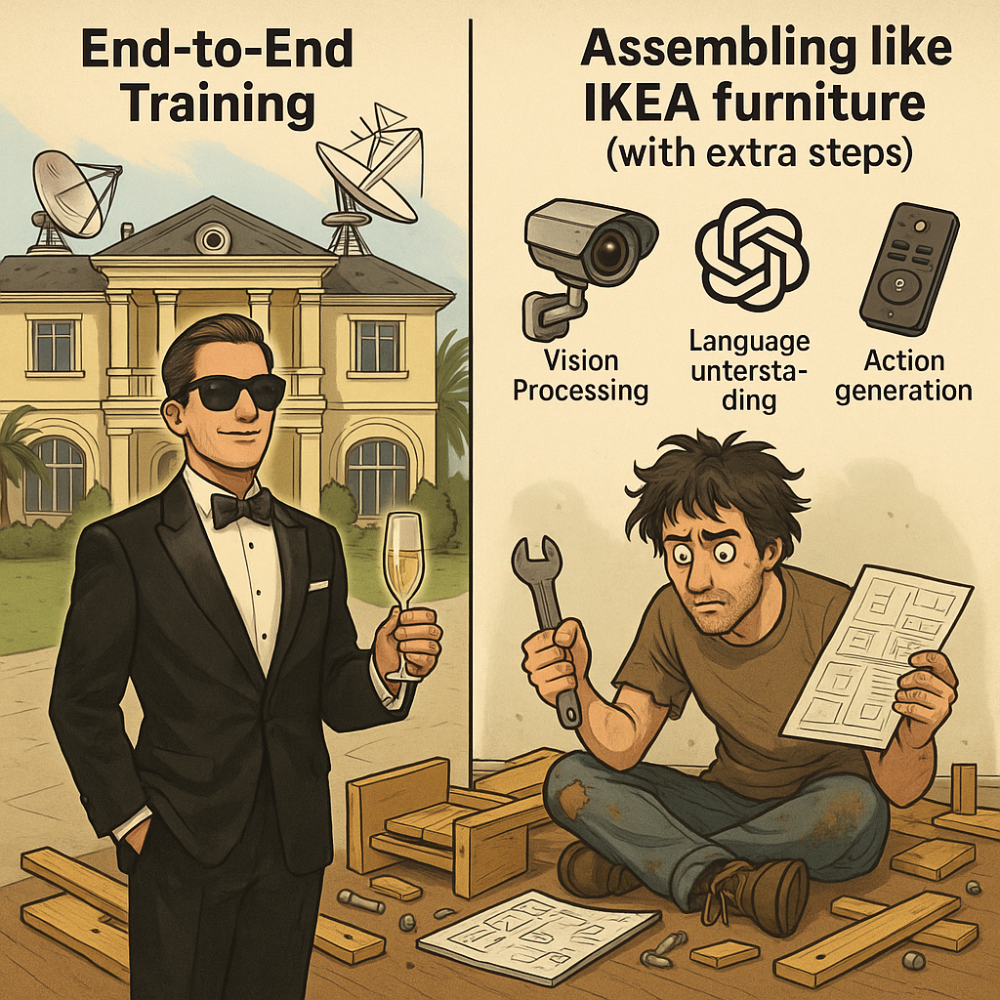

Optional Lab 3: Poor Man's VLA
===============================

Goal
----
Embed the pupper_llm codebase with vision processing capabilities to create a Vision-Language-Action (VLA) system! This lab challenges you to enhance Pupper's intelligence by enabling it to understand and respond to both visual and textual inputs.

What is VLA?
-----------
Vision-Language-Action (VLA) is an emerging paradigm in robotics that combines visual perception, natural language understanding, and robotic control into a unified system. In this lab, you'll create a simplified version ("poor man's VLA") where you'll modify the existing GPT-based control pipeline to incorporate visual information alongside text commands. With vision integrated, Pupper will be capable of doing many more advanced tasks, giving us more freedom to add dynamic functionalities to our KarelPupper API calls.

Why "Poor Man's VLA"?
~~~~~~~~~~~~~~~~~~~~
While fancy VLA systems use end-to-end training to learn everything from pixels to actions in one go (like a rich person buying a fully automated mansion), we're taking the "poor man's" approach - building our system piece by piece, like assembling IKEA furniture with extra steps. Instead of one giant neural network that does everything, we're creating a hierarchical system where:

1. Vision processing happens separately (like having a security camera)
2. Language understanding is handled by GPT (like having a translator)
3. Action generation uses our existing API (like having a remote control)

    Gotta assemble this pipeline piece by piece!

It's not as elegant as the end-to-end approach, but hey, we're working with what we've got! Plus, this modular approach gives you more control over each component and makes debugging easier - when something goes wrong, you know exactly which part of your IKEA furniture is wobbly.

The Challenge
------------
Your task is to improve the pipeline from lab 7 by enabling the GPT model to process both text and vision inputs in a single inference pass, producing appropriate robot API action calls. This will allow Pupper to make more informed decisions based on its visual understanding of the environment.

Getting Started
--------------
We have provided two potential starting points:

1. **Debug Existing Implementation**
   
   - Location: `pupper_llm/vision_integration`
   - This is a barebone (not functional) implementation that currently includes depth and recognition mask inputs
   - Your task: Debug and modify this implementation to work with simpler vision inputs
   - Note: You'll need to remove the depth and recognition mask components

2. **Direct Modification**
   
   - Location: `pupper_llm`
   - Alternative approach: Modify the main codebase directly
   - Your task: Implement an image message publisher to feed visual information to the GPT model

Refining the KarelPupper APIs with Vision Integration
---------------------------------------------------
Now that Pupper has vision capabilities, we can enhance the KarelPupper API to enable more sophisticated behaviors that make use of visual feedback. Here's what you'll need to do:

Location and Task
^^^^^^^^^^^^^^^^
- File: `pupper_llm/karel/karel.py`
- Implement new API functions that utilize vision input

Important Timing Constraint
^^^^^^^^^^^^^^^^^^^^^^^^^^
The Vision-Language Model (VLM) pipeline has a significant processing delay:

- Each image takes over 15 seconds to process + execute the API call
- This results in sparse visual feedback (one image per 15+ seconds)
- Plan your API implementations accordingly:
  
  - For real-time tasks (obstacle avoidance, navigation): Implement a separate, lightweight vision pipeline
  - For non-time-critical tasks (goal recognition, scene understanding): Use the VLM output directly

Suggested API Additions (In Order of Complexity)
^^^^^^^^^^^^^^^^^^^^^^^^^^^^^^^^^^^^^^^^^^^^^^^^
1. Basic Movement Extensions
   
   - Side stepping capabilities
   - Diagonal movement options
   
2. Audio Integration
   
   - Goal achievement sounds
   - Warning/alert noises
   
3. Choreographed Sequences
   
   - Multi-step movement patterns
   - Synchronized movement and audio
   - Example: Make Pupper dance while playing music
   
4. Sensor Integration
   
   - Karel API embedded camera feed processing
   - IMU data handling
   - Joint position monitoring
   
5. Smart Navigation
   
   - Path planning algorithms
   - Real-time obstacle detection and avoidance
   - Note: Requires implementing a separate fast vision pipeline. Builds on concepts from Lab 6
   
6. Advanced Movement Control
   
   - Gait switching functionality
   - Yaw control implementation
   - Note: May require training custom neural policies and modifying the neural controller pipeline. Builds on concepts from Lab 5

These enhancements will significantly expand your VLA system's capabilities and allow Pupper to handle more complex, vision-guided tasks.

Evaluation
----------
The goal is to benchmark how Pupper's decision-making capabilities improve when it can perceive its environment. You should:

- Implement a working vision integration system
- Demonstrate improved task completion with visual input
- Compare performance with and without vision capabilities
- Document any interesting behaviors or limitations

This is an open-ended lab that encourages creative solutions. Feel free to experiment with different approaches to vision integration and pipeline architecture modifications. The key is to make Pupper more intelligent by enabling it to "see" and understand its surroundings.

Remember to document your approach, challenges faced, and lessons learned. We're excited to see how you enhance Pupper's capabilities with vision!
